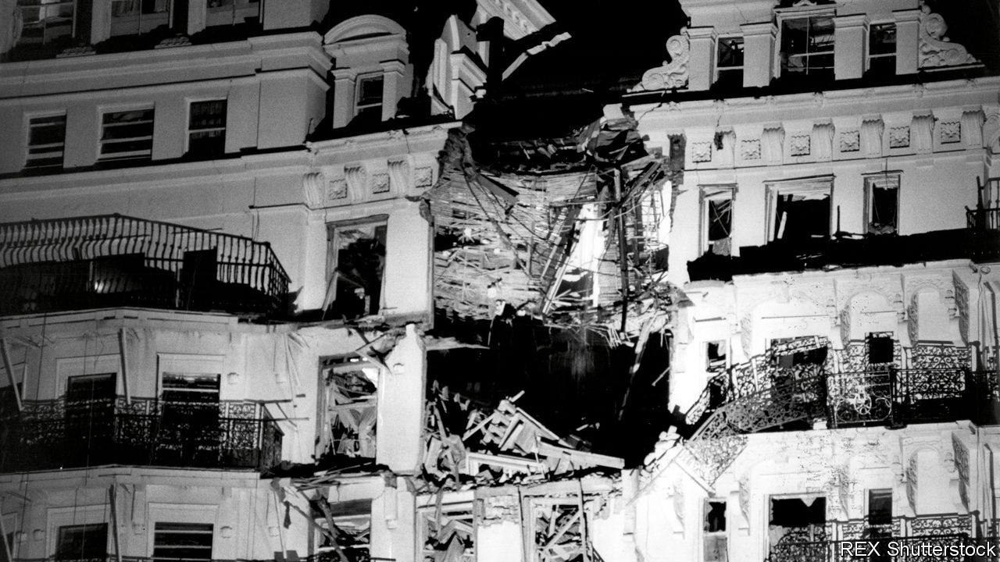

###### Margaret Thatcher and the IRA

# “Killing Thatcher” tells the full story of the Brighton bombing 

##### Rory Carroll recounts the IRA plot to assassinate the prime minister in 1984 and the ensuing manhunt 

 

> Mar 30th 2023 

 By Rory Carroll. 

Just after midday on September 15th 1984, a neatly dressed young man carrying an unusually heavy suitcase walked up to the reception desk of the Grand Hotel in Brighton and asked for an upper-floor room with a sea view. The smiling receptionist offered him room 629. All he had to do now was fill in the registration card with his false name and an address in London, and avoid leaving any fingerprints. By a stroke of luck, 629 was one of the rooms that best suited his plan: to plant a bomb with a long-delay timer that would detonate in the early hours of the morning 27 days later—and kill Britain’s prime minister and much of the cabinet. 

The engineers of the Irish Republican Army (ira) had calculated that, if positioned correctly, the bomb would bring down the giant chimney stack of the Victorian hotel, so that it would topple through the blast hole and slice through the building. The chimney would take with it a vertical stack of rooms with numbers ending in 9—including the Napoleon Suite, in which , the prime minister, would be staying as she prepared to address the Conservative Party conference that same day.

The plan almost worked perfectly. But the chimney stack veered slightly, destroying the rooms with numbers ending in 8. Those ending in 9 were merely clipped. The bomb killed five people and injured 34, many of them grievously, including two cabinet ministers, Norman Tebbit and John Wakeham, whose wife, Roberta, was among the dead. The prime minister survived with barely a scratch and insisted on giving her conference speech, as intended, later in the day. Meanwhile, the bomber, Patrick Magee, was 500 miles away, holed up across the Irish Sea in Cork, glued to the radio for news. 

Rory Carroll, a Dubliner who reported from Belfast in the mid-1990s, when  were winding down—and is now the ’s Ireland correspondent—has knitted together an impressive array of sources to tell, for the first time, the complete story of the plot to kill the British leader. He chronicles, too, the hunt to identify and then catch Mr Magee and his accomplices.

Mr Carroll’s account is entirely factual, but it slips somewhat uneasily between a documentary style and a thrillerish one. He leans a little too heavily on descriptions of the weather to create a sense of immediacy. He also feels obliged to provide rather plodding context for readers who may be unfamiliar with Northern Ireland’s peculiar status, the origins of republican violence or what made Thatcher such a remarkable yet controversial leader.

Moreover, some readers may be unsettled by his scrupulous even-handedness in detailing the motives and actions of terrorists and those attempting to save lives by thwarting them. He is ambivalent about two of his main characters. One is Gerry Adams, the calculating president of , the Ira’s political wing: a brooding, manipulative presence who is the epitome of strategic patience. The other is Thatcher herself, who refused to be pressured by hunger strikers in the Maze prison into granting IRA inmates “special category status”. Ten of them died. This, above all, made the ira seek revenge against a woman they saw as a cruel and implacable foe.

But the author’s admiration shines through for the heroic police bomb-disposal specialists in his narrative, such as Peter Gurney and Ken Howorth (who was killed in the basement of a London hamburger bar in 1981). The same goes for the painstaking work of ordinary detectives and a brilliant forensic scientist, David Tadd, who eventually matched Mr Magee to the hotel registration card. 

Nor does Mr Carroll spare readers the horror of the lives truncated or wrecked by the IRA’s bombing campaign. His mostly gripping tale is a reminder of a time, before the rise of Islamist terrorism, when random bombings seemed routine in Britain, and every so often the IRA would pull off a grisly “spectacular”. The book opens on the awful August day in 1979 when the terrorists blew up Earl Mountbatten’s family boating party and killed 18 British soldiers in an ambush in Northern Ireland. Three years later, in July 1982, the IRA’s “England Department” matched that with same-day bombings in Hyde Park and Regent’s Park, killing 11 soldiers and leaving indelible images of eviscerated horses lying in the road. 

As the 25th anniversary nears of the Good Friday Agreement, which brought a fragile peace to Northern Ireland, the book is a warning to those prepared to play fast and loose with its terms. Paradoxically, the reckless mendacity of Boris Johnson, the former prime minister, over the impact of , and the self-harming intransigence of the Democratic Unionist Party on that and other issues, have done more for the prospects of a united Ireland than IRA bombing ever did. ■


