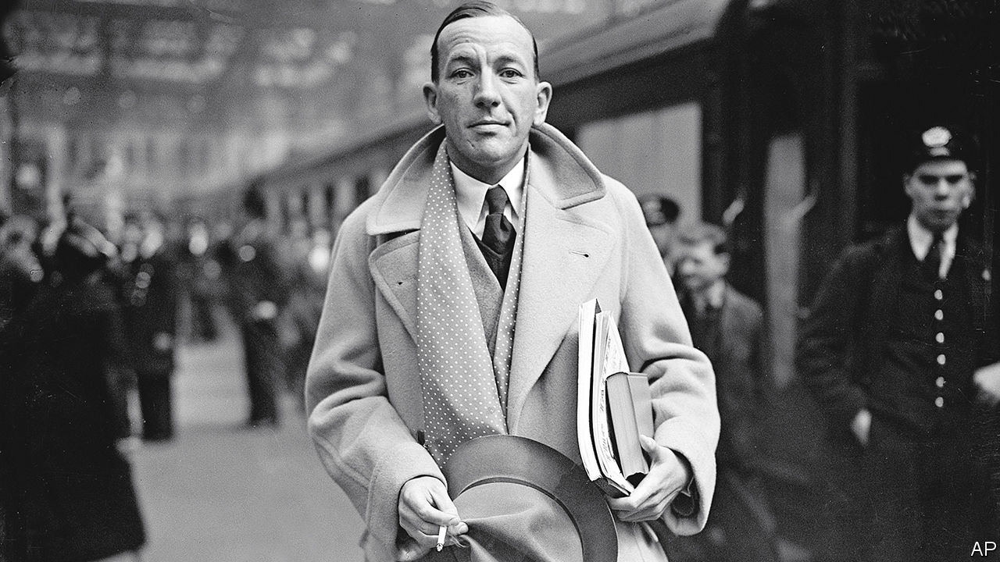

###### Entertaining lives

# “Masquerade” depicts the darkness behind Noel Coward’s frivolity 

##### The playwright and performer was a more serious artist than even he cared to acknowledge 

 

> Mar 30th 2023 

By Oliver Soden. 

Noel Coward made his acting debut on the London stage in 1911 at the tender age of 11. The production—an underwater-themed Edwardian fantasia—was not auspicious. The young actor’s doltish lines included “Crumbs, how exciting!” All the same, he tried to play the minor part of court jester with such conviction that everyone in the theatre might recognise his talent. He already seemed set on a starring role. Asked once what he wanted to be when he grew up, he replied, with great seriousness, “a success”.

“Masquerade”, a new biography of Coward by , reveals how a precocious child actor from a working-class family became the highest-paid writer in 20th-century Britain. Through playwriting, singing, acting, directing and composing—there were few art forms in which he did not excel during his six-decade career—Coward was at one time earning £50,000 a year (around £15m today). He revelled in the nickname “the Master”.

A trip to Broadway in 1921, where he was electrified by the dialogue, turned him on to playwriting. In notebooks he recorded the  he overheard on his travels and began to fashion sharp, sardonic dialogue of his own. His lines come alive on stage. During a revival in 1964 of the play “Hay Fever”,  brought the house down simply by flicking her wrist, arching an eyebrow and drawling: “This haddock’s disgusting.” 

For audiences in the 1920s, recovering from the first world war, Coward’s early plays were a tonic. “Hay Fever” and “The Vortex” delight in the magnificent wordplay, inconsequential yet entertaining, between eccentric old aristocrats and a younger generation brought up on alcohol, drugs and jazz. These plays were Coward’s way of sending up the decadence and destruction of the Roaring Twenties, when it was a virtue to be flippant and fun even in the face of tumult. As one character says in “Private Lives”, Coward’s hit play of 1930, you had to “laugh at everything”.

Critics often dismissed his comedies as light and unintellectual, but so long as they were doing well at the box office, Coward’s main concern was the accumulation of property. Goldenhurst, an Elizabethan farmhouse in Kent, was his largest and most lavish purchase. He used the fortune he made in the West End and on Broadway to transform it into a plush estate enjoyed by his mother, Violet, to whom he felt indebted for his success.

Male lovers came and went, but he clung to a group of friends with lives as glamorous as his own. Gladys Calthrop designed the costumes for many of his plays; the composers Ivor Novello and Cole Porter were among his closest pals. Perhaps no one was more devoted to Coward than Cole Lesley. First employed as his valet in 1936, Lesley managed to weather Coward’s vicious moods and bleak depressions for more than 35 years.

When the second world war erupted, it unleashed in the writer a burst of nationalism which, in Mr Soden’s account, made him snobbish and petulant. Through his friendship with Winston Churchill, and in spite of his lack of experience or training, Coward managed to bag a top job in the Secret Service. The Nazis put him on their list of British residents who were to be arrested—and presumably executed—in the event of a German victory. But this employment was abruptly terminated, in part due to growing impatience with Coward’s flamboyant lifestyle. The success of his play “Blithe Spirit” (1941), performed as bombs whistled overhead, did not lessen his resentment. He sent a flurry of peevish letters to Whitehall.

With age, Coward became embittered about . To avoid paying tax, he decamped to his seven-acre estate on the Jamaican coast, where he painted landscapes and reminisced about the empire with guests including Churchill and Ian Fleming. His views on the new welfare state and Indian independence were stubbornly reactionary.

Yet old age also emboldened his defence of homosexuality. Using recent archival discoveries, Mr Soden highlights Coward’s opposition to its criminalisation, which he called “stupid and quite barbarous”. An unpublished letter reveals that in 1960 he planned a daring but unfinished play about a male love triangle; later he drafted several scenes for a play confronting the deep-rooted nature of homophobia. Had either been produced, it would have made history as the first depiction of homosexual desire on a British stage.

These days his plays are often regarded as frivolous and outdated. Mr Soden finds in them a seriousness that their original audiences failed to see—and that even Coward, guarding his reputation as a light entertainer, may have preferred to gloss over. Return to his work after reading Mr Soden’s illuminating biography, and it is striking how often his sparkling wit seems shadowed by despair. “Is he happy, do you think? I mean really happy?” someone asks of Garry Essendine, a character in “Present Laughter” (written in 1939). Essendine, a thinly veiled self-portrait, responds with rare candour: “There’s something awfully sad about happiness, isn’t there?” ■


