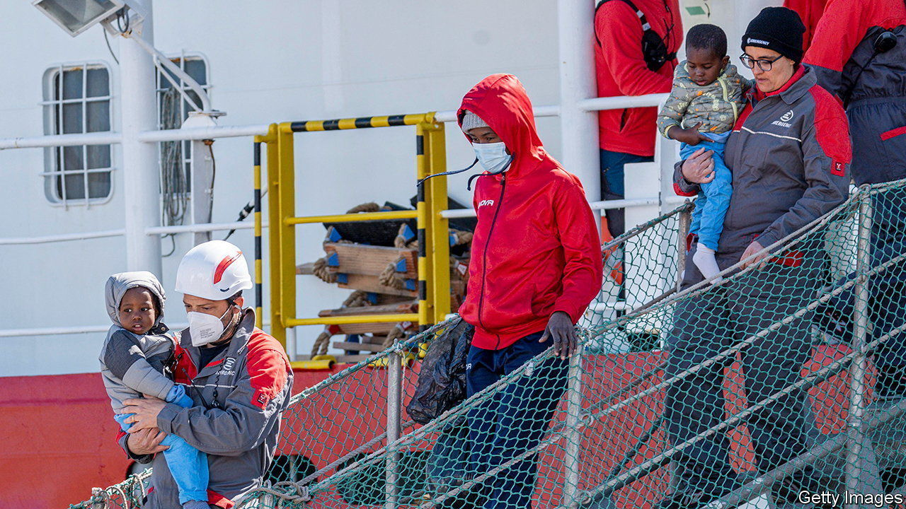
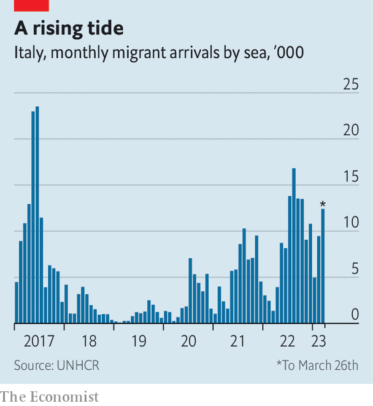

###### No good options

# A surge of migrants is reaching Italy 

##### Giorgia Meloni’s right-wing government is facing its first real crisis 

 

> Mar 30th 2023 

Defying adverse late-winter weather, migrants fleeing poverty and persecution are reaching Italy’s shores in unprecedented numbers. By March 27th 26,927 had arrived so far this year. This compares with 6,543 at the same point last year, when the annual total was over 105,000. In 2017, the peak year so far, the corresponding numbers were 24,280 and more than 180,000. That suggests that depending on which pattern this year follows, Italy could face an influx of 200,000 seaborne migrants, possibly even 400,000 or more.

That is a nightmare for a coalition that came to power last September promising to clamp down on irregular immigration. Giorgia Meloni, Italy’s prime minister, is not the only European leader affected. Many or most of the migrants who land in Italy move on to countries farther north where their compatriots are already settled, where jobs are more plentiful and public benefits are more generous.

 


Arrivals are one aspect of this drama. Non-arrivals are a much grimmer one. In just four days to March 26th, seven boats carrying migrants foundered off the North African coast, leaving more than 100 people dead or missing. Given the lack of seaworthiness of most of the vessels into which the migrants are packed, tragedies are inevitable. But the Italian government has increased the risks by imposing restrictions on the ships run by NGOs that rescue migrants and bring them to Italian ports. The government and its supporters regard the NGOs as the operators of a ferry service for uninvited guests.

Ms Meloni’s government has not so far attempted to impose the blockade of North Africa’s coastline that her party, the Brothers of Italy, once rashly promised. And it backed down from its efforts to send the NGO vessels elsewhere, in the face of the outraged reaction of France. But the government has obliged the ships to dock at ports in the north of Italy, thereby reducing the time they can spend looking for migrants in distress. And it has told their skippers they must head for land as soon as they carry out a rescue, even if other migrants are in distress nearby. On March 25th, the authorities impounded the MV , purchased by the British artist Banksy, and ordered its crew not to put to sea for 20 days. It had rescued 180 people in four operations before delivering them to the Italian island of Lampedusa.

Though migrants continue to arrive from Libya and Turkey, the key to the recent surge is an increase in the numbers leaving from troubled Tunisia. President Kais Saied last year shut down parliament and awarded himself wide-ranging powers. Unemployment is at more than 15% and the country is short of food. A deal with the IMF for a $1.9bn loan is stalled, apparently because of the president’s reluctance to countenance economic reforms. In an apparent effort to shift the blame for his country’s difficulties, Mr Saied in February ordered the security forces to expel illegal residents, declaring that migration from sub-Saharan Africa was the result of a plot aimed at changing his country’s ethnic composition.

On March 27th the EU’s commissioner for economic affairs, Paolo Gentiloni, held talks in Tunis with Mr Saied and others. Mr Gentiloni held out a promise of additional European financial support—but only once Tunisia had agreed to the IMF plan and all its conditions. That seems to be a very big but. ■

