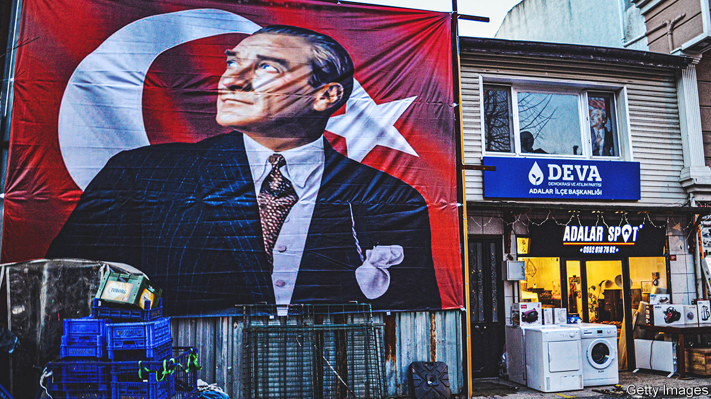
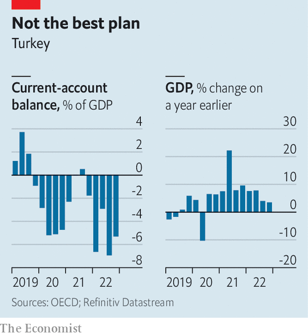
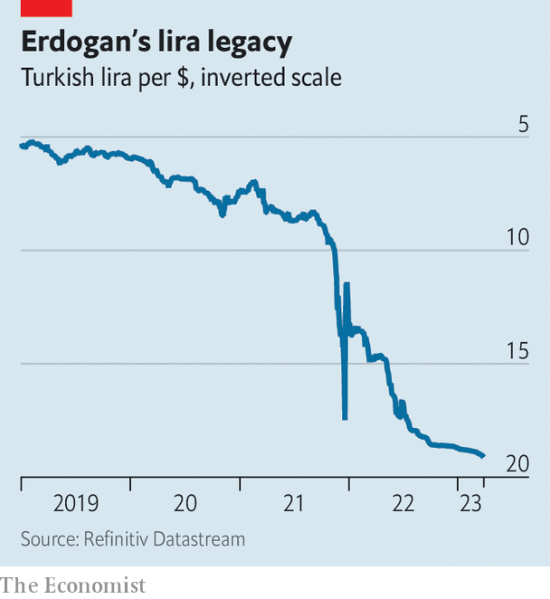

###### Election economics

# Ahead of a critical election Turkey’s economy is running on borrowed time 

##### With the lira down 80%, Recep Tayyip Erdogan’s medicine isn’t working 

 

> Mar 26th 2023 

VISITORS TO TURKEY are often surprised to discover that in a country supposedly consumed by economic malaise, the restaurants, at least in large cities, are bursting with customers. But appearances are deceptive. A big reason for the bustle is that middle-class Turks would rather spend their earnings today than watch inflation, officially measured at 55% year on year but widely believed to be much higher, burn through their savings tomorrow. 

Turkey’s president, Recep Tayyip Erdogan, has bullied the central bank into slashing interest rates in the face of galloping prices, allowing the lira to plummet. He hoped this would turbocharge the economy by making exports cheaper and encouraging domestic production. The policy mix, repackaged as Turkey’s “”, would bring inflation down to single digits ahead of this year’s presidential and parliamentary elections, his finance minister pledged. Things have not gone according to plan. 

Imports remain necessary but are now much more expensive. Hence they have dwarfed exports, landing Turkey with its biggest absolute current-account deficit in four decades. Annual  has dipped from 85% last year, but remains by far the highest in the OECD, a group of mainly rich countries. Growth continues, thanks less to exports than to an unsustainable surge in consumption. Mr Erdogan’s economic model seems to have run its course.

The poor economy, compounded by  that killed over 50,000 people in the country’s south in February, has darkened Mr Erdogan’s prospects. Opinion polls show him trailing the opposition’s joint candidate for president, , by four or more points. For a populist strongman who enjoys a servile news media and control over the country’s institutions, that is hardly insurmountable. But it is the biggest hole Mr Erdogan has faced before any major election. 

How he plans to dig himself out of it remains unclear. The elections are set for May 14th, with a run-off on May 28th if no candidate gets an absolute majority in the presidential contest. More tends to happen in Turkey in two months than in most countries in two years, but Mr Erdogan seems to be running out of ideas, especially regarding the economy. Sensing a historic chance, the opposition is closing ranks. On March 22nd the country’s main Kurdish party said it would not, as had been feared, field its own candidate for the presidency, suggesting it would endorse Mr Kilicdaroglu and avoid splitting the opposition vote.

Many fear that Mr Erdogan may revert to rabble-rousing. One option may be a renewed confrontation with Greece over , says Selim Koru at the Economic Policy Research Foundation of Turkey. An election in Greece, also now expected in May, raises the risk of a clash (of words or, at worst, of arms). Domestic politics may favour hot heads over cooler ones. “I’m not sure these guys will go quietly,” says Mr Koru of Mr Erdogan and his circle. 

 


When it comes to the economy, the Turkish leader’s options are limited. Over the past three months the government has raised the minimum wage by 55%, more than doubled the basic pension and passed a law making millions of Turks eligible for early retirement. Mr Erdogan may announce further handouts during Ramadan, which began on March 23rd. His best hope, however, is that the economy will keep humming until the elections. It grew by a sprightly 5.6% last year, largely thanks to laughably cheap loans and spiking consumer demand.

Mr Erdogan holds all the economic and monetary policy levers in his hands, but has been pulling them in opposite directions. Cuts to the benchmark interest rate, by more than ten percentage points since 2021, drove the lira to new depths last year. That helped exports reach a record $254bn. Imports, however, surged to $364bn (40% of GDP), also a new high. The current-account deficit, Turkey’s balance of payments with the rest of the world, ballooned to $10bn in January.

 


Emergency measures stopped a run on the lira in 2021. But since it began sliding again last year, Turkish officials have been rationing bank loans and selling billions of dollars’-worth of foreign reserves, leaving the central bank’s coffers depleted. Having lost 80% of its dollar value in five years, the lira has now stabilised, but only at the expense of the exporters Mr Erdogan’s model was expected to benefit. Turkish exporters now say the currency is overvalued, and is squeezing profits. “They have become exchange-rate addicts,” says Cevdet Akcay, an economist. “They were ecstatic, and now they’re complaining again.”

Ordinary Turks, meanwhile, are stuck with the bill for Mr Erdogan’s experiment, in the form of a cost-of-living crisis. Other than managing the exchange rate, the government has done next to nothing to keep price growth in check. On March 23rd the central bank kept the benchmark interest rate unchanged, at 8.5%. Adjusted for inflation, credit in Turkey is cheaper than anywhere else in the world. 

The economy is running on borrowed time, says Selva Demiralp of Istanbul’s Koc University. “They’re trying to sustain the current system until the elections, before it blows up,” she says. Without a return to factory settings, Turkey may soon face another currency crisis and a fresh surge in consumer prices. Bringing inflation under control will be hard enough for a new government, says Mr Akcay. “For this one, it has become impossible.” ■

