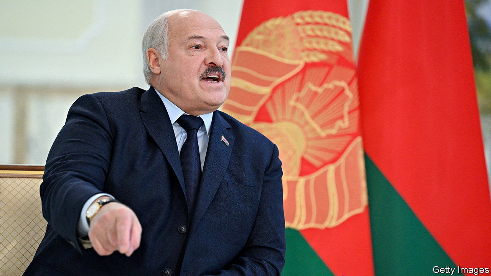

###### Meet the hackers

# Belarus’s beleaguered opposition is flirting with violence 

##### Is a liberation army forming? 

 

> Mar 30th 2023 

The cyber Partisans, a group of anonymous dissidents, have hacked their way to the very top of Belarus’s authoritarian regime. They claim that last year when Alexander Lukashenko, the country’s dictatorial president, said he was more scared of cyber weapons than nuclear weapons, he was thinking of them. “What opposition group can say that they have the passport information of all its country’s citizens :)” typed a hacker identified only as Cyber #3. They have reason to grin. The Cyber Partisans are the cutting edge of a militant wing of Belarus’s opposition that is gearing up for action.

In a Warsaw safehouse, one dissident preparing to return to Belarus fidgeted nervously with a lighter. “We are waiting, but we don’t know what we are waiting for,” he complained. “Everyone is frustrated. Everyone is scared.” Crackdowns have caused many to abandon the dangerous game of dissident politics entirely. That despair has, however, led some to consider more radical methods. 

Sviatlana Tsikhanouskaya, the challenger who undoubtedly won the election that Mr Lukashenko stole in 2020, has kept the flag of opposition flying from exile in Lithuania; but radicals want more. “These people wanted her to become Belarus’s Charles de Gaulle,” says Artyom Shraibman, a political analyst affiliated with the Carnegie Endowment for International Peace. “A leader-in-exile that could create a liberation army. They were disappointed that what we have is a diplomat-in-chief.” 

So they have set about creating that army themselves. In December the Cyber Partisans merged with the Kastus Kalinousky Regiment, Belarusian volunteers who are fighting the Russians in Ukraine. The Cyber Partisans say they are using terabytes-worth of hacked data to help Ukraine and some Western countries root out Russian and Belarusian spies. 

The Kalinousky Regiment and the Cyber Partisans say that once they are finished with Vladimir Putin in Ukraine, they want to liberate Belarus. Katia Glod of the European Leadership Network, a London-based think-tank, reckons these groups see themselves as an emerging force that could challenge Ms Tsihanouskaya’s more cautious leadership. “We are already part of hacktivist history,” says Cyber #3. “Never before has the Belarusian opposition had its own military units and its own cyber-army. We have never been stronger.” 

“Belarusians need to be prepared,” says Pavel Kutkha, a recruiter for the Kalinousky Regiment in Warsaw, with boxes of equipment destined for his soldiers fighting in eastern Ukraine’s stronghold of Bakhmut stacked around him. “The only way Belarus will change is through force. If we want to be free, we have to win our freedom with weapons and blood.” For now, the focus is on Ukraine; but what would happen, he wonders aloud, if his men popped up in Brest or Gomel (two big cities in Belarus) after Russia loses? 

Ms Tsihanouskaya bristles when asked about the criticism she receives. “You do not have the tools to do this. You are not ready psychologically for this,” she says about those that want to take the armed fight to Mr Lukashenko. This is not unreasonable, as she must maintain a broad church; but frustration is breeding fragmentation abroad and disappointment among supporters at home. Even so, she now describes Belarus as “occupied” and those in the Kalinousky Regiment as “heroes”. She has built links with ByPol, a group of ex-security personnel that claims it has 600 members and is training partisans in Poland and running operations inside Belarus, including a hit on a Russian airbase near Minsk, the capital. 

Mr Lukashenko has used the militants to justify even fiercer repression. His forces have been running periodic counter-terrorism exercises. In addition, they have been hunting partisans who disrupted Russian military trains at the start of the invasion of Ukraine, and those still sharing details about Russian movements with monitors abroad. Violent or not, his opponents face an uphill struggle. ■

