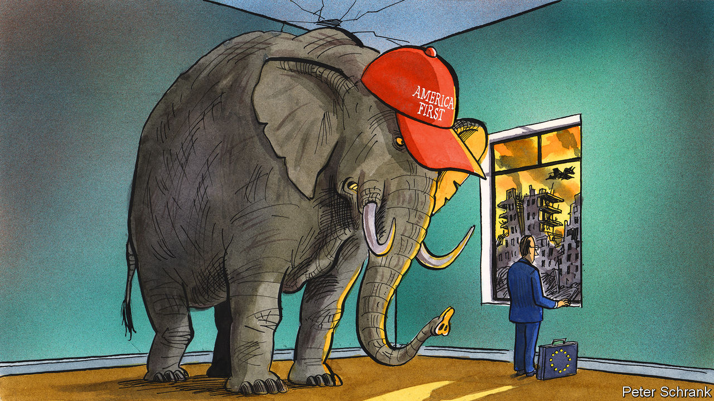

###### Charlemagne

# Europe is unprepared for what might come next in America 

##### A Trumpian revival would leave Europe exposed 

 

> Mar 30th 2023 

The West’s two biggest democracies head to the polls in 2024: the EU will vote to refresh its 705-seat parliament in the spring, before America picks a new president and Congress in November. One of these ballots will be enormously consequential for Europe, potentially reshaping its entire political landscape. The other will elect Members of the European Parliament.

A spectre is haunting Europe—the spectre of Trumpism rebooted. The nativist leanings of a president with little regard for diplomatic mores caused plenty of heartache the first time around. That was before war broke out on the continent. Now the prospect of a revival—either with Donald Trump himself, or a variant like Ron DeSantis, the governor of Florida who is his most serious challenger for the Republican nomination—is setting nerves jangling. Everyone knows trouble may be coming. Nobody can agree on what to do about it. Like a deer caught in the headlights, Europe is stuck, waiting to see what happens. 

The continent’s leaders and voters were relieved in November 2020 when Joe Biden returned the Democrats to the Oval Office. Unlike President Trump, he has not called the EU a “foe” nor idly questioned the point of NATO. He holds reassuringly boring views about climate change (ie, that it is happening). As American presidents not called Trump are wont to do, he listens to the Washington foreign-policy elite that European diplomats have schmoozed for decades. President Biden’s secretary of state, Antony Blinken, speaks impeccable French, an indication of moral deviance in Trumpian circles. The incumbent commander-in-chief rarely fails to talk up his Irish heritage. Even so, the current relationship between Europe and America is not always smooth: witness the ructions over Mr Biden’s green tax breaks, which Europe frets come with protectionist strings attached.

The most obvious concern, should America decide to strive for Trumpian greatness again, is Ukraine. In an ideal world, Russian troops would be defeated before the next presidential term starts in January 2025. Yet the mere chance of an unpredictable leader in the White House could be enough to encourage Vladimir Putin to tough out his botched invasion until then. For it is American weapons and intelligence that have kept Ukraine in the war above all else, including European aid. Trying to guess what a re-elected President Trump would do is a mug’s game; he has said he could end the war “within one day” by cutting a deal with Mr Putin (details to follow). Mr DeSantis recently termed the war a mere “territorial dispute” between Russia and Ukraine and said it was not in America’s interest to become entangled (though he reversed himself after facing a storm of criticism). Either way, Europe would have no choice but to accept Washington’s decision.

If anything, Europe’s dependence on America has deepened under Joe Biden. A year ago Constanze Stelzenmüller of Brookings, a think-tank in Washington, noted that Germany had “outsourced its security to the United States, its energy needs to Russia and its export-led growth to China.” In Europe today, says Jeremy Shapiro of the European Council on Foreign Relations, another think-tank, all three facets are increasingly in American hands. NATO remains the guardian of European security, not least since armouries from Estonia to Portugal have been emptied to bolster Ukraine. Much of the gas that used to come to Europe through Russian pipelines is now supplied from ships full of fracked American LNG. And green subsidies have turned America, not China, into the El Dorado for European companies. 

What do you do when the guarantor of your security is of dubious reliability? France, having never quite trusted America with defending its interests, has decades of experience at this game. President Emmanuel Macron pleads to all those who might listen that the EU needs to develop its own “strategic autonomy” (again: details to follow). During the Trump years he spoke of Europe being on the edge of a precipice, and NATO approaching brain death. To those with this updated Gaullist mindset things have scarcely improved under President Biden. Witness the hasty departure from Afghanistan that blindsided Europe in August 2021, or the abrupt manner Australia was flipped away from a large French submarines contract a month later. 

But French solutions to the problem of an unsteady America fall largely on deaf ears. Central Europeans in particular do not trust anyone but America with their security, least of all France or Germany. Poles and others suspect Mr Macron is pushing his own agenda, perhaps to fill French defence contractors’ order books. Right now, Europe is united over Ukraine because its various leaders are broadly on the same page as Mr Biden. If America changes tack, expect parts of Europe—but not others—to follow suit. 

Biden its time

Even a divided Europe may have a few diplomatic cards to play, no matter who sits in the White House. A Republican administration will be as hawkish on China as President Biden, if not more so. But for America to isolate its rival requires the help of Europe, which is looking merely to reduce its dependency on China, not throttle it. So far the EU is content to keep doing business there: Mr Macron will visit Xi Jinping in Beijing next week, along with the European Commission’s boss, Ursula von der Leyen. Europe’s role as balancing power could give it some sway over American thinking. 

But not much, probably. The real problem will be at home. Ever since Barack Obama announced a “pivot to Asia” over a decade ago, Europe has known it needs to spend more on its own security. Belatedly, Germany and others have promised to do so. Yet nobody thinks this will make a difference by the end (let alone the start) of the next American presidential term. So Europe will be, again, vulnerable to the whims of a superpower for which European interests are an afterthought. The continent will go into 2024 hoping for the best: it lacks the means to prepare for anything else.■


