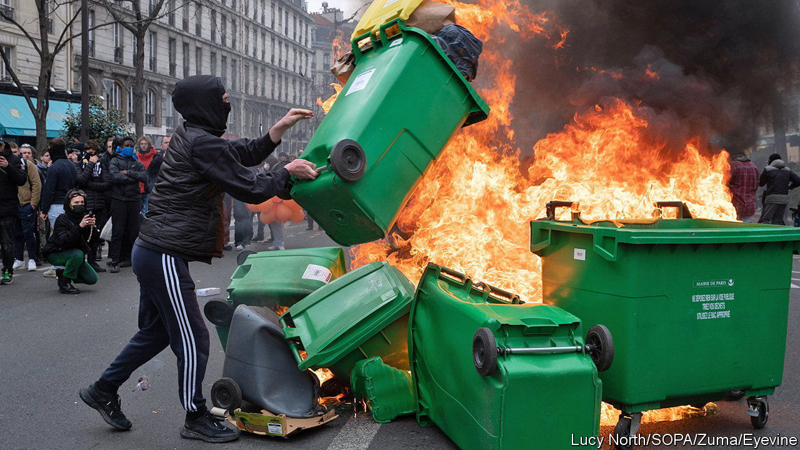

###### Impasse

# More strikes and demonstrations against French pension reform 

##### Protesters still think they can force Emmanuel Macron to back down 

 

> Mar 30th 2023 

Sausages are sizzling on open grills; a bass beat is pumping from a nearby float. “A violent desire for happiness” reads a giant red banner. The mood in Paris is festive, despite fears that this protest might yet turn violent. Those who gathered on March 28th, for the tenth one-day national strike against the French government’s decision to raise the minimum pension age from 62 years to 64, vowed not to give up. Many of them were young. 

“Yes, we are concerned about our pensions,” said Ameline, a 20-year-old law student, who was on her sixth protest. She is willing to retire two years later, but was acting out of “solidarity” with others. Joanna, aged 30, who works as a rubbish collector for the Paris town hall, had been on strike for weeks. She thinks that retirement “at 60 feels right, 64 is too much.” President Emmanuel Macron, Joanna suggested, should come down and try cleaning streets. “I would just like him to understand that the French, Parisians, are tired.”

With 740,000 demonstrators across France, turnout on March 28th was below the level five days earlier. But protests look set to continue. The next national strike has already been scheduled for April 6th. Legislation to raise the pension age may have been pushed through parliament, without a direct vote. But the Constitutional Council still needs to approve the reform. It will also rule on an opposition proposition to hold a referendum on the pension age. Its decision is due on April 14th. 

“It’s never too late,” says Mohammed, a member of the CGT, a trade union, at the Paris protest. “Macron and the government have got to listen to the  (fed-up-ness) of the people.” Anger at the president is acute. “I’m not someone who wants to burn rubbish bins,” says Catherine, who belongs to the CFDT, the country’s biggest trade union. “But his contempt is dramatic, and makes us mad.”

Mr Macron seems determined not to back down. But he is under pressure to ease the tension. The night of March 23rd saw 903 acts of arson in Paris, as anarchists, known as , joined in. Bins overflowing with stinking rubbish were torched. In Bordeaux rioters set the town-hall door alight. Across France, 457 people were arrested and 441 law officers injured, as well as uncounted numbers of protesters. The French police were accused of using excessive force. 

Elisabeth Borne, the prime minister, has agreed to talk to trade union leaders next week. It is hard, though, to see what they could agree on. Laurent Berger, head of the CFDT, wants to put the pension reform “on pause”, an idea the government rejects. His relationship with Mr Macron, which started well in 2017, has soured. “It’s nothing personal,” Mr Berger told  at the protest march this week. “But for two and a half months there have been millions of people in the street, week after week, and his response has been: no meeting, no phone call, nothing.”

The political fallout from this episode looks dark. If Mr Macron were to call fresh elections, nobody would win a majority. His centrist alliance would lose five points, getting just 22% of the first-round vote. The party set to benefit the most, with a seven-point gain to 26%, is Marine Le Pen’s hard-right National Rally. ■

