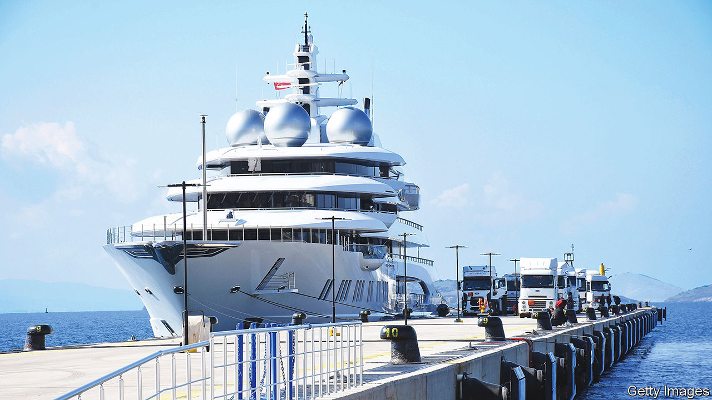

###### Stranded assets

# What to do with Russia’s abandoned luxury yachts? 

##### Seizing them was the easy part 

 

> Mar 30th 2023 


Courts in the mostly Western countries applying sanctions on Russian oligarchs have ordered the seizure of at least four of their grand yachts: the , the , the  and the But many more remain in limbo, running up maintenance and harbour fees while they are being investigated. Some of the cost of their upkeep ends up being paid by taxpayers. 

Stopping suspect boats from leaving port has proved easier for governments than conclusively demonstrating their ownership. Few suspect vessels are foolish enough to fly the Russian flag these days, and many of the oligarchs who have been placed under sanctions have long used front companies to conceal their assets. 

America’s government is examining ways to sell off the handful of yachts it has seized so far, hoping to use the money to fund Ukraine’s war effort or reconstruction. This is easier said than done. Alex Finley, a former CIA officer and now a spy novelist who has tracked the movements of suspect yachts, says that seizing assets was an important tool for destabilising Mr Putin’s support network and “the yachts are the biggest catches”. 

Nevertheless, she points out that selling off a boat the size of a football field and worth half a billion dollars is no easy feat. There are simply not a lot of potential buyers, and even fewer who might wish to gallivant about in the former property of a Russian oligarch (who might take it rather badly). Given how quickly luxury yachts deteriorate without maintenance, many could end up fetching only knock-down prices.

Frozen yachts have become a potential shipping hazard even in places where the authorities are not enforcing sanctions. The government of Antigua and Barbuda declared in March that it would amend its law to allow it to sell the , a yacht under American sanctions that has been cluttering up Falmouth Harbour since early 2022. The  allegedly belongs to Andrei Guriev, a Russian billionaire. But the vessel appears abandoned, with fuel, crew and general upkeep going unpaid for. ■

