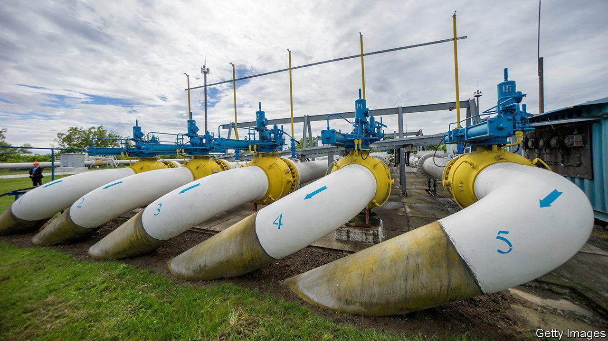

###### Vestigial network

# Why Russian oil and gas is still flowing through Ukraine 

##### Even in war, old pipelines and contracts die hard 

 

> Mar 30th 2023 


It is, as a Ukrainian energy consultant who prefers to remain nameless put it, “ironic and ridiculous”: in the midst of Russia’s savage war on Ukraine, Russian oil and gas continue to flow through Ukrainian pipelines. Before the war, Europe relied on Russia for 40-45% of its imported gas and about a quarter of its oil. Russia has since tried to bully Europe into dropping economic sanctions by throttling supplies; Europe in turn has almost entirely unplugged itself from Russian energy. But not entirely. The continuing flow is partly a hangover from the old system, and partly thanks to contract law, market reality and political expediency.

Take oil first. Last December Europe banned imports of sea-borne oil from Russia (with a few temporary exceptions). But in a concession to landlocked countries pipelines were exempted. In retaliation, Russia shut off the Northern Druzhba pipeline to Poland and Germany. Yet oil continued to flow via the Southern Druzhba pipeline through Ukraine to refineries in the Czech Republic, Slovakia and Hungary. The latter helps Vladimir Putin maintain his special relationship with Viktor Orban, Hungary’s prime minister, who consistently lobbies against EU sanctions. 

Sanctions bar these three countries from exporting the fuel they make from their Russian crude to others, with one ironic exception: they can send it to Ukraine. Ukrainian refineries, mostly in the country’s war-torn east, have been badly hit. With its ports on the Black Sea blockaded, the only other way Ukraine can get petrol is by truck or train. “In terms of a cynical military strategy, we still need this oil,” says the Ukrainian energy adviser.

Russian gas, meanwhile, has never been blocked. Yet as soon as Europe imposed sanctions, Russia began to turn off the taps. Despite the mysterious destruction of the Nord Stream pipeline in September, Russia could have supplied European customers with gas through the Ukrainian network. But when Ukraine shut down a pipeline entry point in occupied territory, Russia refused to pay full transit fees and threatened to cut off supply. Ukraine offered to reroute the gas, but Russia declined. Naftogaz, Ukraine’s state energy firm, has taken Gazprom, the Russian one, to the International Court of Arbitration to resolve the dispute.

Mr Putin’s warning that Europe would “freeze” without Russian gas never panned out: the winter was warm, and Europe found other sources. By March Russia’s share of European gas imports had fallen to a bit over 10%. About half of that is liquefied natural gas bought from a private Russian company; another quarter goes through the TurkStream pipeline to southern Europe. The rest goes through Ukraine, mostly to Slovakia and Austria. Analysts expect Russia to wind down this diminishing flow. The contract between Naftogaz and Gazprom runs out at the end of 2024, and it is hard to imagine it being renewed. 

Ukrainian officials say as long as Europeans are buying Russian gas they will honour their contract to transport it. It would not be in their interests to jeopardise European support by kicking up a fuss. Keeping Ukraine’s network open also helps European clients who are suing Gazprom for cutting them off: otherwise the Russians might argue that the Nord Stream explosion made delivery impossible.

Ukraine’s own demand for gas has been reduced, with much of its industry destroyed. The country produces almost enough for its needs. But it imports most of its oil, especially diesel for the generators it uses during blackouts—and for military vehicles. Ukraine buys diesel from various traders, and its origin is often not known. But the Ukrainian energy adviser confirms, half smiling, that a bit of the fuel powering Ukrainian tanks is probably Russian.■

