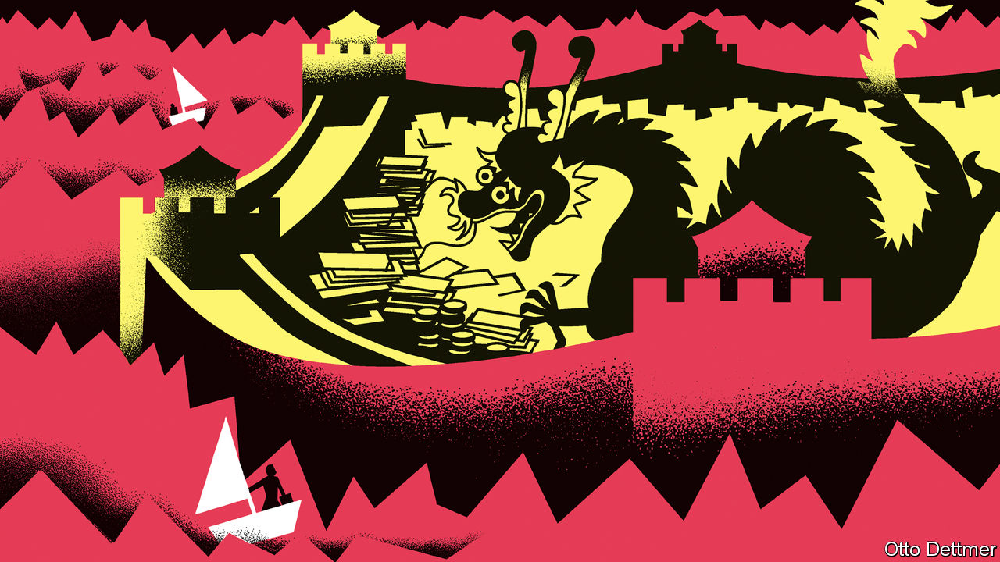

###### Free exchange

# China is now an unlikely safe haven 

##### The country’s financial risks are its own. America’s quickly become everybody else’s, too 

 

> Mar 30th 2023 

Financial crises ruin and reallocate wealth. They also reallocate worry. Investors find themselves agonising about things they never used to fret about. Worse, they fret about things they never used to think about. One example is money in the bank. The collapse of Silicon Valley Bank (svb) in America has made depositors newly familiar with the nature and limits of claims they previously took for granted.

America’s worries have quickly spread elsewhere, too. Emerging-market investors, for example, have begun to rethink the countries in which they invest, scrutinising them through svb-tinted spectacles. They are wondering which markets are most exposed to financial jitters and slower growth in America, and which share similar vulnerabilities. What countries, for example, are suffering from stubborn inflation, rapid monetary tightening and sharp drops in bond prices? And where in the developing world do depositors look a bit flighty? Through this lens, one emerging market looks surprisingly robust. Whisper it, but could China offer a safe haven to global investors in a time of banking turmoil? 

On the face of it, the question is absurd. Only a year ago prominent voices were calling China “uninvestible”. Anyone venturing their money in the country must worry about a new cold war between China and its most important trading partners. That includes the prospect of crippling financial sanctions and suffocating export controls on China’s most sophisticated firms. 

Needless to say, the country poses home-grown dangers as well. Uncreditworthy property developers remain a financial concern. The Communist Party’s  has terrified its best-known entrepreneurs and wealthiest families, many of whom are eager to move money out of the country. The appearance of Jack Ma, founder of Alibaba, in his home town this week perhaps offers some reassurance. But in a normal country investors do not crave visual proof that the nation’s most celebrated entrepreneur is welcome in his homeland. 

China also has banking vulnerabilities of its own. Smaller regional lenders, including more than 120 city commercial banks and thousands of rural lenders, are not as robust as the rest of the system. They struggle to compete with bigger banks for deposits and find it hard to resist pressure from local governments to lend to white elephants. Investors must also remember the country’s approach to covid-19. Policymaking managed to be both obstinate and capricious, inflexible and unpredictable. 

And yet China has several macroeconomic and financial peculiarities that look like strengths in the current turmoil. The eccentric commitment to the country’s zero-covid policy has thrown its economic cycle out of sync with the rest of the world. It thus represents a natural “growth hedge”, according to Xiangrong Yu, Xinyu Ji and Yuanliu Hu of Citigroup, a bank. China may be the only big economy that grows faster this year than last, they point out. This means the growth gap between China and America could widen to five percentage points, according to the Economist Intelligence Unit, our sister company. 

These same pandemic restrictions also kept a lid on price pressures. Consumer prices rose by only 1% in February, compared with a year earlier, a number that would seem to belong to a lost era in much of the world. China is the land that inflation forgot. Thus its central bank has not felt compelled to raise interest rates in a hurry. Indeed, it eased policy in March, cutting reserve requirements by 0.25 percentage points for most banks.

Bond prices did wobble during the chaotic abandonment of the zero-covid policy. But in China, unlike in America, Europe or most emerging economies, yields remain lower now than at the end of 2020. Moreover, instead of triggering a run on the banks, the bond sell-off accelerated a run into them. People who lost money on wealth-management products, which invested in bonds, fled into deposits. The economists at Citi reckon that household deposits now exceed pre-pandemic trends by 15.4trn yuan ($2.2trn). 

China is not only at a different stage of the business cycle; it is also at a different stage in the financial cycle of fear and complacency. svb’s swift collapse was so damaging partly because it was so unexpected. In China the dangers posed by regional lenders are well understood, representing grey rhinos not black swans. 

China’s regulators are now in a cautious mood, rather than a hawkish one. They are aware of financial risks faced by regional banks but keen not to precipitate them. If another regional lender gets into trouble, they may show more forbearance than they have previously displayed. The authorities will not want to let anything interrupt an economic recovery that is still only a few months old. The central government “will likely do everything it can to evince an aura of stability”, writes Houze Song of MacroPolo, a think-tank, even if that requires “quiet, below-the-radar bail-outs” of some vulnerable borrowers. This offers an attractive window for investors. The authorities are neither blind to banking risks nor inconveniently keen to crystallise them in the immediate future. 

Both sides of the great wall

Even the new cold war may not undermine the case for China as a hedge. In the Asia-Pacific region, the country’s onshore stocks are already among the least sensitive to American growth or financial conditions, according to Goldman Sachs, a bank. America’s efforts to decouple from China and China’s offsetting efforts to encourage self-reliance could untether the market’s fortunes from America still further. That will weaken China’s efficiency but increase its resilience. The country will become a less attractive source of growth but a more useful source of diversification.

China has risks of its own. But that is the point. China’s financial risks are its own, whereas America’s quickly become everybody else’s, too. Risks with Chinese characteristics could offer some respite from risks with global characteristics. ■


