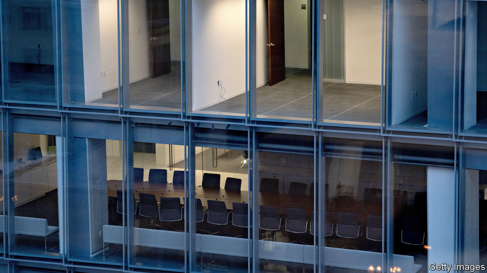

###### The next shoe to drop

# Commercial-property losses will add to banks’ woes 

##### Real-estate investors see a hellish-perfect-dumpster-fire-storm 

 

> Mar 29th 2023 

Ask an investor to describe the outlook for commercial property and you will get a colourful response. “Office is a dumpster fire,” says Daniel McNamara of Polpo, an investment fund. His view of the wider market, which includes shops and warehouses, is only a little less grim: “It really is the perfect storm.” Tom Capasse of Waterfall Asset Management, an investment firm, has nicknamed places where the tech bubble has burst, including San Francisco and Seattle, “office hell.” 

A combination of nasty events has produced this hellish-perfect-dumpster-fire-storm. The lingering impact of covid-19, which kept shoppers away from malls and workers at home, has undermined the value of shopping centres and offices; all real-estate valuations are undermined by higher interest rates, which push up landlords’ expenses. These woes have been added to by the recent banking turmoil and fears of a recession in which workers are laid off and their former employers downsize. 

 


The situation poses a problem for two big, intertwined American industries. The first is property, where owners are grappling with the idea that the office buildings they own—uncomfortably empty and unlikely to fill up again—might be worth only half what they paid for them. The second is their financiers. When Brookfield, an asset manager, recently decided it would be better off handing over the keys of two vast office towers in Los Angeles, rather than refinancing the $784m of loans it owed on them, it handed the keys over to Citigroup and Morgan Stanley, two big banks.

No commercial-property sector looks insulated. “Even in warehousing you have seen firms like Amazon admit they overspent and overbuilt,” says Mr McNamara. But the real concern is office space, which makes up around a quarter of total commercial property (and its debts) in America, because “it is not a cyclical issue”.

Vacancy rates have risen in all but the best offices. Landlords are offering generous incentives to lure skittish tenants. In San Francisco more than 29% of offices are empty, nearly eight times the pre-pandemic level. Asking rents in the city, which has seen the biggest jump in vacancies across America, are down by 15% compared with 2019. As these buildings can have high costs to run, in part owing to property taxes, even a small dip in rents or occupancy can turn a building into a lossmaker. 

Some landlords may be unable, or unwilling, to hang on to these properties. They may be unable if they cannot roll over their loans. Around 15% of outstanding commercial-property debts across all lender types in America are maturing this year, reports Kevin Fagan of Moody’s Analytics, a research firm. Of these, he thinks about 40% might have trouble refinancing. Landlords may be unwilling if the buildings involved are clearly worth less than the value of the loan. There are examples of “bigger sponsors pre-emptively giving back the keys even a year before loans were due to expire,” notes Mr Capasse.

At the end of 2022, the commercial-property industry owed $5.6trn in debt to investors and financial institutions. According to Trepp, a data provider, half of this was to banks. Brookfield and funds of its size might need to repay big institutions, but the vast majority are on the hook to lenders with below $250bn in assets—ones which are already under severe stress after the collapse of Silicon Valley Bank.

The danger is that banks end up with lots of offices, which they have to sell at deep discounts. This will bring back memories of the global financial crisis of 2007-09. But there are reasons to think history will not repeat. First, commercial property is worth just half as much as residential real estate, which is where problems were last time around. Second, lax lending saw banks grant mortgages worth as much as 100% of a home’s value before the financial crisis. Commercial-property lenders, by contrast, offer a borrower a maximum 75% mortgage, meaning prices will have to fall much further for banks to face losses. 

Even the worst-case scenario would have limited impact. Roughly a quarter of the $2.2trn of commercial-property loans owed to small banks are office loans. Imagine that landlords hand back the keys on half these loans this year—some $280bn in total. If banks could recover just half the value of the loans by selling off the assets at deep discounts (say, a third of their value three years ago) they would be wearing losses of $140bn. That is just 10% of the equity capital that small banks hold. The blow would be unevenly distributed, however, and could imperil some institutions.

The office apocalypse

There remains the question of what happens to buildings no one wants to work in anymore. Many offices already need sprucing up. And building costs are sky-high, thanks to material and labour shortages, as well as new laws around the world which seek to make buildings greener. Energy-efficiency rules in England and Wales, for example, will make it unlawful to let one in twelve buildings in London from April 1st, unless landlords upgrade them. 

Ryan Williams of Cadre, a property-investment platform, foresees two paths. The first is a “fundamental repricing, where the banks take back the keys and sell assets at a huge discount”. This might allow new buyers to adapt, upgrading or maintaining buildings so that they suit lower occupancies. In the second, local officials step in: “It is not in the interest of [many cities] to see a whole street of lower-tier office buildings become blighted, so governments may start to offer incentives to renovate or convert.” In some places, this kind of adaptation is already happening. Look out of the windows at ’s office in Washington and on any given weekday a handful of builders are busy converting the old Vanguard building, an office that once housed the Peace Corps, into a block of shiny new apartments. ■


