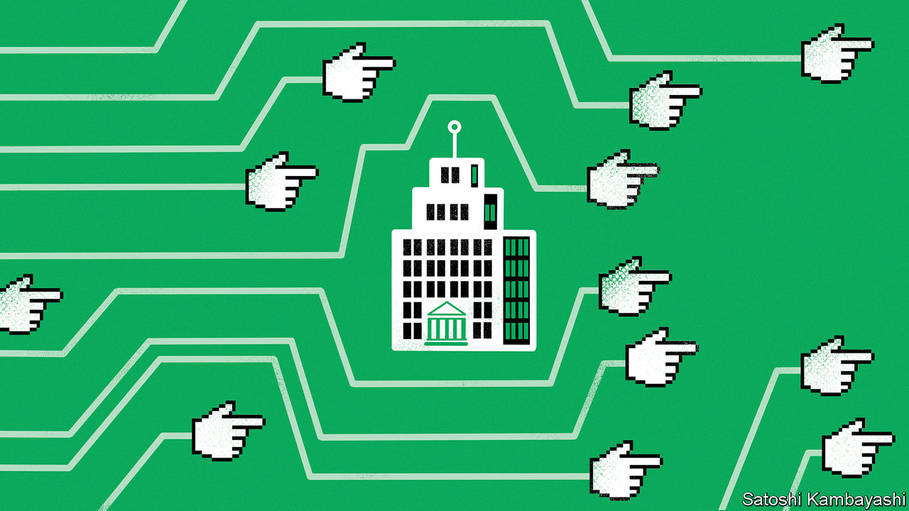

###### Buttonwood

# Did social media cause the banking panic? 

##### New technology does more than just speed up financial wobbles 

 

> Mar 30th 2023 

The banking turmoil that has sent a handful of American and European lenders to the wall in recent weeks has a new feature. Use of social media and messaging apps, which spread information at lightning pace to an ever-larger group of panickers, marks a break from past crises. Meanwhile, new digital-finance tools let nervous depositors withdraw funds as soon as the notion strikes them, whether from offices in San Francisco or ski slopes in Saint Moritz. 

After the fall of Silicon Valley Bank, the idea of faster bank runs is understandably causing concern among analysts and legislators. Yet the wave of new tech in the past decade and a bit is by no means the first to change behaviour. Previous examples suggest something of a pattern: innovations initially help facilitate a boom, contributing to exuberance based on a sense of futuristic possibility, before speeding up and magnifying the eventual bust. History also suggests that recent technological changes may have a deeper impact, reshaping markets in the long run, too.

From the 1840s onwards, America was blanketed by the electric telegraph, which transmitted messages by overhead wires, connecting previously disparate financial markets in Boston, Chicago, New York and Philadelphia. In 1866 reliable communication became possible between America and Europe as well, thanks to an undersea telegraph cable. Historians credit these new methods of transmitting financial information with smoothing out pricing inefficiencies. The gap between American and British cotton prices dropped by a third, for example, and volatility also declined. The new form of communication was significant enough to have left a legacy. Among currency traders, the sterling-dollar exchange rate is still known informally as “cable”.

But efficiency often comes at a cost. In the 19th century, communication by cable was expensive and limited, and the information received at risk of manipulation by those transmitting it. During the panic of 1873, correspondents at  went back and forth about whether the debilitating effects of new technologies, spreading panic from one market to another, outweighed the positives. A century later, new technology again provoked worries during a market crash in October 1987. The Brady Commission, which later investigated the slump in America, found that electronic communication across borders exacerbated problems. Traders and regulators believed they were in the more insulated, national markets of the past. They were not. 

The effect that technological breakthroughs have on banking crises is just one way they transform financial markets, however. John Handel, an economic historian at the University of Virginia, notes that increasingly widespread use of ticker tape—a more advanced form of telegraph-transmitted messaging—in late-19th-century finance enhanced the power of the institutions that monopolised it. The London Stock Exchange and the Exchange Telegraph Company, which was licensed to transmit data from the exchange, were beneficiaries. This helped formalise the role of the stock exchanges in global financial markets.

Historically, banks have benefited from high transaction costs and the low financial literacy of customers, which together have kept depositors from moving too much money into higher-yielding money-market funds. Today new communications tech and digital finance mean the investing populace is both more aware of the alternatives to bank deposits and has more opportunity to invest in them. Recent research by academics at Columbia, Peking and Stanford universities notes that Chinese banks where depositors have more exposure to Yu’ebao, an online investment platform offering money-market-fund investments, see more withdrawals from customers. New tech might have helped facilitate the surge of almost $300bn into American money-market funds in March, further destabilising banks.

Innovation has sped up sudden market wobbles, truncating panics that would have taken months in the 19th century to weeks. In the modern era, timelines have contracted further, from weeks to days or even hours. Yet this may turn out to be just one of the ways in which frictionless trading and freely available information, of varying quality, affect finance in years to come. The profits banks have enjoyed for decades—or centuries—thanks to high transactions costs and low financial literacy might also become harder to sustain. ■


