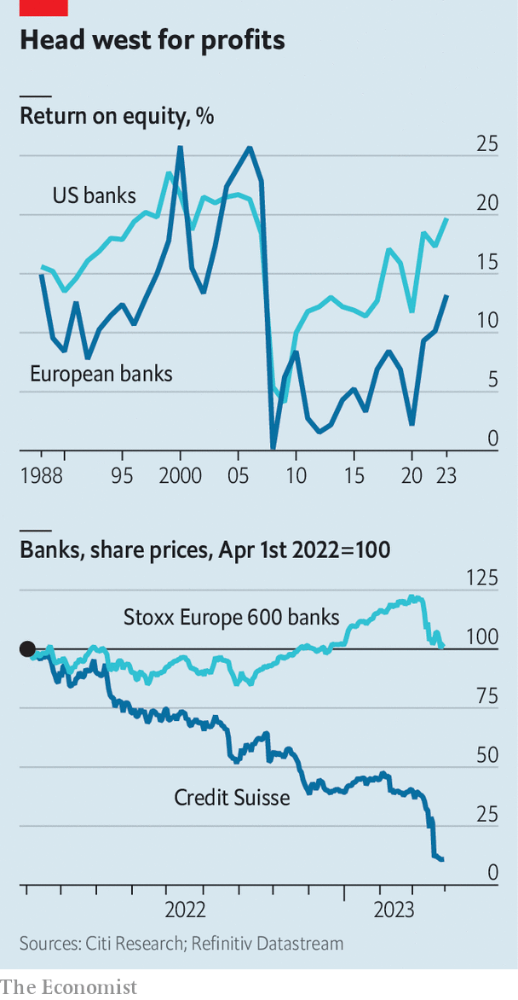

###### Credit where it’s dull

# European banks and the price of safety 

##### Investors are anxious that troubles elsewhere could contaminate euro-zone lenders 

 

> Mar 30th 2023 

“Greece is not Switzerland,” quipped an analyst on March 20th after the Greek central-bank governor assured investors his country’s banks would not suffer from the implosion of Credit Suisse the weekend before. Investors are anxious that troubles could contaminate euro-zone lenders. Their share prices have sunk since March 9th and are still volatile. 

That is a disappointment. After being struck by the global financial crisis of 2007-09 and the sovereign-debt crises shortly after, the euro zone’s big banks were brought under the supervision of the European Central Bank (ecb). As rules were toughened and dud assets flushed, banks became boring but more resilient. Now, “it seems the market is sifting through one balance-sheet after another”, frets a mover and shaker. Three risks stand out. 

 


The most immediate is a liquidity crunch. In September liquid assets held by European banks stood well above 150% of what regulators assume a deposit outflow in a crunch month would involve. But the speed at which deposits were whisked from Silicon Valley Bank and Credit Suisse suggests such assumptions are too rosy. It does not help that the data European banks disclose on the nature of their deposits is less detailed than in America, prompting some investors to assume the worst. 

Thankfully, a vast chunk of deposits is held by households, which are mostly insured. Those that are not tend to belong to a diverse array of firms, rather than a coterie of depositors who mimic each other, such as Swiss family offices or Silicon Valley startups. Europe also lacks money markets of the same depth and ease of access as Uncle Sam’s, so there are few liquid, lucrative alternatives to bank accounts. This is why most corporate overnight deposits that have been withdrawn—some €300bn ($325bn) since the summer—re-entered banks as “term” deposits, in less flexible accounts that offer higher returns.

A second threat to European banks is deteriorating assets. Here, too, the danger seems manageable. Like bonds, the value of existing loans on banks’ books diminishes when interest rates rise. But regulators in Europe have forced banks, big and small, to buy hedges against that risk. 

The third is that borrowers fail to honour their dues. Investors particularly worry about credit extended to owners of commercial property. Rising interest rates and a worsening economic outlook are putting pressure on prices and rents at a time when owners have to pay more to service debts. The saving grace is that European banks are less exposed to commercial property than American ones. 

As the economy stalls, a wider range of loans may sour. But banks now have ample capital buffers to absorb losses. Between 2015 and September 2022, the share of core equity funding of banks increased from 12.7% to 14.7% of their risk-weighted assets, well above the 10.7% threshold required by regulators. Some made provisions for loan losses during covid-19, which could be repurposed to absorb new losses. A chunk of corporate loans also remains under government guarantee.

This leaves euro-zone banks with a painfully familiar problem: they make too little money. The issue has dogged them since the 2010s, when a heap of foul assets, low interest rates, anaemic economic growth and stricter rules constrained both margins and revenues. In 2022 it had seemed as if things were finally improving, as rising rates boosted banks’ profits. That year the sector posted its first double-digit return on equity in 14 years.

But these cash-filled dreams are fading. One reason for this is that rates will probably peak sooner and lower than expected just weeks ago, as central bankers adjust to banking fragility and a slowing economy. This will depress banks’ revenues. At the same time, funding costs are expected to rise. Depositors are hunting for better yields, forcing banks to offer juicier rewards. Meanwhile, investors in banks’ Additional-Tier 1 bond will demand higher premiums after some were wiped out during ubs’s takeover of Credit Suisse.

These pressures will squeeze net interest margins—just when other costs threaten to dent bank profits. Wages, which represent 60% of overall bank costs, have yet to fully catch up with inflation. The premiums banks pay for deposit insurance will probably rise, too. JPMorgan Chase, a bank, predicts such costs alone could trim returns on tangible equity by one percentage point. Watchdogs may also tighten rules to make sure institutions can withstand rapid bank runs facilitated by digital banking and social media. 

All told, returns on equity of 10% or less are probably European banking’s future. That is not the end of the world. Such returns are enough for banks’ balance-sheets to grow at 2-3% a year, meaning customers need not expect credit to be rationed soon, says Ronit Ghose of Citigroup, another bank. Core services like digital banking should not be starved of investment. For shareholders it will be like investing in a utility—nice dividends, but little action. 

The downside is that racier firms, such as startups, will have to look elsewhere for funding, pushing risk to darker corners of the financial system. Punters hoping for hefty returns will be disappointed. To avoid bottom-line boredom—in both good ways and bad—investors might keep looking across the pond. ■


