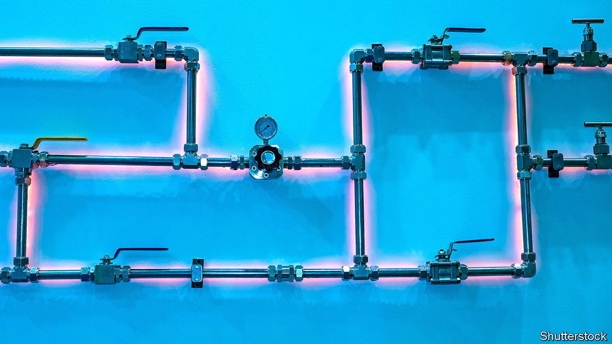
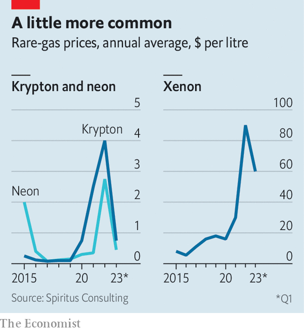

###### Neon lights, shining bright

# How rare-gas supply adapted to Russia’s war 

##### Against expectations, firms avoided disruption and chaos 

 

> Mar 30th 2023 


The war in Ukraine has reconfigured global flows of oil and gas. Less visible has been its impact on another supply chain: that of the so-called rare gases—neon, krypton and xenon—which are used in everything from chipmaking to medicine to space propulsion. Russia and Ukraine have long been big suppliers, accounting for about 40-50% of the global supply of neon before the conflict, and 25-30% of xenon and krypton, according to John Raquet of Spiritus Consulting, an industrial-gas specialist. At times, their share of the supply of neon has been as high as 70%.

Hence the concern, after Russia’s invasion, about disturbance to chipmakers, which use neon in the lasers that etch circuit patterns onto silicon wafers, and in turn supply other industries. The Joint Research Centre, the European Commission’s scientific-advisory body, warned of “severe” disruption, and noted a shortage of neon could “substantially impact industrial supply chains reliant on semiconductors”. Worse, as the war began, the semiconductor industry was seeking to ramp up output to meet post-pandemic demand. A year later, however, it is clear that chaos has been avoided. What went right?

 


Krypton, neon and xenon are by-products of air separation, an industrial process used in steelmaking to extract oxygen and nitrogen from the atmosphere. This allows the recovery of leftover mixtures, from which the gases can be extracted at specialist purification facilities. In the 1980s the Soviet Union built air-separation plants at steel mills in Russia and Ukraine. Its aim was to produce gases for use in military lasers, to compete with America’s “Star Wars” programme. After the Soviet Union fell, Russia and Ukraine became global suppliers of rare gases. Even after Russia’s annexation of Crimea in 2014, Russian steel mills continued to send rare-gas mixtures to Ukraine for purification.

This flow stopped after Russia’s invasion last year. The conflict also affected the operation of steel mills in Ukraine. As a result, rare-gas purifiers in Ukraine have been running at a fraction of full capacity. At the same time, sanctions have limited exports from Russia. The drop in supply caused a surge in wholesale prices, particularly of xenon, which went from $15 a litre in 2020 to more than $100 in mid-2022.

In response, chipmakers drew on their rare-gas reserves and invested in technology that enables recycling. Other buyers cut usage or switched to alternatives. Xenon is sometimes used as an anaesthetic, for example, but less so if the price is high, when it is replaced by gases including nitrous oxide. Other gases, such as argon or nitrogen, can be used in place of krypton in triple-glazed windows. Krypton and xenon are used as propellant in satellite thrusters, but the latest Starlink satellites launched by SpaceX now use argon instead.

Retrofitting air-separation plants with taps that allow rare-gas mixtures to be extracted is costly and halts production for two or three months. But new plants are being built with the taps installed, which will increase future supply. Meanwhile, Russia diverted exports to China, which then had a surplus, and began exporting its own production. In Japan, says Koizumi Yoshiki, president of , an industrial-gas journal, efforts are under way to boost domestic production through a mixture of retrofitting and new plants. South Korea, another chipmaking hub, aims to become self-sufficient in rare gases in the next couple of years, notes Mr Raquet.

Collectively, these efforts to reduce consumption and boost supply have stabilised the market. Prices have fallen from their highs; a litre of xenon now costs around $45. Media coverage of the warnings helped, says Dan Hutcheson of TechInsights, a consulting firm. Along with rising prices, it delivered a “one-two punch”, he notes, that spurred companies to take rapid action. At the same time, demand fell. By mid-2022 it was clear that the chip shortage was turning into a glut.

Supply chains have been reinforced and suppliers diversified, meaning the rare-gas industry is now much less vulnerable to geopolitical risk. Companies of all kinds have been paying more attention to their supply chains lately, in response to upsets caused by trade disputes, covid-19 and the war in Ukraine. Firms make the headlines when they fail to cope with disruption. As the rare-gas industry shows, few people notice when they succeed. ■


