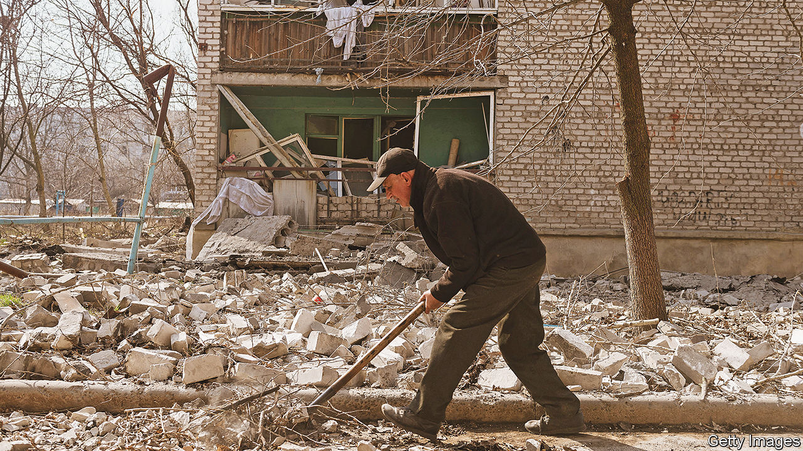

###### Funding conflict

# Western lenders may regret forcing Ukraine to turn to the IMF 

##### The worst outcome would be crippling the country with debts while it is still at war 

 

> Mar 30th 2023 


War is tearing apart Ukraine’s economy. Last year the country’s gdp fell by 30%; a ballooning budget deficit forced the central bank to print billions of hryvnia and devalue the currency. On March 21st the imf announced Ukraine would receive the seventh-biggest bail-out in the fund’s 79-year history. The country is set to receive $15.6bn over the next four years through an emergency programme that may be approved by the imf’s board (on which Russia has a seat) next week.

Although a huge sum for the fund, this is still nowhere near enough for Ukraine. The country estimates that to continue financing the war this year, it will need $39.5bn more than it expects to receive from tax and aid, a shortfall equivalent to 9% of gdp. The imf is expected to release at most $5bn this year. The rest, it says, should come from the likes of America, Europe and the World Bank. Such donors have stumped up at least $34bn in grants and loans at cheap interest rates since the war began. The hope is that the imf’s involvement, which includes a stress test of Ukraine’s economy and its debts, will coax them into providing more. 

Even if Ukraine cobbles enough together to fill the gap, there is the matter of repayment. Borrowing from the imf is expensive—more so than from other donors. As a middle-income country, Ukraine has to pay a basic interest rate of 3.5%. Every time it receives a disbursement, the fund charges an additional half a percentage point for administrative costs. And because Ukraine is borrowing so much, it is liable for surcharges. These are payments intended to discourage countries from seeking more than they require from the fund. By the time Ukraine has received its full package, surcharges will probably tack on an extra three percentage points to its interest bill. All told, Ukraine’s government could rack up rates of 7.5-8%.

Surcharges are not the end of the attached strings. All imf loans come with economic prescriptions. On paper these should boost growth and fiscal discipline, helping the borrowing country to repay its debts. The fund has struggled to adapt its bread-and-butter prescriptions for misbehaving economies to an economy under siege. Some of its suggestions may prove useful. After getting into a scuffle with the government last year about printing money, the central bank will welcome the fund’s demand that no more printing take place. Other reforms, such as a commitment to reactivate domestic debt markets, are admirable, if a little difficult to get going while bombs fall. But the imf’s most substantial reforms typically revolve around restraining spending, which is simply not an option so long as Ukraine is at war. So far, the fund has said it plans to recommend fiscal reforms, but stayed vague on the details. Given that it has a reputation for heavy-handedness, any missteps in Ukraine could prove disastrous. 

Although these risks in theory should be incorporated into the imf’s stress tests, the fund’s forward-looking analysis is easily thrown off balance. Predicting the future of any crashing economy is tricky. Nailing down what Ukraine’s economy, caught in an invasion, might look like in a year, let alone at the end of the four that the programme covers, is even more difficult. At the moment, the fund has a four-percentage-point range of expectations for gdp growth in 2023, from -3% to 1%. If Ukraine’s fortunes fall at the lower end of the spectrum, or below, the worry is that the fund will have wildly overestimated its ability to repay. The nightmare would be crippling the country with debts while it is still at war, or just beginning to recover.

“There needs to be economic support for Ukraine but its allies should have borne the risk, not the imf,” argues Mark Malloch-Brown of the Open Society Foundations, a campaign group, “and done so with grants instead of letting Ukraine rack up debt.” For some, the fund is bringing back memories of the last time it lent at scale in Europe: bail-outs to Greece, Ireland and Portugal in the wake of the euro-zone crisis. Just as France and Germany did too little then, Kyiv’s allies are doing too little today. Ukraine will bear the cost. ■


