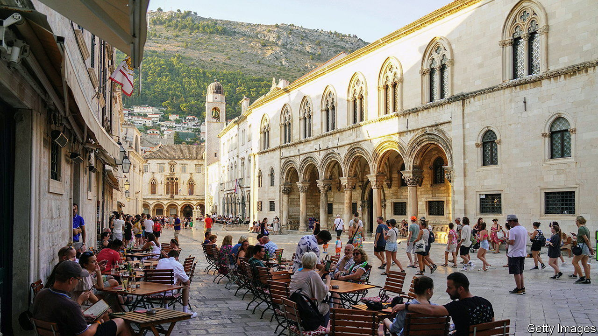

###### Losing its bite

# Which countries have escaped the middle-income trap? 

##### Progress is more noticeable in the Gulf than Africa 

 

> Mar 30th 2023 

Over the past half-century, many promising economies have become ensnared in middle-income mediocrity. To help its biggest client avoid this fate, the World Bank published a flagship report ten years ago entitled “China 2030”. The publication warned of the “middle-income trap”, a term to describe the phenomenon. “Of 101 middle-income economies in 1960, only 13 became high-income by 2008,” it claimed. This striking statistic was illustrated with a chart similar to the one below. A decade later, how has the picture changed? 

Answering the question depends on the definition of middle-income employed. According to the World Bank’s official classifications, a country becomes high-income only when its gdp per person exceeds around $13,200. By that standard, China looks set to escape the middle-income trap in a year or two. But for the purposes of the “China 2030” chart, the bank adopted a more stringent definition: middle-income countries have a gdp per person, at purchasing-power parity, of between roughly 5% and 43% of America’s. 


The “China 2030” chart drew on historical gdp statistics prepared by Angus Maddison, an economist. His colleagues and successors have since revised and updated the estimates to 2018. We have further updated them to 2022 using figures from the Economist Intelligence Unit, our sister organisation. 

The result is that 23 countries which were middle-income in 1960 now qualify as high-income—more progress than one might have expected over the past difficult decade. Graduates include three countries in the Gulf (Bahrain, Oman and Saudi Arabia) and six members of the eu (Croatia, Cyprus, Hungary, Malta, Poland and Slovenia). Malaysia has joined the Asian tigers in the high-income bracket. The Seychelles, an island nation off Africa, has also crossed the threshold. Unfortunately, two other countries in the region, Equatorial Guinea and Mauritius, which were considered high-income in 2008, have moved in the other direction.

The list could in fact be expanded further. Seven countries that are now high-income by the “China 2030” definition did not exist as sovereign nations in 1960, so do not appear on the chart. These include the Czech and Slovak republics, as well as several former members of the Soviet Union: Estonia, Kazakhstan, Lithuania, Latvia and Turkmenistan.

The country that once dominated them, Russia, also moved from middle-income in 1960 to high-income in 2022. Its economy has withstood Vladimir Putin’s war better than expected. Yet its gdp per person could fall below the high-income threshold this year. A Russian reformer once quipped that his country had been trapped in middle-income for two centuries. Mr Putin is doing his best to return it to that state.■


