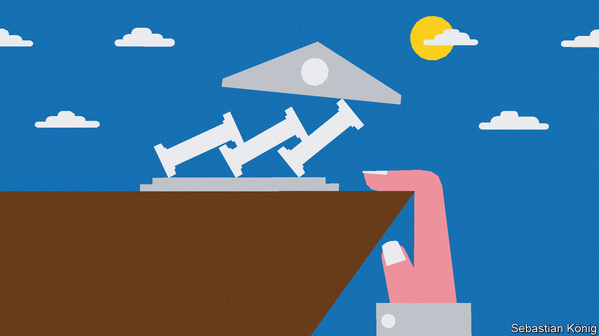
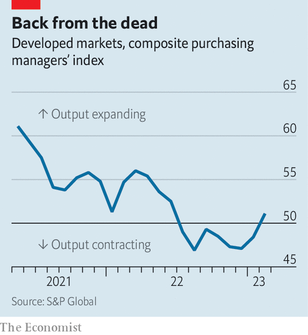
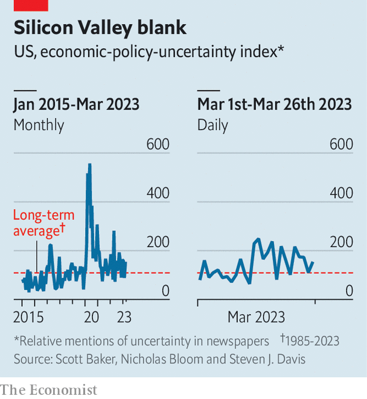
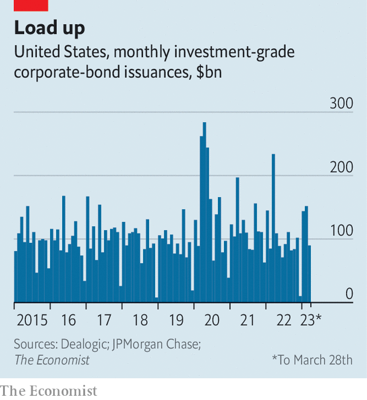

###### Dime turners

# Will the recent banking chaos lead to an economic crash? 

##### So far, people seem remarkably blasé 

 

> Mar 28th 2023 

How quickly things change. Not long ago analysts thought the global economy was powering ahead; now they worry about a deep recession caused by fallout from the banking turmoil. “From no landing to hard landing”, as Torsten Slok of Apollo Global Management, an asset manager, has written. Analysts at JPMorgan Chase—better at economics than metaphors, one hopes—say that “a soft landing now looks unlikely, with the airplane in a tailspin (lack of market confidence) and engines about to turn off (bank lending)”. 

Evidence from before the  suggested global gdp was increasing at an annualised rate of 3%. In rich countries, job markets were on fire. So far there is scant evidence of a shift in “real-time” data towards slower growth. A “current-activity indicator” produced by Goldman Sachs, a bank, derived from a variety of high-frequency measures, looks steady. Purchasing-manager indices showed a slight improvement in March. Weekly measures of gdp produced by the oecd, a rich-country club, are holding up. ubs, another bank, tracks global gdp growth as priced by financial markets (in prices of oil and cyclical shares, for example). This currently indicates growth of 3.4%, versus 3.7% before  (svb) collapsed.

 


It is still early days. Pain may be on the way. As the JPMorgan analysts noted, economists have two worries. One is uncertainty. If people fear a banking crisis and the accompanying economic pain, they may cut consumption and investment. The other relates to credit. Financial institutions, fearing losses, may pull back on lending, depriving firms of capital. Fortunately, there is reason to think recent turmoil will have less impact than many fear. 

Take uncertainty first. imf research published in 2013 finds that leaps in uncertainty—caused by things like America’s invasion of Iraq and bank collapses—can trim annual gdp growth by 0.5 percentage points, largely because firms delay investment. If such a hit were to materialise, global growth would fall from 3% to 2.5%. 

Yet unless the turmoil continues, the impact is unlikely to be that significant—because bank collapses have made surprisingly little impression. A survey by Ipsos, a pollster, found that from early to mid March American consumer confidence grew a bit, even as startups in Silicon Valley worried their cash would vanish. An “uncertainty index” derived from analysis of newspapers by Nick Bloom of Stanford University and colleagues rose a little when the turmoil began, but is drifting back down. German business sentiment improved in March. Google searches for terms related to “banking crisis” jumped in early March, but have also fallen again. 

It is hard to say why people are so blasé. Perhaps after pestilence and war, ructions in the banking industry seem more manageable. Or perhaps people think governments will step in to protect them.

Many economists worry more about the second problem: credit. If firms cannot get their hands on finance, they cannot grow so easily. On March 22nd Jerome Powell, chairman of the Federal Reserve, referred to a “very large body of literature” when asked about the connection between tighter credit conditions and economic activity. In the years after the global financial crisis of 2007-09, broken credit markets held back both the short-term economic recovery and long-term productivity growth.

 


After the fall of svb, capital markets froze. From March 11th to 19th American firms issued no new investment-grade bonds, having issued a daily average of $5bn in January and February. This caused consternation. Fewer people noticed when the market picked up. In recent days Brown-Forman, which makes Jack Daniel’s whiskey, and NiSource, a utility firm, have raised lots of money. Although spreads on corporate bonds rose a little after the collapse of svb, they too have fallen back in recent days. Companies may have briefly held off issuing new debt to check that the coast was clear. But it seems likely March 2023 will turn out to be a fairly average month for corporate-debt issuance.

 


Damage to banks will prove more consequential. Since the start of March global banks’ share prices have tumbled by more than 10%. Research suggests falling share prices tend to hit loan growth. Banks may also cut lending if they see deposit outflows, or need to raise capital because investors doubt their safety. Indeed, many already appear to be tightening standards. The hit to lending implies a growth drag of 0.4 percentage points in both America and the euro area, according to Goldman Sachs. The turmoil may have hurt American banks more, but the euro-zone economy is more dependent on bank lending. This could cut global growth yet further, from 2.5% to something more like 2%.

Although the recent banking turmoil is hardly good news, it is unlikely to push the world economy over the edge. True, another rotten bank could cause a downward spiral. Lenders will take time to rebuild balance-sheets. Rising interest rates will continue to impede growth until central bankers judge their work done. But there are forces working in the other direction, too. One is the rebound of China. Economists expect the world’s second-largest economy to grow by over 7% year on year in the second quarter of the year. Meanwhile, supply-chain bottlenecks have mostly eased and energy prices have fallen. Do not be surprised if the world economy’s unusual resilience continues. ■


