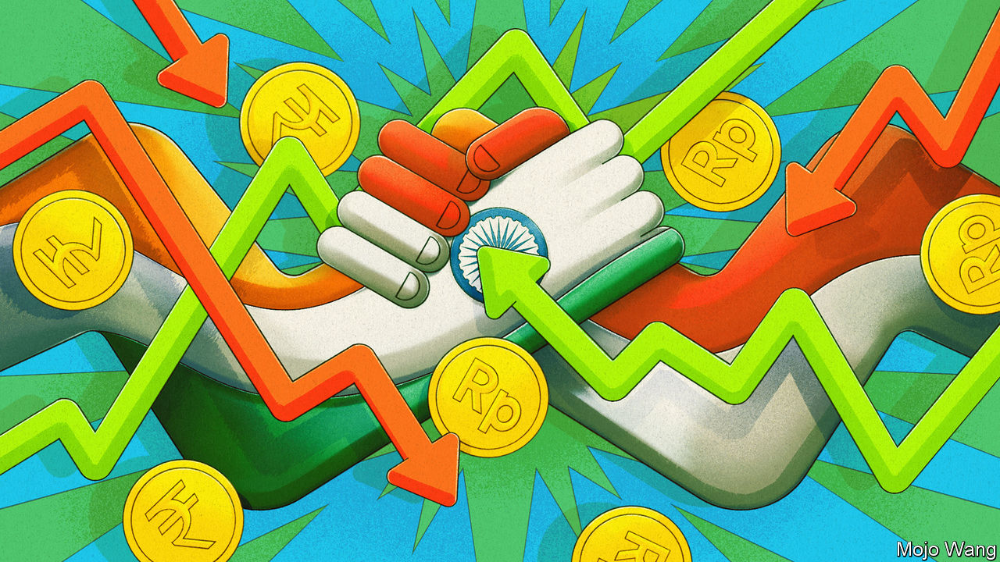
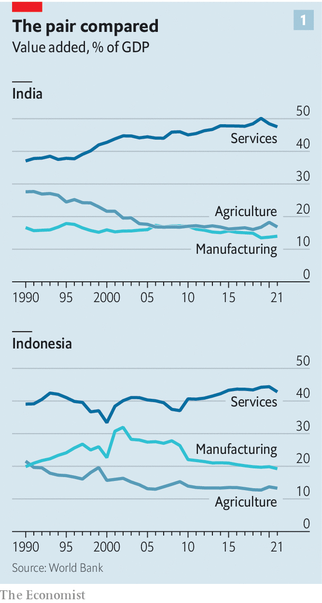
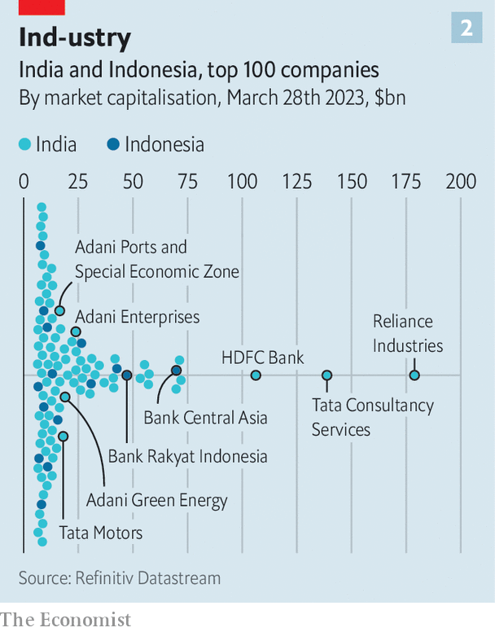
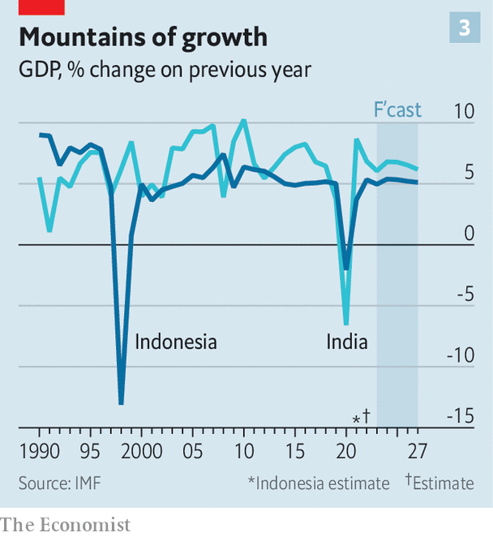

###### Asia’s greatest race

# Which will grow faster: India or Indonesia? 

##### Both countries are pioneering new ways to get rich in a troubled world 

 

> Mar 29th 2023 

If you are looking for growth opportunities among the world’s 20 biggest economies, two stand out: India and Indonesia. The Asian giants, with a combined population of 1.7bn, are forecast by the imf to be the two fastest-growing top-20 economies in 2023, and over the next five years. Both are pioneering strategies for getting richer in an era of de-globalisation, fraught geopolitics, automation and energy shifts, even as they seek a political formula that wins elections and avoids social unrest. Whether they succeed matters not just for their people and the investors betting many billions of dollars on them. It will also set an example for scores of other countries searching for new and reliable ways to develop in the 2020s and beyond.

For decades developing countries have followed a trusted formula for growing wealthier. Move workers from fields to more productive manufacturing jobs in cities, have them make goods for export, and watch the rapid formalisation of the economy. It worked in South Korea and Taiwan. In China it saw 800m people escape poverty. But today this scheme no longer works well. Many countries are rowdy democracies, not authoritarian states (as South Korea and Taiwan were when they industrialised). Protectionism challenges export-led growth. Factories use more robots.

At first glance, India and Indonesia have much in common. Both are led by charismatic leaders first elected in 2014, and both will hold elections next year. Narendra Modi, India’s prime minister, and Joko Widodo (widely known as Jokowi), Indonesia’s president, cut their teeth in local politics and have a reputation for getting things done. They run vast (India has 1.4bn people and Indonesia 280m) and relatively young countries with myriad ethnicities and languages.

 


Both places have grown quickly: India’s gdp has expanded by 71% over the past decade, and Indonesia’s by 52%. Services, not manufacturing, dominate output (see chart). Both are fairly open, with trade at around 40% of gdp and annual inflows of foreign direct investment worth some 1.5% of gdp. Both are largely informal: 90% of India’s workers and 60% of Indonesia’s toil in the grey economy. The state is small by rich-world standards: public spending comes to just 30% of gdp in India and 18% in Indonesia. 

Both countries are in the midst of ambitious infrastructure build-outs. Indonesia has built 18 ports, 21 airports and 1,700km of toll roads since Jokowi took office. India is adding 10,000km of highway each year. Yet there is still a huge amount of economic catch-up to exploit. Indonesia’s gross national income per person is $4,180 and India’s is about half that: both are “lower middle-income” economies. 

That is where the similarities end. To illuminate this we considered four areas in each country: the leading export sector; industrial policy; their geopolitical stance; and their strategy for pleasing voters. Start with export successes, a reflection of comparative advantage. In India the leading export sector is technology services. Thanks to its ability to crank out half a million new engineers a year, in 2021 India accounted for 15% of global it services spending. Indonesia’s advantage lies in commodities, some of which, such as nickel, are in global demand owing to the energy transition. By 2030 Indonesia will be the world’s fourth-largest producer of the “green commodities” used in batteries and grids. 

These industries generate chunky foreign earnings. In 2021 tech services made up about 17% of India’s exports by value, and commodities (excluding fuel) accounted for 22% of Indonesia’s. But these sectors generate few jobs: even India’s it industry has only 5m workers.

 


Both governments want to supercharge the private sector through industrial policy. India has a more auspicious starting-point (see chart two). The msci India index, which covers about 85% of the market, is worth some $830bn, about 24% of gdp. The Indonesia Index is worth just $123bn, or 10% of gdp. India has 108 “unicorn” businesses (ie, valued at over $1bn), more than any other country except America and China. Indonesia has produced fewer than a dozen. Mr Modi is betting on $30bn of “production-linked incentives” to catalyse investment in 14 priority industries, including semiconductors. His pledge to achieve “net-zero” emissions of greenhouse gases by 2070 involves building solar farms, producing batteries and much more. Beyond greenery, the idea is to create jobs and cut the cost of power. India’s energy-import bill is expected to drop from 4% of gdp in 2021 to 2.5% in 2032. 

The Indonesian government’s flagship industrial policy, “downstreaming”, is focused on natural resources. It uses sticks more than carrots. It hopes that by banning exports of selected raw materials, it will push multinationals to build refineries locally. Exports of raw nickel, for example, were prohibited in 2014. The number of nickel smelters has grown from two before the ban, to 13 in 2020 and as many as 30 by the end of this year. A ban on bauxite exports will soon take effect. Plans are afoot to shimmy higher up the value chain. Indonesia aims to make electric-car batteries with a total capacity of 140GWh in 2030—almost as much as global production in 2020. Last year Hyundai, a carmaker, started building electric cars in Indonesia.

A cruel, cruel world 

As Sino-American tensions build, the two countries maintain different geopolitical stances. These will affect foreign investment and trade for decades. Consistent with its long-held policy of nonalignment, Indonesia wants to balance China and the West. Its sovereign-wealth fund, launched in 2021, is expected to receive up to $3bn in investment from China, which is also one of its largest sources of foreign direct investment. The government doesn’t see this as playing countries off against each other. “Indonesia puts Indonesia first,” says Nadiem Makarim, a minister. 

Mr Modi’s India is far more wary of China. Amid deadly border clashes with its neighbour, it has joined the Quad, a strategic grouping with America, Australia and Japan. This has implications for the economy. In 2020 India banned TikTok and dozens of other Chinese apps. Chinese tech firms, including Vivo and Xiaomi, have faced raids and investigations since. Part of Mr Modi’s industrial strategy is designed to lure Western firms that are diversifying away from China. A unit of Foxconn, a Taiwanese maker of iPhones, recently received approval to build a $1bn facility in the state of Karnataka.

 


Our final category concerns how the two governments keep voters happy. Both are delivering decent growth, but far too few formal jobs of the kind China and East Asian tigers managed to create. “There are a lot of unemployed youth, which is a waste of [India’s] demographic dividend,” says Raghuram Rajan, formerly the Indian central bank’s governor. 

Part of the response involves better redistribution, often using new, digitally enabled welfare states. Indonesia has an enormous cash-transfer scheme. Mr Modi’s “India stack”, a state-sponsored suite of digital platforms, links citizens, armed with an electronic identity, to payments and tax systems, and bank accounts. In the 2022 financial year the state handed over $76.5bn, more than 2% of gdp, through these so-called direct-benefit transfers, reaching around 900m beneficiaries.

Yet the political differences are stark. Jokowi sits atop a sprawling coalition that includes former opponents and eight of the ten parties in parliament. Part of Jokowi’s “genius” has been to stem Islamist parties through inclusion, writes Kishore Mahbubani, a Singaporean former diplomat. Jokowi is barred from running again in next year’s election, but his pluralist approach is fairly likely to endure. 

Mr Modi has gone the opposite way, using anti-Muslim chauvinism to galvanise India. Two-thirds of India’s Hindus now say being Hindu is very important to being “truly Indian”, according to Pew, a research firm. Next year’s elections are likely to see rising religious tensions and a further erosion of liberal norms. Last week , the leader of the main opposition party, lost a court case and was disqualified from parliament.

Getting rich quickly

Which model will deliver the quickest growth? The countries face some common problems, such as cronyism. Jokowi is surrounded by well-connected tycoons; in India the troubles of the Adani Group, an influential conglomerate, have been national news. Arvind Subramanian, a former economic adviser to the Indian government, points out that the conglomerates in Japan and the in South Korea operated in tradable sectors, forcing them to compete with international rivals. But Adani and other favourites mainly service the domestic market, leaving them sheltered. This charge may also apply to Indonesian firms.

Ultimately, with its deeper private sector and capital markets India is likely to continue to grow faster. The risk lies in its politics. Both countries’ models of development rely on a narrow part of the economy racing ahead; on wealth trickling down through the informal economy or welfare schemes; and on the political system being able to manage the resulting social pressures. In Indonesia the government moulds and placates public opinion; in India it sometimes incites and directs public anger. In the short term that may not matter much. In the long run, it may be a serious problem.■

