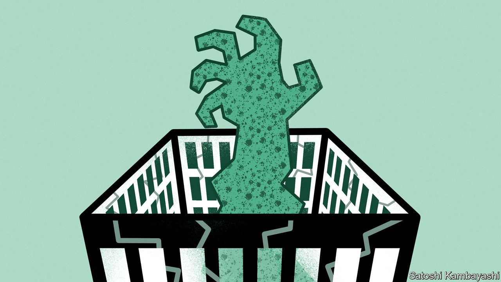

###### Undead finance

# America risks propping up zombie banks 

##### The banking crisis may have calmed, but only because of a government backstop 

 

> Mar 30th 2023 

FROM THE calm of financial markets, it may seem as if America’s banking crisis is over. No more lenders have failed since March 12th. Banks’ stock prices appear to be settling at about a quarter beneath their level at the end of February. Policymakers are no longer fighting financial fires, but are telling congressional hearings about the lessons to be learned. President Joe Biden says the administration has done “a pretty damn good job”.

Yet America is far from solving the problems in its small and midsize banks. The markets are tranquil mainly because the federal government is backstopping the system. That means the economy could yet face a slower-burning crisis instead.

The underlying problems are plain to see. As of March 15th, banks other than the biggest 25 institutions had lost $141bn of deposits this year, equivalent to nearly 5% of those not covered by federal deposit insurance (which is capped at $250,000 per customer). Banks with nearly $4trn in combined assets have unrealised losses worth more than half of their core equity safety cushions. For smaller banks, losses on  could wipe out still more of the buffer . Some lenders’ losses are probably far worse.

Calm prevails because of generous and indiscriminate support for the banks. By March 22nd the Federal Reserve had lent $164bn via facilities that issue loans worth more than the securities posted as collateral. According to Barclays, the Federal Home Loan Banks, lenders with an implicit government backstop, may have advanced $300bn to banks in a single week.

The Fed and the Treasury have also strongly hinted that they will bail out uninsured depositors should other banks fail, as they did the customers of Silicon Valley Bank (svb). The Federal Deposit Insurance Corporation (FDIC) has promised to set out options for expanding its guarantees by May 1st. It expects the bail-out of svb‘s depositors to cost $20bn, a record in cash terms.

These measures have apparently succeeded in slowing deposit flight. But the propping up of banks with unrealised losses brings fresh problems of its own. The danger is that they become zombies which keep capital tied up in unproductive legacy assets—a problem that last struck America in the 1980s, plagued Japan in the 1990s and troubled Europe in the early 2010s. One risk is that zombies try to restore their capital ratios by lending less. Another is that they put off recognising losses that may yet materialise on their loan books as higher interest rates bite. First Citizens Bank is now buying $72bn of svb’s loans at more than a 20% discount, suggesting that it foresees defaults ahead. The consequences of ignoring losses can be severe: in Japan it contributed to a “lost decade” of economic growth. 

Avoiding zombification requires quickly recognising losses and infusing banks with fresh capital. When calculating their safety buffers, megabanks must mark to market much of their securities portfolios; smaller banks ought to be required to do the same. Policymakers should use stress tests to work out what would happen to banks’ capital cushions if all their unrealised losses were to crystallise during a run, and if interest rates rose further. Banks that look too risky should be made to recapitalise by suspending dividends, and discouraged from trying to improve their capital ratios by lending less. 

All this would hurt shareholders. The danger is therefore that the lobbying of smaller banks stalls the agenda. Nearly 5,000 are spread around the country, and many have the ear of their local congressional representatives. In 2018 Congress watered down the rules governing smaller banks’ minimum liquidity and crisis-planning. Many policymakers argue that smaller banks are vital for their local knowledge and as a source of competition—a sentiment Janet Yellen, the treasury secretary, recently voiced to the American Bankers Association. That is true, but a further reason to avoid looser rules and zombification.

A crucial test will be whether the Fed closes its emergency facility as planned in March 2024. If it is extended, and if Congress expands deposit insurance without trying to fix the underlying problems in the banks, then zombies could proliferate. Worryingly, even with prolonged support in place some banks may not have a route to profitability, and might take big risks to be resurrected, in effect gambling with taxpayer money. Banks are supposed to circulate trillions of dollars of capital around America, but they could yet become a drag on the economy. ■


