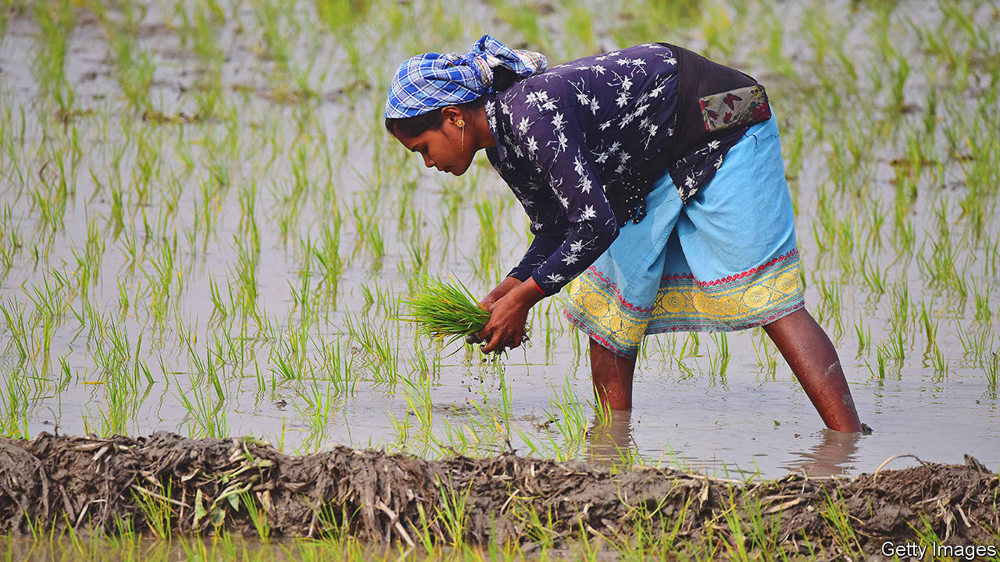

###### Green revolution 2.0

# How to fix the global rice crisis 

##### The world’s most important crop is fuelling climate change and diabetes 

 

> Mar 30th 2023 

The green revolution was one of the greatest feats of human ingenuity. By promoting higher-yielding varieties of wheat and, especially, rice, plant-breeders in India, Mexico and the Philippines helped China emerge from a famine and India avoid one. From 1965 to 1995  doubled and its poverty almost halved, even as its population soared.

Asia’s vast rice market is a legacy of that triumph. The starchy grain is the main source of sustenance for over half the world’s population. Asians produce over 90% of rice and get more than a quarter of their calories from it. And demand for the crop is projected to soar, on the back of population growth in Asia and Africa, another big rice consumer. By one estimate, the world will need to produce almost a third more rice by 2050. Yet that looks increasingly hard—and in some ways undesirable.

Rice production is spluttering. Yields have increased by less than 1% a year over the past decade, much less than in the previous one. The greatest slowdowns were in South-East Asia, where Indonesia and the Philippines—together, home to 400m people—are already big importers. This has many explanations. Urbanisation and industrialisation have made labour and farmland scarcer. Excessive use of pesticides, fertiliser and irrigation have poisoned and depleted soils and groundwater. But the biggest reason may be global warming.

Rice is particularly susceptible to extreme conditions and is often grown in places where they are increasingly evident. Patchy monsoon rains and drought last year in India, the world’s biggest rice exporter, led to a reduced harvest and an export ban. Devastating floods in , the fourth-biggest exporter, wiped out 15% of its rice harvest. Rising sea-levels are causing salt to seep into the , Vietnam’s “rice bowl”. 

It gets worse. Rice is not merely a casualty of , but also a contributor to it. By starving soils of oxygen, paddy cultivation encourages methane-emitting bacteria. It is a bigger source of greenhouse gas than any foodstuff except beef. Its emissions footprint is similar to that of aviation. If you count the conversion of forestland for rice paddy—the fate of much of Madagascar’s rainforest—that footprint is even bigger.

This amounts to an insidious feedback loop and, in all, a far more complicated set of problems than the food insecurity that spurred the green revolution. Indeed, eating too much rice turns out to be bad for people as well as the climate. White rice is more fattening than bread or maize, and is not especially nutritious. In South Asia rice-heavy diets have been linked to high rates of diabetes and persistent malnutrition.

Policymakers need to increase rice yields, then, but more selectively than in the 1960s. In the places most suitable for rice cultivation, such as hot and sticky South-East Asia, faster adoption of new technologies, such as flood-resistant and more nutritious seeds, could provide a big productivity boost. In tandem with improved practices, such as direct seeding of paddy, they could also shorten the growing cycle and reduce the amount of water required, mitigating environmental harm. Farmers have been slow to adopt such improvements, partly because of overgenerous subsidies that shield them from the rice crisis. A better approach would make state support contingent on best practice. By encouraging crop insurance—a good idea in itself—governments could also help reassure farmers as they switch from old ways to new.

Governments need to nudge producers and consumers away from rice.  are promoting millet, which is more nutritious and uses a lot less water. Scrapping subsidies that favour rice over other crops would make such efforts more effective. India, for example, procures rice from farmers, often at above-market rates, then distributes it as food aid. It should make its interventions more crop-agnostic, by replacing subsidies and free rice with income support for farmers and cash transfers for the poor. That would encourage farmers to choose the best crop for their local conditions—much of India’s agricultural north-west would switch from rice to wheat overnight. Poor Indians would be free to choose a more balanced diet. Thereby, it would correct a market skewed towards environmental damage and poor health.

Bringing about such change in Asia and beyond will be far harder than promoting new wonder seeds was. Farmers are almost everywhere a powerful constituency. Yet policymakers should get used to blending complicated economic and technological fixes in this way. Increasingly, it is what fighting climate change will entail. Sorting out the mounting crisis in the world’s most important foodstuff would be a good place to begin. ■


