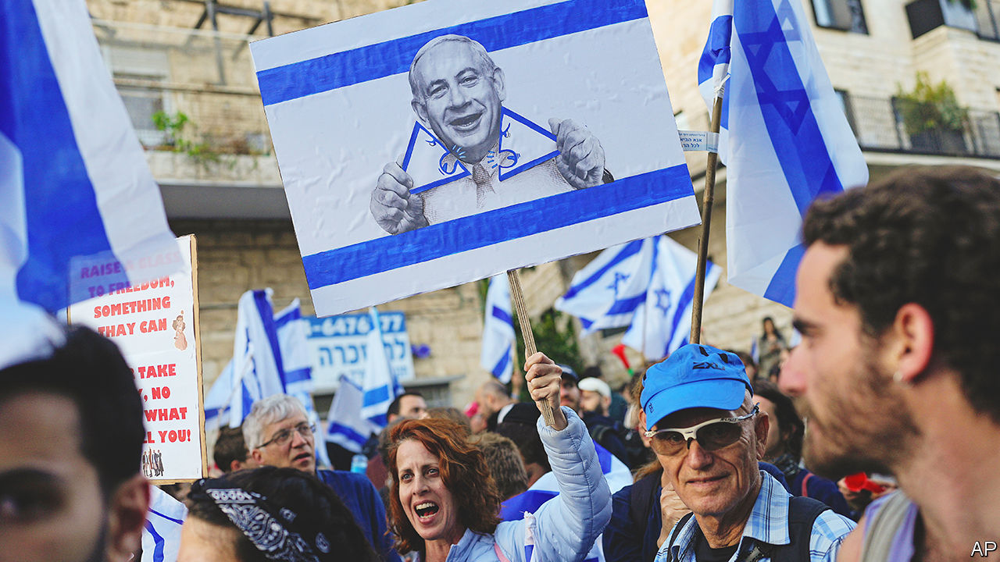

###### Constitutional crisis

# Israel should not squander the opportunity for meaningful constitutional talks 

##### The government’s retreat has pulled Israel back from the brink. But its people remain deeply divided 

 

> Mar 30th 2023 

Israel’s citizens have won a rare victory after marching, week after week, to defend judicial independence and the character of their democracy. On March 27th they forced their prime minister, Binyamin Netanyahu, to suspend his plan to rein in the courts. Yet, although the crisis has abated, it has not passed. 

The danger now is that, hoping the protesters’ fervour has cooled, Mr Netanyahu and his extreme right-wing and religious coalition partners try to force through his laws with only cosmetic changes in May, in the next session of the Knesset. That would almost certainly reignite the conflict. If right-wing parties called out their supporters, violence could erupt. To heal their divisions, Israelis must take this chance to resume the constitutional talks they put on hold 73 years ago.

The protests that halted Mr Netanyahu’s legislation have few precedents in Israel. Organisers claim that, at their peak, almost 7% of the population joined demonstrations. The anger was amplified by, in effect, a strike by thousands of elite soldiers and pilots in the reserve units that make up much of Israel’s combat power. When Mr Netanyahu said he would sack the defence minister for warning of the threat this posed to national security, actual strikes closed the ports, grounded flights and shut embassies. The uproar, fuelled by the fact that  himself faces corruption charges, left him with little choice but to pause his legislation and to call for talks instead.

This alone should cheer liberals and democrats everywhere. Viktor Orban in Hungary, Andrzej Duda of Poland and Recep Tayyip Erdogan in Turkey all weakened or politicised their courts as a prelude to ramming through illiberal policies. In India a court recently convicted Rahul Gandhi, an opposition leader, over a campaign speech, leading to his exclusion from parliament. 

How to turn this opportunity to Israel’s advantage? This crisis has been long in the making. Even before independence the country’s founders fell out over constitutional principles such as the role of religion in the state and the protection of minorities. Instead of facing up to these, David Ben-Gurion, the first prime minister, left it to future parliaments to pass “basic” laws. A constitution was supposed to emerge from these gradually but it never has. Instead the courts eventually came to imbue these laws with special authority. Many right-wing and religious Israelis believe that today’s system is rigged against them, and that democracy is thwarted when judges overturn laws passed by elected politicians. The status quo is as unacceptable to them as Mr Netanyahu’s reform is to their opponents.

The remedy is as easy to propose as it will be hard to carry through. The lesson from the past few weeks for Mr Netanyahu and his allies is that a reform which is quasi-constitutional requires a broad political consensus if it is to endure. For the protesters the lesson is that demographic and political trends have tilted electoral power towards religious Israelis and will continue to do so. They need to compromise, too. 

Israel finally has a chance to resolve old and fundamental questions through an orderly process. To succeed, both sides will have to make uncomfortable concessions. Secular and liberal Israelis may have to guarantee privileges and protections to ultra-Orthodox Jews (who do not serve in the army, for instance). In return, religious parties may have to respect civil liberties by relinquishing religious control over institutions such as marriage. All will have to settle on an appropriate level of restraint on majoritarian rule. If the best constitutions are made to endure hard times, then perhaps there is no better moment to forge a new one than the crisis in Israel’s streets today. ■

