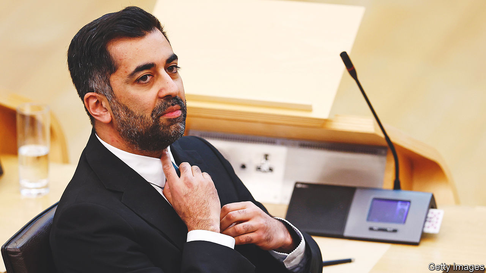

###### Secession, season 1

# The Scottish National Party’s limitations have been laid bare 

##### Will Humza Yousaf learn the right lessons? 

 

> Mar 29th 2023 

Who needs HBO when you can watch the SNP melt down? A vicious battle to take the place of an all-powerful Scottish leader has turned “Succession” into must-watch television. The fight to succeed Nicola Sturgeon as leader of the Scottish National Party (SNP) had the same plot line and the same mix of underwhelming pretenders and fratricidal ambition. The successor in the real-life drama is now known. , previously the health secretary, this week became the new head of the SNP and Scotland’s first minister. But the party he leads suddenly seems as  as Waystar Royco. 

That is a remarkable shift. The SNP is an election-winning machine. Ms Sturgeon, who had led the party since 2014, masterminded eight ballot-box wins in eight years. Under her and her predecessor, Alex Salmond, the cause of Scottish independence went from a fringe pursuit to the defining question of politics north of the border. But the past few weeks have seen the party’s reputation for discipline implode and the goal of statehood recede further into the distance. For the sake of all Scots, not just those who want secession, Mr Yousaf needs to reflect on the limitations of the Sturgeon era. They hold lessons for politicians elsewhere, too.

One is that an imperial leader will eventually become a problem. Ms Sturgeon dominated her party to such an extent that she stifled debate. In her resignation speech on February 15th, she acknowledged that her views warped those of others. A tight coterie ran things: her husband was the party’s chief executive until he resigned over revelations during the campaign that the SNP’s membership was smaller than billed. Worse, she operated within a political set-up that imposed few constraints on her. The Scottish Parliament in Holyrood has no second chamber; parliamentary committees are less independent than in Westminster. Thorough scrutiny is missing, as shown by her gender-recognition reforms, which owe more to dogma than design.

Another limitation is polarisation. Ms Sturgeon left office with a string of homilies about the need to practise a less confrontational form of politics, the equivalent of Logan Roy giving a sermon about forgiveness. On her watch the Scottish electorate bifurcated. According to polling for , support for, or opposition to, independence predicts Scots’ attitudes to pretty much everything else. This tribalism helped the SNP win all those elections. And outside Scotland, polarisation of a different kind helped Ms Sturgeon: a certain type of liberal ignored the ideological fanaticism, economic recklessness and predilection for alternative facts of nationalist campaigns and saw in her only a progressive Remainer. In fact, her all-consuming “us” and “them” approach made it hard for the nationalists to win over voters from the other camp.

That matters because of the SNP’s last limitation: monomania. The Westminster government and the Supreme Court have stymied hopes of a second independence ballot to follow the failed one in 2014. With roads to that destination blocked, the party is increasingly bound to be judged on things that matter more to voters’ daily lives. And that record is pretty mediocre. Death rates from drug misuse match those in opioid-addled America. Scotland’s schools lag behind the rest of Britain’s. The ferry services to the Scottish islands are an embarrassment. 

Charisma, tribalism and taking back control can go a long way. They are the ingredients that brought about Brexit. But, as Brexit’s poisonous aftermath showed, they are also a recipe for gridlock and fragility. If Mr Yousaf can govern more consensually and competently, he would serve all Scots better. And although this newspaper does not share his goal of independence, he would also help the nationalist cause. As yet, the vote for independence is not large or sustained enough to force another referendum. A divorce between England and Scotland would make Brexit look simple, but the SNP has not shown itself capable of thinking through its complexities. Good government rather than slogans is the way for the party to win doubters round. 

Whether Mr Yousaf is the person to change the SNP’s approach is debatable, however. His margin of victory was narrow and he may be tempted to double down on promises of independence as a way to suppress party divisions. His own record in government is one of serial underperformance, a kind of tartan Tom Wambsgans. Kate Forbes, his main rival, has already gone to the backbenches rather than accept his offer of a cabinet demotion. Mr Yousaf’s new deputy is an old friend of Ms Sturgeon’s and the architect of the gender-recognition reforms. Season two of “Secession” has been set up nicely. ■

