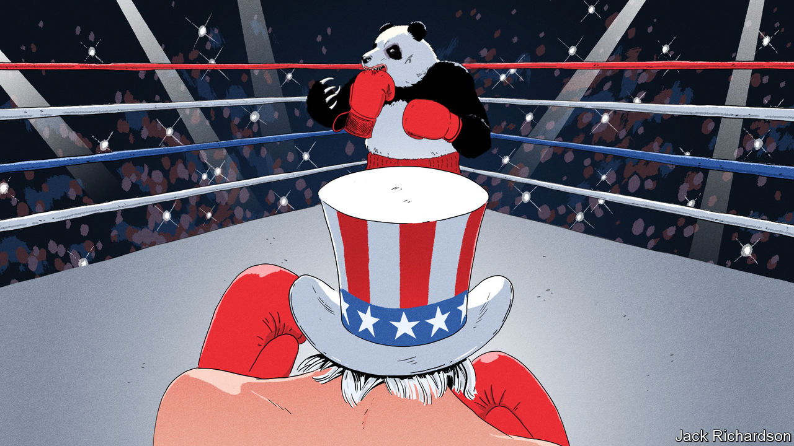

###### America v China

# Why the China-US contest is entering a new and more dangerous phase 

##### Chinese officials rage at what they see as American bullying 

 

> Mar 30th 2023 

You may have hoped that when China reopened and face-to-face contact resumed between politicians, diplomats and businesspeople, Sino-American tensions would ease in a flurry of dinners, summits and small talk. But the atmosphere in Beijing just now reveals that the world’s most important relationship has become more embittered and hostile than ever. 

In the halls of government Communist Party officials denounce what they see as America’s bullying. They say it is intent on beating China to death. Western diplomats describe an atmosphere laced with intimidation and paranoia. In the Diaoyutai State Guesthouse, multinational executives attending the China Development Forum worried what a deeper decoupling would mean for their businesses. The only thing both sides agree on is that the best case is decades of estrangement—and that the worst, of a war, is growing ever more likely.

Each side is following its own inexorable logic. America has adopted a policy of containment, although it declines to use that term. It sees an authoritarian China that has shifted from one-party to one-man rule. President Xi Jinping is likely to be in power for years and is hostile to the West, which he believes is in decline. At home he pursues a policy of repression that defies liberal values. He has broken promises to show restraint when projecting power outward, from Hong Kong to the Himalayas. His meeting with Vladimir Putin this month confirmed that his goal is to build an alternative world order that is friendlier to autocrats.

Faced with this, America is understandably accelerating its military containment of China in Asia, rejuvenating old alliances and creating new ones, such as the aukus pact with Australia and Britain. In commerce and technology America is enacting a tough and  on semiconductors and other goods. The goal is to slow Chinese innovation in order that the West can maintain its technological supremacy: why should America let its inventions be used to make a hostile regime more dangerous?

To China’s leaders, this amounts to a scheme to cripple it. America, in their eyes, thinks it is exceptional. It will never accept that any country can be as powerful as itself, regardless of whether it is communist or a democracy.  only if it is submissive, a “fat cat, not a tiger”. America’s Asian military alliances mean that China feels it is being encircled within its own natural sphere of influence. Red lines agreed on in the 1970s, when the two countries re-established relations, such as those on Taiwan, are being trampled by ignorant and reckless American politicians. China’s rulers think it only prudent to raise military spending.

In commerce, they view American containment as unfair. Why should a country whose gdp per head is 83% lower than America’s be deprived of vital technologies? Officials and businesspeople were appalled by the spectacle of TikTok, the subsidiary of a Chinese firm, being roasted in an American congressional hearing this month. Although some Chinese liberals dream of emigrating, even worldly, Western-educated technocrats now loyally condemn shows of wealth, promote self-reliance and explain why globalisation must serve Mr Xi’s political priorities.

Given two such entrenched and contradictory world-views, it is naive to think that more diplomacy alone can guarantee peace. A meeting in Bali between President Joe Biden and Mr Xi in November eased tensions, but the deeper logic of confrontation soon reasserted itself. The spy-balloon crisis (Chinese officials mock America for downing what they call a stray “naughty balloon”) showed how both leaders must appear tough at home. America wants China to adopt guardrails to control the rivalry, including hotlines and protocols on nuclear weapons, but China sees itself as the weaker party: why tie yourself down with rules set by your bully? Nothing suggests the hostilities will ease. America’s election in 2024 will show that China-bashing is a bipartisan sport. Mr Xi faces a slowing economy and has tied his legitimacy to a vision of a muscular and “rejuvenated” nation.

Faced with such an opponent, America and other open societies should adhere to three principles. The first is to limit economic decoupling, which the IMF reckons could cost anything between a manageable 0.2% of world gdp and an alarming 7%. Trade in non-sensitive sectors also helps maintain routine contact between thousands of firms, thereby narrowing the geopolitical divide. Embargoes should be saved for sensitive sectors or areas in which China has a chokehold because it is a monopoly supplier: these account for a minority of Sino-American trade. Where possible, businesses that straddle both sides of the cold war, such as TikTok—accused of spreading Chinese misinformation—should be ring-fenced, sold or spun off, not be forced to close.

The second principle is to lower the chances of war. Both sides are locked in a “security dilemma” in which it is rational to shore up your position, even as that makes the other side feel threatened. The West is right to seek military deterrence to meet a growing Chinese threat—the alternative is a collapse of the American-led order in Asia. But seeking military dominance around flashpoints, notably , could spark accidents or clashes that spiral out of control. America should aim to deter a Chinese attack on Taiwan without provoking one. This will take wisdom and restraint from a generation of politicians in Washington and Beijing who, by contrast with the leaders of America and the Soviet Union in the 1950s, have no personal experience of the horrors of a world war. 

The last principle is that America and its allies must resist the temptation to resort to tactics that make them more like their autocratic opponent. In this rivalry, liberal societies and free economies have big advantages: they are more likely to create innovations and wealth and to command legitimacy at home and abroad. If America sticks to its values of openness, equal treatment of all and the rule of law, it will find it easier to maintain the loyalty of its allies. America must be clear that its dispute is not with the Chinese people, but with China’s government and the threat to peace and human rights that it poses. The 21st century’s defining contest is not just about weapons and chips—it is a struggle over values, too. ■


