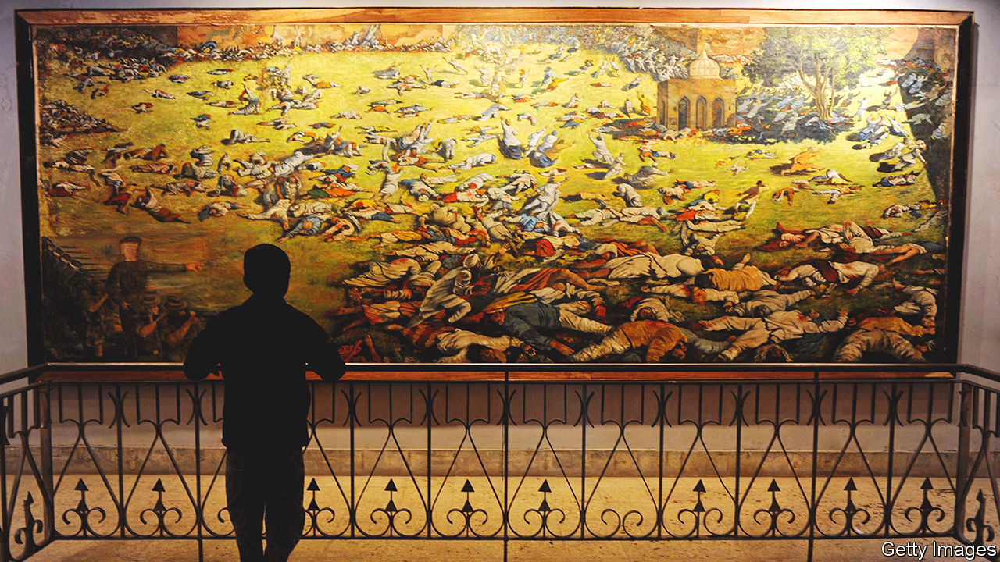
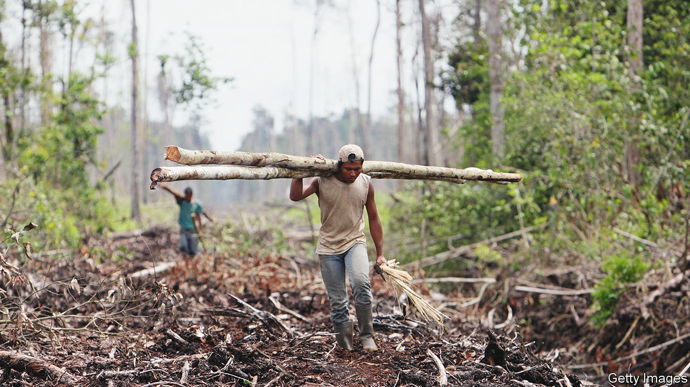

###### On colonialism, planting trees, Taiwan, Japan and South Korea, megaprojects, the Moon, Bibi

# Letters to the editor 

##### A selection of correspondence 

 

> Mar 30th 2023 


Nigel Biggar responds

Your review of my book, “Colonialism: A Moral Reckoning”, judged it to be “often foolhardy and sometimes just banal” (“”, March 4th). First, you tell us that plenty of people “in Britain’s former colonies have long regarded the British Empire as racist and exploitative, even genocidal”. Sure, but the subjects of British rule didn’t all think the same thing. For example, Chinua Achebe, the African nationalist man of letters, refused to condemn British colonial rule shortly before he died in 2013.

Next, your review was astonished that exhibit A in my case for the growing humanitarianism of the British Empire is “the slave trade”. Of course, my prime exhibit is the fact that Britain was among the first states in the world’s history to abolish the trade and slavery itself. You then emphasise the role of slave rebellions in bringing about abolition. I acknowledge that on page 56. But until you can present a cogent argument that the humanitarian revolution in British mores, which gathered steam decades before the 1791 slave-revolt in Saint Domingue (now Haiti), did not play a leading role in securing abolitionist victories in Britain’s Parliament in 1807 and 1833, my case stands. 

Correctly, you point out that “in some analyses” Britain’s subsequent investment in suppressing slavery worldwide was intended to stop slaveholding economies undercutting British exporters, now reliant on free labour. But human actions usually spring from several motives and sometimes genuinely humanitarian motives really do dominate economic ones. You also claim that I argue that the empire was not “wantonly violent”. That is untrue: I admit it was—sometimes. 

Finally, you find “lazy and banal” my point that the empire was like any long-standing state in harbouring evils and injustices. But that was merely the elementary stage in the larger argument, clearly stated in the Conclusion, which you overlooked. That concludes that the British Empire wasn’t “essentially” racist and murderous and that it contained growing humanitarian and liberal elements, which found climactic expression when, between May 1940 and June 1941, the empire stood alone (with Greece) as the only military opposition to the massively murderous racist regime in Nazi Berlin.

Nigel Biggar


 


Paying people to plant trees

The notion of paying the owners of rainforests not to destroy them (“”, March 4th) brought to mind the late, great Wangari Maathai, a Kenyan environmentalist. It was while visiting some of Kenya’s poorest areas that Maathai saw how environmental degradation had affected the lives of rural women. In 1977 she founded the Green Belt Movement. Women were brought together to plant seeds, store rainwater, reduce soil erosion and provide food. For each tree planted, they would earn a small allowance. By 2004, the year Maathai became the first African woman to win the Nobel peace prize, the movement had planted more than 30m trees. It shows that empowering a community can achieve a lot. And also that payments for climate services works. 

Mburu Gatonye


Taiwan’s energy problem

Another issue that vexes those who want to see Taiwan thrive is its energy policy (, March 11th). The island has rushed headlong towards adopting natural gas to power its electricity grid, spurning coal and nuclear power. For all its economic advantages, natural gas presents grave risks to Taiwan because of the country’s precarious geopolitical status. All of its natural-gas supply is carried by tankers that dock at two terminals on its exposed west coast. A third terminal is due to be completed by 2025. A fourth location is under discussion; fulfilling Taiwan’s electricity-generation needs would require that fourth terminal, and possibly a fifth.

Natural gas is dependent on just-in-time delivery, exacerbating the island’s vulnerability to a blockade that many military experts now consider to be China’s most probable method to subdue Taiwan. Whereas coal and nuclear enable about 18 months of on-site storage, Taiwan can hold just two weeks’ worth of natural gas without a huge commitment to build more infrastructure. Reducing coal reflects important environmental concerns, but the elimination of nuclear power from Taiwan’s mix is a dangerous misstep.

Jordan McGillis

Policy analyst

Manhattan Institute


 


You mentioned a lack of will in Taiwan to defend the island. Some historical background may explain this equivocal attitude. The people of Taiwan have been forced to identify with different nationalities over the past two centuries. As a colony of Japan from 1895 to 1945 the Taiwanese were coerced into identifying as Japanese. Then came the Chinese nationalists led by Chiang Kai-shek, who, defeated by the Chinese Communists, ruled Taiwan under martial law for nearly four decades. During this time the Taiwanese had to learn a new language, Mandarin, and identify as Chinese. Only after the lifting of martial law in 1987 did the idea of a Taiwanese identity start to circulate, and it took time to be adopted. 

The formal name of the country is still the Republic of China and its Olympic team is represented as Chinese Taipei, names that the global powers support in order to maintain the status quo in the Taiwan Strait. Fewer and fewer countries formally recognise Taiwan each year. Given all this it is hard for the Taiwanese to be optimistic about their collective destiny. They feel powerless about sustaining their national identity in an acquiescent world. 

Denis Wu


 


Japan and South Korea

When I was first posted to Seoul in 1975 diplomatic relations between South Korea and Japan were only ten years old, and were at best bumpy. Now, after decades of continued bumpiness, the decision by South Korea to seek a positive, forward-looking relationship with Japan should be applauded (“”, March 11th). There is so much the two neighbours have in common, and so much they can achieve by closely working together, not just for mutual benefit but for the region and beyond, especially on foreign- and security-policy issues with North Korea and China in mind. It is understandable that some South Koreans may be upset, but it is to be hoped that they will accept that although the past is important, it should not be allowed to shape the relationship between two such successful and important countries in a changed world. 

Warwick Morris

British ambassador to South Korea, 2003 to 2008


 


Britain’s nutty megaprojects

Bartleby put his finger on the key problem with megaprojects: we never learn from past mistakes and let politics trump prudence (). The prototype of all modern megaprojects in Britain was the groundnut scheme. It was launched in 1947 by Clement Attlee’s Labour government to transform African agriculture and solve Britain’s post-war shortage of oils and fats by developing a 3m-acre fully mechanised peanut farm in the middle of what is now Tanzania. It failed so spectacularly that it helped bring down the Labour government in 1951. It cost £36m (equivalent to £1bn today) and imported more groundnuts as seed than it ever exported.

Haste, hubris, political deadlines and ignoring the experts all played their part. But these lessons were swiftly forgotten, and so we have suffered one groundnut scheme after another since then. The HS2 high-speed rail project is merely the latest in a sadly long line.

Nicholas Westcott

Professor of practice in diplomacy

School of Oriental and African Studies, University of London

 


Living underground

The idea of using caves on the Moon as viable living spaces is not new (“”, March 18th). Robert Heinlein’s science-fiction novel “The Moon is a Harsh Mistress”, published in 1966, describes a lunar colony based in pressurised subterranean caves. As suggested in your article, the caves provided protection from solar radiation as well as allowing access to whatever resources might be available.

Robert Checchio


 


For the sake of five

Israel’s constitutional crisis (“”, March 18th) could be resolved by taking a lesson from the biblical story of Sodom. Abraham gets God to agree that the presence of just ten righteous people would be enough to save the entire city. In Israel today, if just five Likud members of the Knesset were to break away from the governing coalition they could end Binyamin Netanyahu’s march towards undemocratic judicial reform. 

The biblical story ends with the destruction of Sodom, implying that not even ten righteous people could be found. Time will tell if the Likud has five righteous members willing to challenge the prevailing powers, just as Abraham once did.

Paul Greenberg


