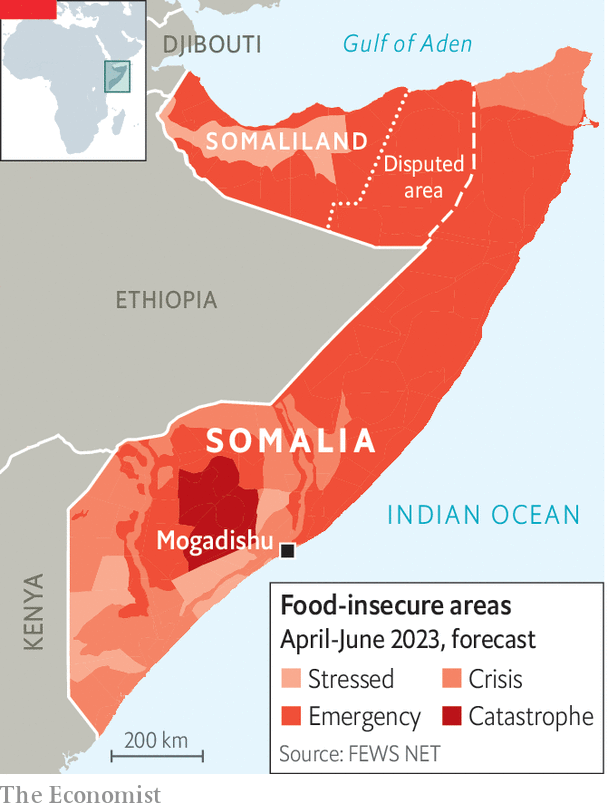

###### Hunger in the Horn

# Drought killed 43,000 people in Somalia last year 

##### Weather, jihadists and the Ukraine war all share some of the blame 

 

> Mar 25th 2023 

First the rains in Somalia failed in 2021. Then they failed again and again and again and again. For five wet seasons in a row, Somalis looked anxiously to the skies while their crops withered, their cattle perished and many people died of hunger or disease. A new report, released by UN agencies and the Somali government, estimates that there were 43,000 “excess deaths” in the country last year, relative to the typical level. Half of the dead were children under the age of five.

This hunger is the deadliest in Somalia since the famine of 2010-11, which claimed 260,000 lives. And it will get worse before it gets better. Researchers at the London School of Hygiene and Tropical Medicine, whose modelling underpins the report, project that in the coming months 135 people will die every day from drought-related causes. The Integrated Food Security Phase Classification (IPC), a UN affiliate that measures hunger, reckons that 6.5m Somalis will face “crisis”, “emergency” or “catastrophe” levels of food insecurity between April and June (see map).

 


The drought is the worst in the region for 40 years. Its barren shadow stretches beyond Somalia and into Kenya, Djibouti and Ethiopia, where millions more go hungry. Dry spells in the Horn of Africa are linked to La Niña, a temporary cooling in the Pacific Ocean that affects weather patterns worldwide, and which is only now relenting after three stubborn years. Its impacts may have been amplified by climate change, though the people of Somalia can hardly be blamed for that. They have emitted roughly as much carbon dioxide since independence in 1960 as Americans have in the past two and a half days.

Two exacerbating factors have turned trouble into tragedy. The first is Russia’s invasion of Ukraine, which before the conflict accounted for 90% of Somalia’s wheat imports. Soaring prices for food and fuel stretched the budgets of both families and aid agencies, says Shashwat Saraf, the regional emergency director for east Africa at the International Rescue Committee, a non-government organisation. In 2017, when Somalia last grappled with drought, a swift humanitarian response saved lives. This time the distraction of the Ukraine war (coupled with covid-19) meant that help was slower to arrive.

The second challenge is insecurity. Al-Shabab, an al-Qaeda affiliate, controls much of the countryside. Since August the Somali army and clan militias have pushed it out of some central parts of the country. But the jihadists are entrenched in their southern heartlands, where hunger is severe. Aid workers fear being kidnapped or killed. In the past al-Shabab has demanded protection money to allow aid through. One recent study finds that violent incidents along transport routes can increase food prices as far as 900km away.

If food cannot move, the people must. Last year alone, 1.2m people were driven from their homes by drought. In all, some one in five Somalis, or 3.7m people, are internally displaced. Many of them crowd into settlements on the edge of towns, where aid workers can reach them in relative safety. People are dying from preventable diseases such as diarrhoea or respiratory problems, says Mamunur Rahman Malik, the World Health Organisation’s representative in Somalia. Without protein from their animals, their immune systems are severely weakened.

Now Somalis are scouring the skies again for signs of the “Gu” rains, which are due next month. A slightly improved forecast and a recent drop in food prices offer hope that full-blown famine can be avoided. But even when this drought finally ends, it will take years for indebted families to restock their animals and assets. Governments and aid agencies should start planning for the next one by developing strategic water points and infrastructure, argues Guyo Malicha Roba of the Jameel Observatory, an international research partnership in Nairobi. Too often, their focus fades when the emergency does. “Immediately we get a better season, we go back and sleep,” he says. ■

