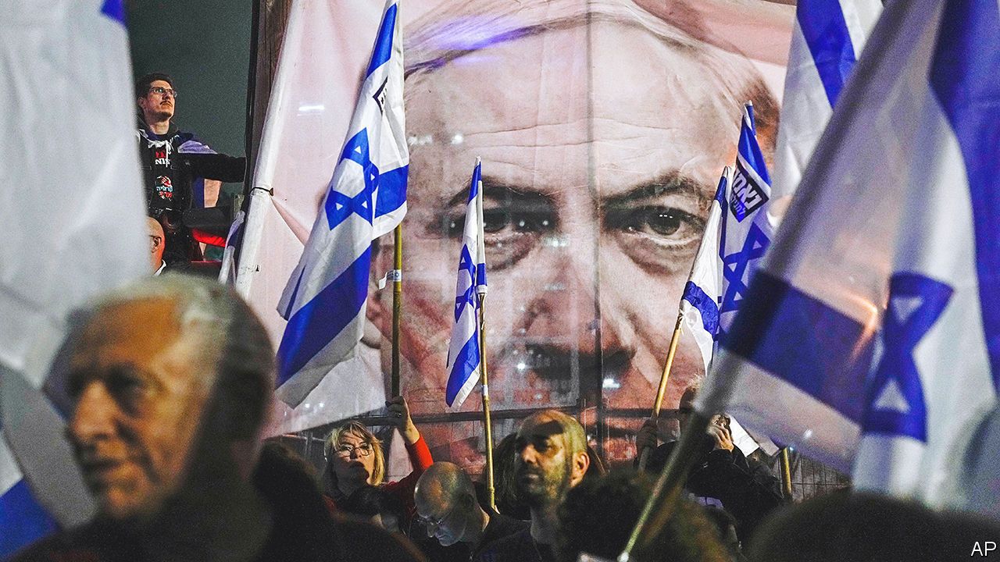

###### Holy land, unholy mess

# Israel’s government is still in a bind 

##### Binyamin Netanyahu is being pulled from one side to the other—and back again 

 

> Mar 30th 2023 

Israel’s new right-wing government has reached its three-month mark with a lot to show for its brief stint in office. Since it was sworn in on December 29th, several tech companies, the jewels in the crown of Israel’s buoyant economy, have threatened to move abroad. Thousands of officers in elite reserve units of the armed forces have said they will refuse to report for duty. Trade unions and employers have together called for a general strike. And most recently President Joe Biden, the leader of Israel’s most important ally, has openly scolded the government, saying it “cannot continue down this road”. 

This is a stunning reversal of fortune for Israel’s prime minister, Binyamin Netanyahu, who returned to office triumphant, after a year and a half in opposition. He has squandered his victory on a radical plan to weaken the powers and independence of the Supreme Court. Yet he failed to anticipate the strength of opposition of swathes of Israeli society. Business leaders, the security establishment, even members of his own Likud party, have jibbed against his plan to remove checks and balances from Israel’s democracy.

 


On the evening of March 27th, as hundreds of thousands of protesters in Jerusalem, Tel Aviv and elsewhere brought the country to a standstill, Mr Netanyahu backed down, announcing a “time out” for negotiations over the legislation. Yet instead of calming tempers he inflamed them, spluttering that “there are a minority of extremists that are willing to tear our country to shreds.” They were “escorting us to civil war and calling for refusal of army service, which is a terrible crime”, he said.

On cue, gangs of violent far-right supporters of the government took to the streets, attacking their political opponents, journalists and Arab passers-by. The scene reminded some of Israel’s neighbour, Egypt, where in the revolution of 2011 angry crowds had filled Cairo’s Tahrir Square in the dying days of Hosni Mubarak’s regime. In his inaugural speech three months ago Mr Netanyahu promised to broaden Israel’s ties in the region. So far he has succeeded only in emulating some of his neighbours’ worst tendencies.

Almost until the last Mr Netanyahu brazened it out, against the counsel of such level-headed advisers as the central bank’s governor and the chiefs of Israel’s military and security services, who want him to drop his judicial plan altogether. At times in the past three months he has wavered. But the coalition of religious zealots, Jewish supremacists and homophobes that he relied on for his return to power insisted that he must not budge. At the very least they wanted him to pass a law giving them control of the committee that appoints judges to the Supreme Court, by April 2nd, the end of the winter session of the Knesset, Israel’s parliament.

Ultimately it was the few remaining moderates in Likud, a party which once prided itself on being both nationalist and liberal, who persuaded Mr Netanyahu to hold back, for the moment. On March 25th Yoav Gallant, the defence minister, publicly warned that tensions over the judicial reforms were hurting the defence forces and security agencies. “This poses a clear, immediate and tangible threat to the security of the state,” he said. Mr Netanyahu then announced his sacking. 

Within hours of the statement, Israelis began pouring onto the streets again, besieging the Knesset and Mr Netanyahu’s home in Jerusalem and blocking roads in Tel Aviv. Next day the trade unions and the country’s main employers announced a general strike that shut ports, grounded flights at the main airport and brought much of the country to a halt. Influential Likud members with their own bases of power were among the union barons and mayors endorsing the strike. It was a final warning to Mr Netanyahu. 

By then the game was up. Mr Netanyahu still had to spend long hours begging his more radical coalition partners not to abandon him. The price he had to pay to Itamar Ben-Gvir, leader of the ultra-nationalist Jewish Power party, was to promise a “national guard”, in essence a publicly funded private militia, which would come under the control of Mr Ben-Gvir’s national-security ministry. 

Many in Israel’s security establishment think this will be another of Mr Netanyahu’s empty promises. But only a few months ago it was unthinkable that Mr Ben-Gvir, who has been convicted of backing Jewish terrorist outfits, could become the minister in charge of the police.

Mr Netanyahu has no alternative coalition. The centrist parties have refused to serve in a government with a prime minister indicted for fraud and bribery, charges Mr Netanyahu still vehemently denies. So he remains at the mercy of his hardline partners in government. 

Ducking and weaving

Mr Netanyahu has been forced to promise “true dialogue” to reach “broad agreement” on constitutional changes. Talks with a wary opposition have begun under the auspices of President Isaac Herzog, whose compromise proposal two weeks ago had been summarily rejected by the government. Neither side seems hopeful that a compromise can be reached now.

The coalition speaks in two tongues. One government official argues that these talks could provide an opportunity for Israel to grapple at last with its lack of a formal constitution and to clarify the status of its “basic laws”, to which the Supreme Court has given a quasi-constitutional standing. But another member of the coalition says: “This is just a tactical retreat.” 

The legislation to curb the court is still on the Knesset’s agenda. Mr Netanyahu could bring it to a vote when the next session begins, on April 30th. His allies on the far right are calling for rallies of their own under the banner “We won’t let the election be stolen”. They are stoking resentment against “unelected elites” who are said to be defying the “will of the nation”. 

In any event, Mr Netanyahu will struggle to get the legislation moving again. Secular and liberal Israelis are unlikely to back down over an issue they see as truly threatening Israel’s democracy. More efforts to ram through the changes will prompt mass protests again. Yet if Mr Netanyahu waters them down, he may lose the support of his far-right and religious partners. 

Even if he does keep his coalition together and in power, he has gravely damaged himself in the eyes of business and the defence establishment, two constituencies vital for a prime minister who has based his entire career on growing the economy and keeping Israel safe. He has brought Israel to the brink of civil conflict and left it deeply divided. After the Passover festival, which begins on April 5th, Israelis are due to celebrate the 75th anniversary of independence. The mood is hardly likely to be festive. ■

