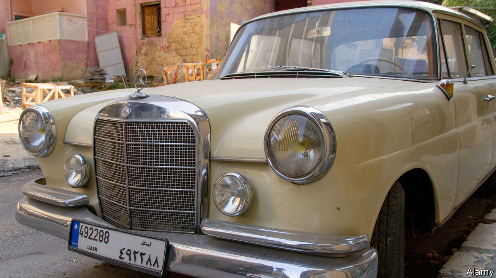

###### No to number-plates

# Why Lebanon’s drivers can’t be legal 

##### Corruption has closed down an entire department of state 

 

> Mar 30th 2023 

It is quite common, amid Lebanon’s current chaos, for cars without number-plates to breeze through the traffic and be waved through checkpoints with nobody batting an eyelid. Last year nearly all the employees of the country’s car-registration office were arrested on charges of corruption. Some 60 workers there are said to remain behind bars. The interior ministry admits that since October the entire department, known as the Nafaa after the area of Beirut where it is located, has been shut down. So the number of numberless cars cruising the roads has been rising. 

The problem is that a ban in place since 2017 means that all public-sector hiring has been frozen, so the errant registrars cannot be replaced. In any case, few Lebanese people can survive on a standard public-sector salary of around $50 a month. The police are being trained to take over the role, but it could take them an age to get rid of the backlog.

For the past five months owners of new and imported cars have not been able to get number-plates. Nor has it been possible to register the sale of used cars. You cannot get a driving licence or renew an old one. Insurance companies have been loth to do business with owners of unregistered vehicles. 

The authorities are tight-lipped about the scandal and the investigation. No official will speak on the record. The state news agency has so far been the sole source of information. 

To the surprise of nobody, the word is that the police seized piles of fake car-insurance papers and evidence of the sale of driving licences to people who had not passed their tests. 

All the same, life on the shambolic roads is unchanged. The impossibility of getting your documents for anything in order is pretty normal in a country on the verge of collapse. As real wages have slumped in the face of rampant inflation, ordinary Lebanese are unkeen to work for almost nothing. Ministries, courts and schools have closed down, sometimes for months at a time.

Meanwhile the absence of number-plates has been a particular annoyance to the police and security service. For a start, it is almost impossible to track down numberless cars involved in accidents, let alone investigate those embroiled in more serious crimes. 

The irony is that this latest cock-up was triggered by a rare effort by the authorities to reduce corruption, which remains endemic across the country and is one of the chief causes of the current national malaise and dysfunction. Indeed, since the mass arrest of people in the Nafaa, most of the lucky drivers who have somehow managed to register their cars and put number-plates on them have been able to do so only through the naughty old method of —connections and bribery. ■

