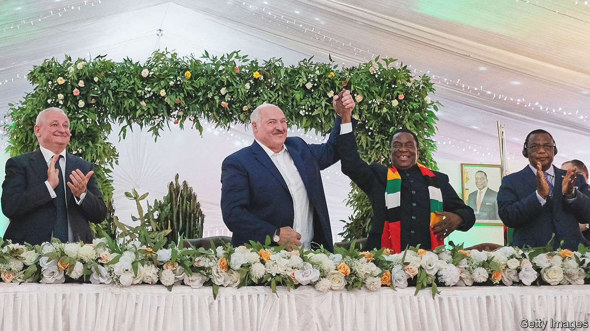
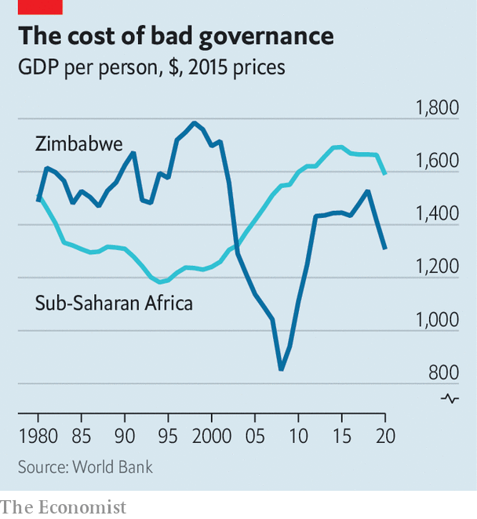

###### Zimbonomics 101

# Zimbabwe wants to come in from the cold 

##### But that would require Zanu-PF to change its thuggish ways 

 

> Mar 28th 2023 

It is a revealing journey from Robert Gabriel Mugabe International Airport to downtown Harare, Zimbabwe’s capital. A new  terminal is all but empty. On Airport Road the first billboard, commissioned by a Belarusian agriculture firm, features a photo of a red tractor and a welcome for Alexander Lukashenko, Belarus’s president (pictured). Earlier this year this  became one of the few non-African heads of state to visit the isolated country. 

Mr Lukashenko is not the only recent visitor, however. On February 23rd Zimbabwe’s government welcomed a group of mostly Western and multilateral creditors to discuss its roughly $17.6bn of external debts. Until these are restructured the country cannot get an IMF loan and will remain largely locked out of international capital markets, as it has been since it began defaulting in 1999. That was the start of a decade of economic madness, invasions of white-owned farms and hyperinflation, complete with paper notes each worth 100trn Zimbabwe dollars. Real GDP per person fell by a half in US-dollar terms; today it is still lower than it was at independence in 1980 (see chart). 

 


The talks have raised hopes in Harare. Some in the West would like to give the country another chance, partly out of resignation and partly because of shifting geopolitics. But the problem remains Zanu-PF, the ruling party. After an internal coup in 2017 that toppled Robert Mugabe, there were several attempts to offer his successor, Emmerson Mnangagwa, a road map to normal relations. Every time, repression or tales of corruption on a massive scale torpedoed the efforts. So long as his regime meddles in the economy and is accused of rigging elections, which are due to be held by August, it will struggle to come in from the cold. 

To avoid that, Zimbabwe must show Western governments progress in two areas. The first is the economy. Zimbabwe’s government pretends that it has an orthodox approach to macroeconomics. Official figures suggest a narrow fiscal deficit. It has its own currency, the Zimbabwe dollar. Like any central bank, the Reserve Bank of Zimbabwe uses a benchmark interest rate to tame inflation. 

The reality is more eccentric: call it Zimbonomics. The country’s debts are larger than they seem. The IMF last year estimated that “unfunded liabilities” amounted to $5.75bn, including $3.25bn in compensation owed to white farmers. Then there is what technocrats call the bank’s “quasi-fiscal operations”: in plainer language, printing money. This is used to subsidise farmers and miners or to buy American dollars to keep up payments on the few foreign loans still being serviced. 

Most worrying is the interference in currency markets. Rather than leaving the value of the Zimbabwe dollar to the whims of the market, the central bank confiscates a portion of exporters’ hard-currency revenues, then auctions greenbacks to a select group of buyers at a cut-price rate. The de facto subsidy is worth the equivalent of 2.5% to 5.25% of GDP a year. As well as depleting trust in the local currency—and keeping annualised inflation at more than 200%—Zimbonomics creates arbitrage opportunities for a lucky few.

Airing dirty laundry

Such shenanigans reinforce the idea that well-connected elites and ordinary people play by different rules. The Sentry, an American watchdog, will soon publish two reports. The first alleges that some of the proceeds of the sale of a chrome mine went to senior politicians. The second looks into the affairs of Kudakwashe Tagwirei, an ally of Mr Mnangagwa (pictured right) who has been placed under sanctions by America since 2020, for allegedly “materially assisting senior Zimbabwean government officials involved in public corruption”. And in March the central bank threatened to sue Al-Jazeera, a Qatar-based network, over a documentary about gold-smuggling. The bank said in a statement that the film falsely created the impression that it was “Southern Africa’s laundromat…for an alleged African gold mafia involved in illicit gold dealings, corruption and money-laundering”. It said it dismisses these “false allegations”.

Zimbonomics is not the only obstacle to improved relations. The other is the need for political reforms. Under the Zimbabwe Democracy and Economic Recovery Act, legislation first passed in 2001 and renewed by Congress in 2018, American support for financial assistance by multilaterals such as the World Bank depends on, among other things, evidence that the government is serious about the rule of law. Yet ahead of the general elections Zanu-PF is putting not so much as a thumb on the electoral scale as a bloody fist. 

In a poll published in February, 53% of respondents said they would vote for Nelson Chamisa, the leader of the main opposition party, Citizens Coalition for Change (CCC), in the presidential election. Just 40% said they would opt for Mr Mnangagwa. “People look at Mugabe and say that things have got worse,” says Mr Chamisa. He would almost certainly win a free and fair election, even though many outsiders and people in the country harbour doubts about his tendency to hoard power.

In any case, the election will be neither free nor fair. The CCC is unable to campaign: 79 of its rallies were banned or broken up in the first two months of this year. Activists are regularly arrested or beaten. Mr Chamisa’s car was shot at in 2021. “I’m lucky to be alive,” he says. 

More subtle tricks are evident, too. State-owned media ignore the opposition. The notionally independent election commission refuses to hand over an electronic file of the voters’ roll and charges $187,000 for a hard copy. Voter-registration centres are scarce in opposition strongholds. Constituency boundaries feature gerrymandering that would shame Texas.

Last year every MP was offered a $40,000 “loan” by the government. Cabinet ministers each received $500,000. Academics have been cajoled into making oaths of loyalty to the regime. Independent judges are hounded. “The judiciary is worse than it has ever been,” says Beatrice Mtetwa, a human-rights lawyer. A new bill awaiting Mr Mnangagwa’s signature would give the government the right to ban NGOs with barely any judicial recourse. “It is unsophisticated, brazen authoritarianism—the stuff of Pol Pot and Idi Amin,” says Tendai Biti, a vice-president of the CCC. 

After at least two decades of stagnation, several Western countries are reflecting on the effectiveness of isolating Zimbabwe. Some officials would like at least to offer Zanu-PF objective targets it would need to hit to get assistance (for instance, improvements in scores given by international human-rights NGOs). Some of this reflects wider geopolitics: Zimbabwe is Africa’s largest lithium producer and China is snapping up its supplies. 

Losing interest

But a big shift in Western policy remains unlikely. Zimbabwe, for all its emotional resonance in parts of the West (crudely put, Zimbabwe is to Britain what Cuba is to America), is just not important enough to warrant going easy on Zanu-PF. America, where policy towards Zimbabwe is determined by the few politicians in Congress who care about it, is unlikely to shift. 

The worry for Zanu-PF would be if its traditional allies get fed up with its antics. China, which has restructured loans to Zimbabwe on at least five occasions since 2000, would like to be paid back. Even South Africa, whose ruling African National Congress has long propped up its fellow liberation party, may one day rethink its indulgence of Zanu-PF, if only for cynical reasons. It is losing votes to opposition parties that want it to send back the possibly millions of Zimbabweans who have fled penury and persecution at home. All the Belarusian tractors in the world could not compensate for a change of approach by South Africa. 

South Africa is not the only destination for émigrés. The latest popular route is to Britain, where Zimbabweans fill gaps in the National Health Service and social care. Almost 13,000 Zimbabweans were granted skilled-worker visas in 2022, a 25-fold increase since 2019; only India (with a population 88 times larger) was granted more health-worker visas. Ultimately Zimbabwe will fundamentally change only when its ruling party is no longer in charge. Until then Zimbabweans will continue to vote with their feet. ■

