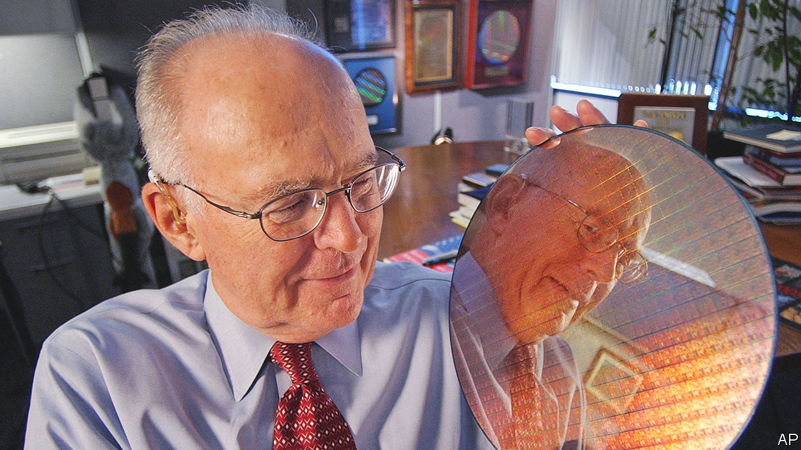

###### A world built on sand

# Gordon Moore’s law was the spur that drove the digital revolution 

##### The physical chemist who co-founded Intel died on March 24th, aged 94 

 

> Mar 30th 2023 

Medieval philosophers once wondered how many angels could dance on the head of a pin. Gordon Moore, who with his liking for pad, pencil and a quiet, solitary desk often looked philosophical, wondered how many transistors could be etched on one silicon wafer to make an integrated circuit. The first transistors he had ever encountered, in 1954 at a lecture by the man who had co-invented them, William Shockley, were as big as peanuts. But they were shrinking fast. The more you could pack together, the more these tiny marvels could do, until they could probably change the world. 

In 1965, in  magazine, he laid out his thinking plainly. In the past decade, the number of components in each integrated circuit had roughly doubled every year. In the next decade, therefore, they would probably do the same. Devices containing such circuits would become more efficient, more popular and less expensive, all at an exponential rate. They would power “such wonders” as home computers, automatic controls for cars, and “personal portable communications equipment”. Even wristwatches could have them. And though he went no further into his crystal ball than 1975, he saw no reason why this extraordinary growth should not go on for a long, long time.

The article caused a sensation. What seemed to him just blind extrapolation was seized on as a Great Truth, “Moore’s law”. From that time on, semiconductor companies took it as a given that the processing power of their product ought to double every year. If it didn’t, they would lose their edge. In 1975 Dr Moore reviewed it, and thought the rate of doubling should be every two years—even though, in the preceding decade, it had in fact doubled in nine of the ten years. This refinement hardly made a difference. The points the industry took away from him were, first, to make semiconductors as tiny as possible, and second, to do it fast. Or fall behind, probably never to recover. 

He was surprised to have given his name to any law, and more so to be called a revolutionary. The silicon revolution was a fact, but he himself was a rooted, reserved sort of fellow who had hardly ever lived outside the foggy country south of San Francisco, and whose greatest love, beyond his work and his wife, was fishing. The closest he had come to revolution was when, as a boy, he made explosives with a home chemistry set, and somewhere in his well-stuffed bookshelves he still had his acid-scorched primer on the nature of nitroglycerine. But when it came to forging the digital age he was simply, he thought, in the right place at the right time. He got into semiconductors at the very start, and that was a great piece of luck.

He also drove the transformation, though, and not just with his law. At Shockley Laboratories, where he went in 1956, his job was fundamental: to create a cheap transistor based on silicon, of which the world had plenty. At Fairchild Semiconductor, founded by “the traitorous eight” who broke from Shockley in 1957, he developed a smooth silicon-dioxide surface on which to print the electric circuits and pioneered the use of aluminium wires to connect the transistors. When he founded Intel with Robert Noyce in 1968 he worked on self-isolating transistors, which could be packed more closely, as well as devising a better dip to clean the silicon surface before the aluminium went on. This single change increased chip production more than tenfold. 

He called himself an accidental entrepreneur, but there was not much accident about it. He left Shockley mostly because the man had no interest in getting the product to market. At Fairchild, in which each founder had invested $500, they were making chips commercially in less than a year, and had overtaken both Texas Instruments and Bell Labs in military applications. But Fairchild became too slow for him. His business plan for Intel, vague as it looked—to make interesting things with silicon—was spurred by his burning belief in chips in everything. By the 1990s, Intel microprocessors were in 80% of all the computers made in the world.

Moore’s law stated that as microchips invaded appliances, sales would soar and prices would fall; but setting up to make them was costly. He therefore strived to save money. He fitted out Fairchild’s first premises with cheap kitchen units and blew his own glass tubes to manipulate gases, as he had done for Shockley. At Intel he watched every cent, down to the rubber gloves which he found for $1 a pair, rather than $2.50. This was habit. Until 1961 he had kept a ledger of all household incomings and outgoings, including a nickel found in his wife Betty’s pocket and a dime spent on a pencil “(red)“. After 1961, he no longer needed to; his monthly salary, as charted in the ledger, was rising as steeply as the number of transistors on each chip. By 2014 his net worth was $7bn.

Typically, though, his wealth did not change him. He liked to wear well-worn khakis and go out in his rickety old fishing boat, until it became unsafe. He liked things as they were. When he became rich he and Betty gave more than half of it away. They were motivated by seeing their fishing haunts in Baja California smothered by development, and their precious wild places disappearing. He did not think small. His foundation’s grants went not just to CalTech and the Bay Area but were also earmarked to save two-thirds of the Amazon basin and the whole arc of salmon rivers that curved from northern California, through Alaska, to Russia’s east. 

He hoped that might be his permanent legacy. Instead his legacy, inevitably, was Moore’s law, which could not last for ever. He had never said it would; exponential growth always burned itself out. By 2020 its end was predicted within a decade in America. The Taiwanese were doing well but, even so, transistors could not endlessly be made smaller. In 2021 one was achieved that measured no more than a nanometre, a billionth of a metre, almost the size of an atom. Already billions of transistors could be squeezed on one silicon chip. Naturally, he accepted the laws of physics. As a chemist, though, he could not help hoping that some new material, some new process, might yet make room for more. ■

