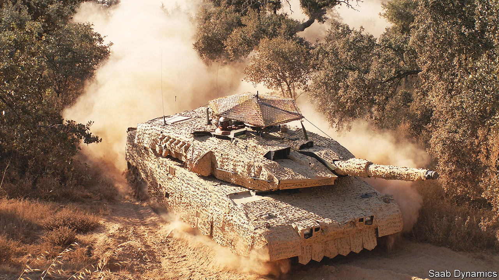
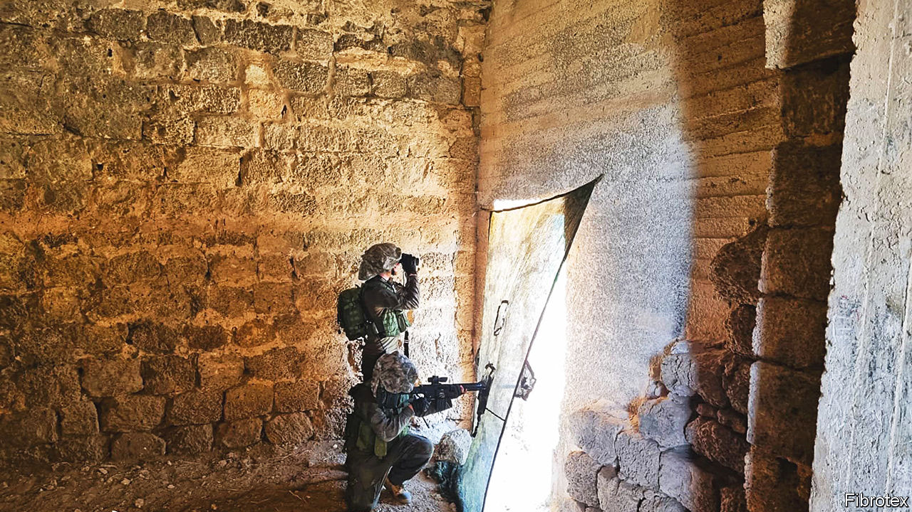

###### Hyperspectral camouflage

# Better camouflage is needed to hide from new electronic sensors 

##### A deadly game of hide and seek 

 

> Mar 29th 2023 

Camouflage ranks highly among the arts of war. Thanks to innovations such as fractal colouration patterns, which mimic nature by repeating shapes at different scales, the distance from which naked eyes can quickly spot soldiers wearing the best camouflage has shrunk, by one reckoning, by a fifth over the past two decades. That is impressive. 

On today’s battlefields, however, it is no longer enough to merely hide from human eyes. People and kit are given away as well by signals beyond the visual spectrum, and devices that detect these wavelengths are getting better, lighter and cheaper. Thermal sensors are a case in point. Today, one that costs about $1,000 and weighs as little as five sachets of sugar can, in good weather, detect a warm vehicle as far off as 10km. 

As Hans Kariis, deputy head of signatures research at the Swedish Defence Research Agency, notes, that is well beyond the range at which a small drone would be spotted. Two decades ago, he adds, a less sensitive thermal sensor weighing a kilogram cost ten times as much.

For forces in Ukraine keen to go unnoticed, the challenge is not just that precision sensors are multiplying, on land, in the skies and in orbit. It is also that better automatic target-detection software is helping operators find needles in the haystacks of data being collected. 

Look out!

For example, software called Kestrel, developed by Sentient Vision Systems of Melbourne, Australia, scans feeds of visual, infrared and radar data, and places red boxes around people and other potential targets, even as their positions in the frame move. Sentient says Kestrel has been deployed on more than 3,500 crewed and uncrewed aircraft since its introduction in 2009. The pertinent data processing, which also classifies objects and calculates ranges, can be done aloft—a bonus, for an aircraft may collect more data than can be streamed to computers on the ground.

As Maksym Zrazhevsky, an analyst with Molfar, an intelligence firm in Dnipro, Ukraine, observes, the fighting in his country shows how these advances have made it far harder to camouflage military assets. This no doubt helps explain why, as Mr Zrazhevsky notes, Russian forces in Ukraine have resorted to using sections of timber to disguise military refuelling vehicles as civilian logging lorries. However clever that may seem, there’s a rub. The 1949 Geneva Convention on warfare bans “the feigning of civilian, non-combatant status”, as Article 37’s “Prohibition of perfidy” puts it.

But there is a different, convention-compliant approach to reducing the chance of appearing in an enemy’s cross-hairs. Rather than make targets seem civilian, design special camouflage that tricks electronic sensors as well as human eyes.

One developer of such “multispectral” camouflaging is Saab, a Swedish industrial giant. Its Barracuda unit sells camouflage netting for vehicles and soldiers that reduces both radar reflections and heat signals. To handle radar, it contains a layer of specially crafted (but secret) semi-conducting polymers that absorb a portion of the incoming beam. That stops reflections revealing tanks and other military gear underneath. Formulating the polymer is tricky, says Johan Jersblad, a senior camouflage engineer at Saab. If it is too conductive, the netting itself will appear on a radar screen and become a target.

Saab’s nets’ heat-signature reduction comes from an insulating material, also of undisclosed composition, which reflects infrared radiation from what it is covering back towards its source, be it an engine, a gun or a body. To better fool soldiers or software scanning thermal imagery, the material also reflects cooler wavelengths emitted by surroundings like the ground and vegetation—in effect, stealing their temperature from them. The material in question is distributed unevenly, to mimic heat variation in the natural world. Dr Kariis reckons today’s multispectral camouflage cuts in half the range at which an asset can be spotted by many sensors.

 


Multispectral camouflage nets are typically reversible—with a different pattern, chosen from a range that includes snowfield, desert, urban, woodland and the like, on each side. The netting is not unduly heavy. A poncho called Noa lite, developed by Fibrotex, an Israeli firm that supplies America’s army, weighs less than 700g. To create a covering for an observation post, the ponchos can be attached to each other, or a single one, hung up, can shield a soldier (see picture).

Producers keep price lists close to their chests, but the products cost enough to be deployed only sparingly on Ukraine’s battlefields. Mr Zrazhevsky notes, for example, that multispectral netting called Nakidka, a product of NII Stali, a Russian firm, is usually used only for high-end kit, like T-90M tanks and mobile Iskander missile launchers. Ukraine is also short of multispectral camouflage, says a colonel in Kyiv, who prefers to remain anonymous. With insufficient ponchos for even snipers and special forces, some soldiers, he says, are attempting to buy their own.

A flaky design that isn’t

Other approaches to reducing soldiers’ heat signatures are in the works. With money from America’s Air Force Office of Scientific Research, and from DARPA, a research agency of that country’s defence department, a team at the University of California, Irvine is designing infrared camouflage by embedding tiny metal flakes into thin sheets of rubber. These sheets can then be incorporated into clothing. 

One design employs copper, the flakes being about a tenth of a micron thick and a few tens of microns in diameter. These reflect body heat inwards. Another uses similarly sized flecks of aluminium with surfaces wrinkled into ridges. These ridges scatter infrared emissions in different directions, blurring a heat source’s shape.

Both designs would add but a trivial amount of weight to military fatigues, notes Alon Gorodetsky, a professor of chemical and biomolecular engineering at Irvine, who leads the project. The technology, he says, could be ready within a few years. Such materials, he adds, might also be used as insulation for the better control of heat flows in electronics.

A different sort of infrared camouflage, called an “appearance modulation” system, is being developed for military vehicles, by BAE Systems, a British defence contractor, with money from the Swedish Defence Materiel Administration. Adaptiv, as it is dubbed, draws electricity from a fighting vehicle to cool, rapidly, sheets of hexagonal “pixels”, each somewhat larger than a hand, which are affixed to it. The pixels’ temperatures are individually adjustable.

In “blending mode”, Adaptiv uses data from an infrared camera to match itself to the temperatures of nearby objects. Operators can also select among pre-programmed patterns in an image library. As BAE Systems points out, this is to allow them to make a military vehicle appear in thermal imagery to be another object, such as a car or lorry. Some reckon that could fall foul of the Geneva Convention’s passing-off prohibition. (BAE declined a request for an interview.) At any rate, the firm says the technology, which has been demonstrated on a CV90 armoured vehicle, could enter production in two years’ time.

Adjustable visual camouflage is also in the works. With €700,000 ($700,000) from the European Defence Agency, an arm of the European Union, a research outfit called TNO in the Netherlands has designed battery-powered sniper suits that have some 500 light-emitting diodes (LEDs), each half a centimetre in diameter, embedded in their fabric. The system uses data from a helmet camera and a light sensor to change automatically the colour and luminosity of the LEDs to match the wearer’s surroundings. Maarten Hogervorst, a researcher on the project, describes the suit as “a Harry Potter cloak”.

Wilder things, even more deserving of Dr Hogervorst’s description, are in the pipeline. Hyperstealth Biotechnology, a firm in Maple Ridge, British Columbia that has designed some 15,000 camouflage colouration patterns for more than 50 countries, is now making objects appear invisible. Its “Quantum Stealth” system uses translucent plastic sheets with rows of elongated lenses called lenticules. Sticking two sheets of these together so that the lenticular ridges in one are aligned with the troughs in the other causes destructive interference. This stops light reflected from an object close to the sheets reaching an observer on the other side, while transmitting that from objects somewhat farther away, in the background.

The illusion, though imperfect, is startling. According to Guy Cramer, the company’s founder, the system also works at infrared wavelengths. A national-security agency of America’s government that prefers to remain unnamed has purchased the material for testing.

Exciting as these advances are, it remains to be seen which will prove most effective, or even practical, on tomorrow’s battlefields. Sensors, too, are improving in ways that Dr Jersblad calls “scary stuff” for camouflage technologists. The threat from radar, for example, which had been fairly constant for a couple of decades, has risen sharply in recent years. Dr Jersblad points to satellite-based synthetic-aperture-radar (SAR) imagery supplied to Ukraine by ICEYE, a firm in Espoo, Finland. This permits users (who include Ukraine’s armed forces) to observe, from orbit and through cloud and even light foliage, objects just half a metre in diameter. New SAR systems for drones promise higher resolution.

Look natural

A greater threat still may be hyperspectral sensors. These use sophisticated data processing to map not just objects’ shapes, but also their composition—be that foliage, fabric or metal. Giorgio Licciardi, an expert on collecting hyperspectral data from orbit at the Italian Space Agency, in Rome, says the technology even detects buried anti-tank mines. (Soil on top of them is typically drier.) Officials are tight-lipped about use of hyperspectral data for fighting in Ukraine, he and others note, but no one doubts that its role will grow.

What, then, might be next? In an age in which hyperspectral sensors are identifying materials over broad areas, it will not suffice, Dr Jersblad says, “to look like nature anymore—you have to  nature”. His lab has therefore acquired a hyperspectral sensor. Their plan is to design camouflage systems that incorporate the actual organic and inorganic materials found in places over which armies might fight. ■


