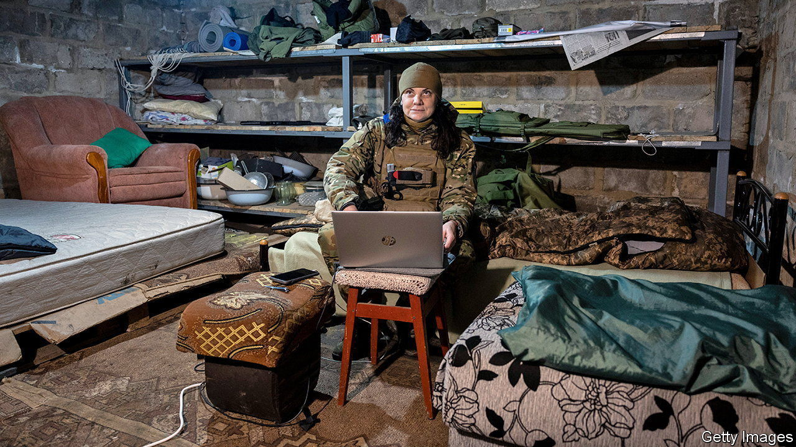

###### Cyber-warfare

# Russian hackers are preparing for a new campaign in Ukraine 

##### A spring cyber-offensive is about to be unleashed 

 

> Mar 29th 2023 


Russia’s cyber-offensive last year was fast, furious—and underwhelming. In it, hackers conducted perhaps the largest ever assault on computer networks. Ukraine, well-prepared and supported by foreign tech companies and allies, parried many of these blows, keeping communications and crucial government services online against all expectations. But the cyberwar, like the physical one, is evolving.

Russian cyber-forces, portrayed as lumbering bumblers, have in fact adapted to circumstances, argues Dan Black, who served in NATO’s cyber-threat analysis branch until December and now works for Mandiant, a cyber-security firm within Google. During its offensive in eastern Ukraine between April and July, Russia expanded its cyber-operations in Poland and eastern Europe to collect intelligence on arms shipments to Ukraine. The GRU, Russia’s military-intelligence agency, began using more malware from criminal markets to augment fancier home-made tools.

In a paper for the IISS, a think-tank, Mr Black says Russian forces showed signs of “a more prepared and reinvigorated cyber-programme” from October, during Ukrainian offensives in the south and east. That included heightened cyber-attacks against energy, water and logistics targets in parallel with drone and missile strikes on Ukraine’s power grid. This pointed to a co-ordinated strategy to ratchet up cross-domain pressure, he argues. A report published by Ukraine’s main cyber-security agency on March 8th showed that “critical” and “high-severity” cyber-incidents, the two most serious sorts, leapt in December, reaching the highest level since the first week of the war. 

That pressure is still building. On March 15th Microsoft Threat Intelligence, which monitors Ukrainian networks, warned that the GRU was “preparing for a renewed destructive campaign”, including reconnaissance against important targets. Its deployment of “wiper” malware, which destroys data, was “reminiscent of the early days of the invasion”. Between January and mid-February hackers working for all three main Russian intelligence services tried to penetrate government and military targets in 17 European countries, paving the way for either espionage or disruption—access to a network allows both. 

Russian cyber-doctrine also puts a premium on information warfare. In November a website began publishing private messages from two senior officials in Moldova—a classic “hack-and-leak” operation akin to the one the GRU conducted ahead of America’s presidential elections in 2016. On March 10th the White House publicly accused Russia of trying to foment a coup in Moldova. Recent Russian propaganda has also spread false claims that Ukrainian refugees abroad were being extradited and conscripted into Ukraine’s army.

Russia’s army is exhausting itself in crude and costly ground assaults across eastern Ukraine. It has little offensive potential left. But it is easier to execute cyber-attacks than raise new battalions.

Some sophisticated operations are only just coming to light: Microsoft recently revealed that Russia had been using a “zero-day” vulnerability—one that is previously unknown and thus impossible to patch—for over a year until it was disclosed in mid-March. The vulnerability was used not just against Ukraine, but also government, military, energy and logistics sectors in Poland, Romania and Turkey. “European energy security and logistics are in the cross-hairs,” warns Mr Black, “and these priorities aren’t fading away.”

Ukraine needs continuous cyber-aid as much as a steady supply of shells. On February 22nd Dutch spy agencies warned that Ukraine’s staunch defence could “probably only be sustained as long as Western support remains as intensive and adaptive as the cyber-operations of the Russian intelligence services.” Mr Black agrees. “The reality is that the war is not over,” he writes. “Interactions between offence and defence could still change as Russia continues to learn from its early shortcomings.” ■


