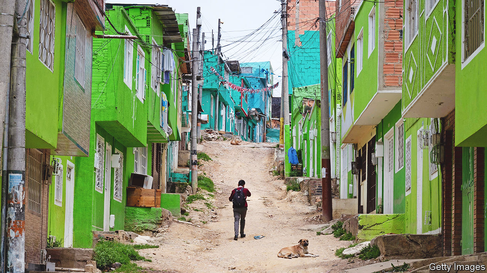
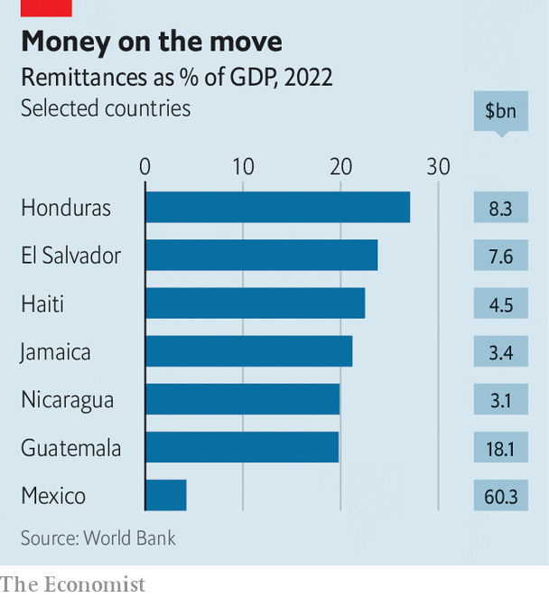

###### Paying back

# Mexico now receives more remittances than China 

##### Migrants are sending record sums home—and shaping Latin America for the better 

 

> Mar 30th 2023 

When covid-19 began to spread in early 2020, bosses in the United States booted millions of foreign-born workers from their jobs. That risked catastrophe for households across Latin America and the Caribbean, many of which cover essential expenses with money sent from relatives abroad. What happened next was a surprise. After crashing briefly, the amount remitted to these countries soared. Last year remittances reached a whopping $142bn, 48% more than in 2019.

The surge owes much to stimulus in the United States, which put dollars back in pockets, as well as to the generosity of migrants, who have dug deep to help relatives in need. Yet bumper flows during the pandemic capped what had already been a decade of fast-rising remittance growth. Over ten years the sums sent home annually to countries in Latin America and the Caribbean have more than doubled, according to the World Bank. That is a swifter rate of increase than in any other region. 

 


Mexico receives by far the biggest amount. Its remittances rocketed from the equivalent of 1.9% of GDP in 2012 to 4.2% in 2022 (around $60bn). In 2021 it became the world’s second-largest beneficiary, jumping ahead of China (India is number one). Money sent home from abroad is even more important to many of its neighbours. Twelve countries in Latin America and the Caribbean get the equivalent of at least 5% of their GDP from remittances. In El Salvador, Haiti, Honduras and Jamaica these now amount to more than one-fifth of national output (see chart).

This cash is some consolation for societies that have lost armies of hard-working youngsters, mostly to the United States. There is not much for them at home: moribund economies are a big reason why people leave. The IMF estimates that GDP across Latin America and the Caribbean will increase by only 1.8% this year. Manuel Orozco of the Inter-American Dialogue, a think-tank, says that “failed development models” across the region have favoured big mining and agricultural companies while neglecting small and medium-sized firms. Workers in this “missing middle” of the economy have little choice but to go.

Remittances are changing places far off the beaten track. In Anamorós, a town of around 17,000 people in El Salvador, large houses constructed with foreign wages loom over traditional dwellings. Local families that do not have relatives in the United States can be counted “on the fingers of one hand”, says Iveth, a municipal worker. She gets $600 a month from three brothers who work in Texas; that pays for her car and helps her support a fifth sibling, who has a disability. On the outskirts of town, Aracely Benítez sits in a shop that she has set up in the garage of a house built with funds that her son, a restaurant worker in Los Angeles, has sent back during his 12 years abroad. At least a dozen nearby homes were paid for in a similar fashion. Plots are laid out for more. 

Most remitted cash is spent on essentials such as food. That helps keep people out of poverty. One recent study of migration from Mexico and six Central American countries concludes that, over 35 years, every 10% increase in the number of migrants working in the United States correlates with a roughly 9% decrease in the number of people back home who were living on the equivalent of $1.90 or less a day. 

People also use the cash to pay for private health care, a boon given shoddy public services. In Haiti, which is racked by gang violence and where there is little or no functioning state, remittances were the equivalent of 23% of GDP in 2022. Jean-Robert Jean-Pierre, a 67-year-old Haitian, says “you have to pray to God to never get sick” unless someone is helping; in his case a friend who sends $400 a month. 

Education benefits, too. Migrations can harm children if it means growing up away from a parent. One survey found that, in countries in the region that are typical sources of migration, between 7% and 21% of children are missing at least one parent. But research carried out for UNESCO, which weighed up the results of 11 studies in seven countries, found that remittances appeared to drive up the amount households in Latin America and the Caribbean spend on schooling by between 23% and 83%. 

Remittance flows are helpfully counter-cyclical. As was the case during the pandemic, they tend to swell when other sources of foreign income, such as tourism and investment, start to fall. That helps smooth consumption. 

Yet economies that rely on remittances can also suffer unwelcome side-effects. In theory they can cause local currencies to appreciate, making exports less competitive. There is some evidence that this has happened in parts of Central America, though the impacts appear to be small.

 In some parts of the Americas remittances are probably reducing inequality, according to the international-development arm of the United States government (USAID). That is because people who see the least opportunity at home are most likely to try their luck abroad. The reverse may be true in very poor locations, where only households that are doing comparatively well can find the money that it costs to send loved ones across borders. 

Studies suggest that, on balance, remittances have a small but positive effect on growth. One drawback is that receiving remittances can discourage people from working, which limits the extent to which foreign cash drives lasting development at home. Research suggests that, in Honduras, receiving remittances reduces an individual’s likelihood of being employed by nearly nine percentage points on average, compared with people who are otherwise similar. Ercelia Benítez, who runs a café in Anamorós (and is a cousin of Aracely), has spent two months trying to hire someone. She blames the influx of foreign cash. 

Yet across the region there exist many more encouraging tales. Julisa Morena, a mother of two in Chiapas, Mexico’s poorest state, says that food, bills and school uniforms eat up much of the $100 her husband sends her each week from Arkansas. But over four years she has managed to save enough to buy land and some cows. In a few years, she thinks, these will be making enough cash for her husband to come back.

Governments could do more to maximise the benefits that can flow from their diaspora’s success. For years Mexico’s federal and local governments persuaded migrant groups to invest in public projects by offering to match any money they chose to donate to small-scale projects back home, such as better roads or new community buildings. “People loved it,” says Roxanna Hernández, who worked for the programme in San Luis Potosí state. But the project was suspended in 2018. Dilip Ratha of the World Bank says Latin American countries could also follow in the footsteps of Israel, India, Nigeria and other countries which have raised money for investments by selling bonds to emigrants.

A priority should be to push up the share of remittance recipients who have bank accounts, reckons Mr Orozco. These people have more power to save than others. But in much of the region remittances are withdrawn in cash from wire services and never returned to the banking system; any money not spent is often squirrelled under mattresses. Formalising these savings would increase the amount lenders can invest in local businesses. And drawing more people into the banking system would also allow them to use financial products, such as credit, that can further improve their lot.

More than half of remittance recipients in El Salvador do not own a bank account. Nayib Bukele, El Salvador’s millennial president, has pointed to remittances to justify his government’s efforts to promote the use of bitcoin, which became legal tender in 2021. He has said that adopting the cryptocurrency can help reduce the costs involved in receiving money from abroad. There is no good evidence of that. 

Some research suggests that people who receive remittances are more likely than others to emigrate themselves. Helping them build assets makes it more likely that they—and their money—will hang around. Either way, the region will continue to benefit from those who make the journey north. ■

