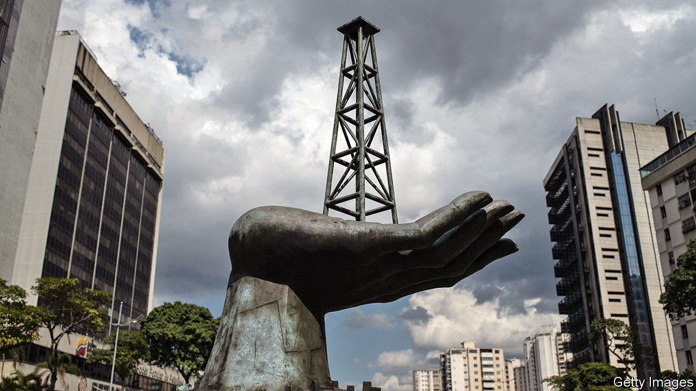

###### Oily business

# Venezuela’s autocrat launches a massive corruption probe 

##### Nicolás Maduro targets the decrepit state oil giant 

 

> Mar 30th 2023 

Oil has been the backbone of Venezuela’s autocratic regimes for decades. According to Juan Pablo Pérez Alfonzo, the country’s oil minister in the 1960s and one of the founders of the Organisation of the Petroleum Exporting Countries, the fuel was not “black gold”, but the “devil’s excrement”. A corruption probe announced by the dictatorial government of President Nicolás Maduro on March 17th suggests there may still be some truth in that.

So far the probe has led to the resignation of Tareck El Aissami, the oil minister, who has not been named in the investigation. Nearly two dozen people have been arrested, including politicians and the cryptocurrency regulator. Eleven other people are being sought by the state prosecutor. The episode offers a rare window into the chaos and corruption at the top of Petróleos de Venezuela SA (PDVSA), the state oil giant which Mr Maduro, following in the footsteps of his late predecessor, Hugo Chávez, has driven to near-ruin.

According to company documents seen by Reuters, more than $3bn has gone missing from PDVSA since 2020 and is likely unrecoverable. There is a further $18bn missing to potential bad debt or fraud. In total, 84% of the value of its invoiced shipments over the last three years remains unpaid. Some of the recipients claim they did pay, but the amounts never showed up in the company coffers. State media show images of private jets and commercial buildings bought allegedly with dodgy funds. 

These losses for the enfeebled company are grave. They came about partly because the firm became more reckless in order to evade American sanctions, which were imposed on PDVSA in 2019 after Mr Maduro rigged the election in 2018. 

Since then, PDVSA has been selling oil at a heavy discount through a byzantine network of intermediaries, mostly to independent refiners in China. The middlemen bypass American sanctions, sometimes deploying so-called ghost ships which switch off their tracking devices or change their names at sea. Some of the companies trading the oil were set up just weeks before they dealt with PDVSA. A few may have been fraudulent and never intended to pay for the cargoes they received.

Rumours of the missing billions and dubious trading practices have been swirling around Caracas, the capital, for months. “Entire oil tankers are being offered in exchange for bitcoins,” one businessman claimed last year. He said the cash-strapped government was seeking to settle its bills with crude oil as part of a barter system of payment. “We are all oil traders now,” he remarked. 

But the government had not said anything publicly about the brewing scandal until March, when it confirmed the first arrests had been made. One theory for the delay is that Mr Maduro felt he needed an explanation for a deteriorating economy. Amid a shortage of dollars, the central bank has been struggling to prop up the local currency, the bolívar. It has slumped sharply since October, falling by two-thirds against the dollar. This undermines Mr Maduro’s claim that he has moved the country on from the economic catastrophe of the past decade. Rising inflation is also a problem for him ahead of presidential elections planned for 2024. 

Blaming malpractice at PDVSA for such problems is politically useful. Some speculate that Mr Maduro’s probe is partly designed to send a message to his internal opponents. But punishing those responsible is also a delicate business in the regime’s nepotistic world. In January Asdrúbal Chávez, then the head of PDVSA, was removed from his post. He is a cousin of the late autocrat. That might explain why no mention was made in public when he was relieved of his duties. 

Francisco Monaldi of Rice University in Houston, Texas, doubts that Mr Maduro is being particularly strategic. Instead, what the probe hints at is something simpler and sadder: that the country’s oil industry is “a massive corruption machine in which very little money at all ends up benefiting the Venezuelan people”. ■

