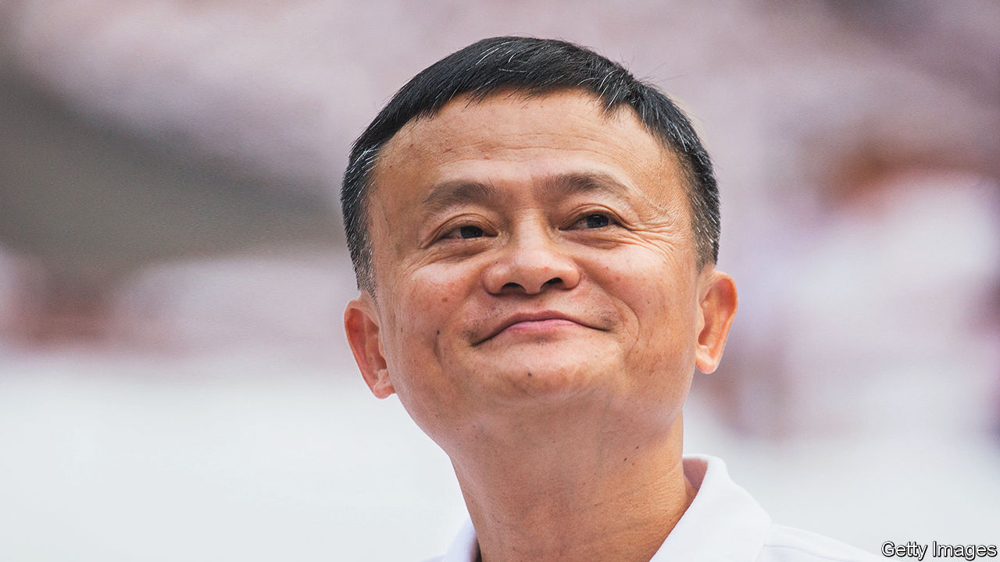

###### The world this week

# Business 

#####  

 

> Mar 30th 2023 

 announced plans to turn itself into a holding company overseeing six divisions, which could potentially pursue their own stockmarket listing. The six units will include the Chinese tech company’s struggling cloud-computing business, media and e-commerce. Alibaba was not forced by regulators to split, but its radical overhaul comes nearly three years after the start of the Chinese government’s crackdown on tech giants for becoming too powerful. Meanwhile, , Alibaba’s founder, returned to China for the first time in more than a year, which was taken as another sign that regulators are easing their campaign. 

Sergio Ermotti is returning to  as chief executive to guide the Swiss bank’s emergency takeover of . Mr Ermotti ran UBS from 2011 to 2020. He is replacing Ralph Hamers, “who has agreed to step down to serve the interests of the new combination”, according to UBS. Merging the two banks is immensely complicated, it said, which calls for Mr Ermotti’s “unique experience”.

There was another casualty from the fallout surrounding the collapse of Credit Suisse. Ammar al-Khudairy resigned as chairman of , a big investor in the Swiss bank. His comments in March about not investing more in Credit Suisse were followed by a market rout. 

 clawed back most of the losses from a sell-off caused by the soaring price of its credit-default swaps, which act as an insurance against a default on its debts. In a jittery market the sell-off spread to other banking stocks, but they, too, recovered. 

A costly bankruptcy

America’s Federal Deposit Insurance Corporation engineered the sale of  deposits and loans to  , a bank based in North Carolina. The FDIC estimates that the failure of SVB will cost its deposit-insurance fund $20bn. 

, the world’s biggest crypto exchange, faced its most serious legal challenge yet when a regulator in America accused it of operating illegally. In a civil lawsuit the Commodity Futures Trading Commission alleged that much of Binance’s trade and profit comes from America, but it had never registered with the CFTC and “disregarded” financial laws. Changpeng Zhao, Binance’s boss, said the complaint was “unexpected and disappointing”.

American prosecutors added another charge against , who ran FTX until the crypto exchange’s spectacular collapse last November. Prosecutors now contend that Mr Bankman-Fried paid $40m in bribes to Chinese officials in 2021 to allow him access to accounts linked to a sister company. 

Bob Iger continued his shake-up of . Isaac Perlmutter was removed as chairman of Marvel Entertainment (which is separate from Marvel Studios); his relationship with Mr Iger has been described as rocky. Disney is also scrapping its nascent attempt to expand into the metaverse, a strategy that envisioned immersing audiences in a digital “experience”. Mr Iger is focused on trying to turn a profit from Disney’s streaming platforms. 

Elliott Management, an activist hedge fund, withdrew plans to nominate directors to the board of , after the business-software company produced a solid set of earnings and a new strategy for growth. Elliott and other shareholders had criticised Salesforce for splashing out on costly acquisitions, such as Slack and Tableau. 

Bits of the source code that underlies  were published on GitHub, a repository for open-source software. Hackers could use the code to attack the platform. GitHub removed it after Twitter threatened legal action. Elon Musk, meanwhile, appeared to backtrack on a plan to promote tweets only from verified users. He also reportedly thinks Twitter is worth $20bn; he paid $44bn for it in October. 

The share price of , a retail-payments system marketed as Square, struggled to recover from a sharp fall sparked by a report from Hindenburg Research, which specialises in short-selling stock, claiming it had “wildly overstated” its number of users and “misled investors”. A report by Hindenburg into the Adani Group in India triggered a sell-off in its shares in January. Block said Hindenburg’s claims were “misleading” and it was considering legal action. 

Do you read me, HAL?

A study by Goldman Sachs estimated that two-thirds of jobs in America and Europe could be affected by, and 7% of workers could lose their jobs. This week more than 1,100 people associated with the AI industry, including Elon Musk and Steve Wozniak, signed a petition calling for a six-month pause in developing systems such as ChatGPT so that discussions can take place on better oversight. 

