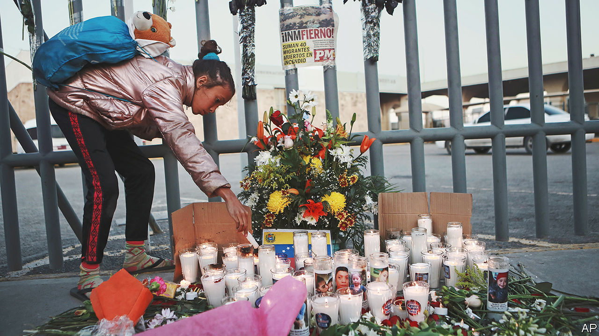

###### The world this week

# Politics 

#####  

 

> Mar 30th 2023 

, prime minister, agreed to pause legislation intended to weaken the Supreme Court and politicise judicial appointments, after mass protests brought the country to a halt. Organisers of the demonstrations claim that almost 7% of the population marched against the new laws. Thousands of soldiers and pilots in elite reserve units said they would not report for duty if the law passed. The calm may last until April 30th, when the Knesset sits again.

UN investigators have found evidence that security forces and militias committed war crimes and crimes against humanity, including the systematic torture of migrants.


Al-Shabab, a jihadist group in  that is affiliated to al-Qaeda, has lost almost a third of its territory to government offensives, according to the American ambassador. 

America is to provide $100m in security assistance to help  countries battle jihadists. Most of the money will be provided over the next three years to Benin, Ghana, Guinea, Ivory Coast and Togo. This is in addition to direct assistance to Ghana that was announced by Kamala Harris, America’s vice-president, on a trip to the region.

The political opposition to the Hindu nationalist government in  demanded that  be reinstated to Parliament. Mr Gandhi, the leader of the Congress party, says that his recent conviction for defaming Narendra Modi, the prime minister, was politically motivated. He was sentenced to two years in prison for comments he made in a speech in 2019 but is out on bail pending an appeal. 

The prime minister of , Shehbaz Sharif, asked Parliament to take action against Imran Khan, his predecessor, whose supporters clashed with police when they tried to arrest him on graft charges in mid-March. Mr Sharif did not specify what he wanted Parliament to do, though some members of the government have called for Mr Khan’s party to be banned. 

In  the ruling junta dissolved the National League for Democracy, Aung San Suu Kyi’s party, and dozens of other political parties, because they had missed a deadline to register for unspecified elections, which will anyway be a sham. 

Own goal

FIFA, football’s global governing body, said that  would not now host the under-20s football World Cup, which begins in May. The governor of Bali, where some of the matches were due to be held, had refused to allow the Israeli team to play. 

Energy ministers in the  gave final approval to an agreement that will require all new cars to have zero carbon-dioxide emissions by 2035. The deal had been held up by Germany, which secured an opt-out for vehicles that run on e-fuels that are made from carbon and hydrogen and cleaner than petrol, but still carbon-emitting.

Police again fired tear-gas at demonstrators in , amid  against a bill that raises the state retirement age from 62 to 64. A huge demonstration in Paris on March 23rd ended with the worst violence seen on the city’s streets in years, which was blamed on anarchists. The trouble forced President Emmanuel Macron to postpone a visit by Britain’s King Charles, which would have been his first official trip overseas as monarch. The king went to Germany instead.

The  parliament approved application to join . Turkey has also said it will support the application, all but securing Finland’s membership of the military alliance. Hungary and Turkey have yet to ratify Sweden’s bid to join. 

The  prime minister called parliamentary elections for May 21st. The governing New Democratic Party has seen its lead in the polls over the leftist Syriza melt away over the cost-of-living crisis and a deadly train crash. 

 was elected leader of the Scottish National Party and became  first minister, succeeding Nicola Sturgeon, who resigned suddenly in February. The election campaign highlighted the disquiet within the party on a number of issues. Kate Forbes, who was Scottish finance secretary, finished a close second and quit the cabinet after she was offered a role in rural affairs. 

 


At least 40 people died in a fire at a migrant detention centre in Ciudad Juárez, a  city near the border with America. The blaze was thought to have been started by migrants after hearing that they would be deported. 

Dina Boluarte, the president of , was named in an investigation by the attorney-general. Ms Boluarte and Pedro Castillo, her predecessor, who was ousted after he attempted a coup in December, are accused of laundering money during the presidential campaign of 2021. Both deny any wrongdoing.

president, , embarked on a trip to Central America that is bookended by stops in New York and Los Angeles.  warned Ms Tsai not to meet the speaker of America’s House of Representatives, Kevin McCarthy, in California. Meanwhile Ma Ying-jeou became the first sitting or former Taiwanese president to visit China. Mr Ma was in office from 2008 to 2016. His trip was criticised by Ms Tsai’s party. 

A shooter murdered six people at a Christian school in , including three nine-year-olds. Police shot dead the suspect, a former pupil who was described as a biological female who used male pronouns. 

At least 25 people were killed in  by a giant tornado that smashed through the town of Rolling Fork. The tornado lasted for 70 minutes, reaching wind speeds of between 166 and 200 miles per hour (267 to 321kph). 

The White House said that Joe Biden would  an energy bill crafted by Republicans if it passes Congress, because it would make energy-efficiency measures more costly. This came after Republicans failed to override Mr Biden’s first veto in office. The president scrapped a measure that would have made it harder for pension funds to consider environmental, social and corporate-governance (ESG) factors in their investments. 

A greener and pleasant land

America generated more electricity from  than coal for the first time last year, according to the Energy Information Administration. Renewables accounted for 21% of electricity generation. Natural gas remained the largest source, at 39%. 

