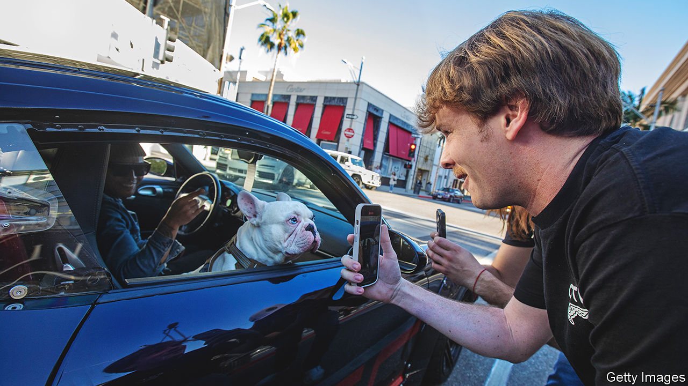

###### China in your hand

# Both America’s political camps agree that TikTok is troubling 

##### That does not mean it will be banned 

 

> Mar 30th 2023 

“Abusing state power to suppress foreign companies”. That might sound like a description of China’s economic strategy, but instead it is the charge that China’s Ministry of Foreign Affairs has levelled against America’s government, without apparent irony. March 28th marked the deadline for TikTok, a wildly popular Chinese social-media app, to be wiped from federal-government devices because of worries about security. Attacks on TikTok, which claims 150m American users, will not stop there. Politicians in Washington are considering two options that China’s government has long embraced for American companies: curbing TikTok’s freedom to operate, or an outright ban.

With its attention-grabbing videos TikTok, like other social-media companies, gets blamed for addicting young people, delivering harmful content and spreading misinformation. According to a new survey by Common Sense, an advocacy group, 45% of American teenage girls say they are addicted to TikTok, compared with a third who say the same about Instagram. American TikTok users spend a staggering 82 minutes a day on the app, more than on Facebook and Instagram combined.

Unlike Silicon Valley firms, however, TikTok has ties to the Chinese Communist Party (ccp) and China’s government through its parent company, ByteDance. This makes users potentially vulnerable to data collection, propaganda and misinformation. “For all the critiques of the American-based platforms, at the end of the day, they don’t report to the cia, and they don’t report to the American government,” says Mark Warner, a senator from Virginia. 

Donald Trump’s administration sought to ban the app but the effort was blocked by a court. Since then TikTok has been trying to negotiate a compromise with the Committee on Foreign Investment in the United States, an inter-agency group focused on national-security risk, suggesting that it should maintain ownership of TikTok but store data in America, under the oversight of Oracle, an American tech firm. 

But few believe that it can really safeguard user data from the Chinese government, given ByteDance’s ties to the ccp and the fact that Oracle would not have true power to police operations. Hence the buzz about forcing ByteDance to divest TikTok, or banning it altogether.

America is not alone in being concerned. India was the first country to ban TikTok (and other Chinese apps) in 2020, after a border clash. Britain, Canada, the European Parliament and others have banned TikTok from officials’ devices, and many countries are considering what to do next. A recent report to Australia’s parliament outlines the “risks not only to the data privacy of individual users, but to social cohesion, democratic functioning and the national-security interests of democratic nations”. National-security folk worry about China using TikTok to interfere in elections, much as Russia used Facebook in the 2016 presidential race in America. 

Although concerns about TikTok began as theoretical, they are no longer so. In December ByteDance confirmed that employees in China and America improperly accessed TikTok data on journalists, including tracking where they were, in an effort to ferret out their sources. TikTok’s content is more pro-CCP than its competitors’ and it also hosts more misinformation, according to the recent Australian report. And for all the talk of American protectionism, China does not make TikTok available at home. A sanitised version, Douyin, is what is on offer from ByteDance in the Chinese market, with strict limits on content and time limits for young users.

Reactions to TikTok—encapsulated in the hostile five hours that TikTok’s boss, Shou Zi Chew, recently spent in front of a committee of congressional interrogators—reveal three important things about America. First, the TikTok question shows how American politicians are more united in opposition to China than at any time in recent history. During the Trump administration it was mainly the China hawks who squawked about the threat posed by China and the app. That has changed. TikTok is “one of the most unifying issues across the political spectrum”, says Ro Khanna, a Democratic congressman from California. Politics mirrors public opinion. Today, only 16% of Americans have a favourable view of China, down from 44% in 2017, according to the Pew Research Centre, a think-tank based in Washington, DC. 

A few fissures are still visible. Republicans are more likely to talk about an outright ban of TikTok, whereas Democrats favour “divestment”, forcing a sale to an American firm. Several politicians, including the “squad” of left-wing progressives in Congress, portray the anti-TikTok rhetoric as xenophobic. But what’s most striking is the broad alignment of opinion in an otherwise polarised Washington.

Second, the TikTok debate offers a lens into politicians’ calculations. With greater reliance on younger voters, who in turn rely on TikTok to fill their days, Democrats have been more hesitant to contemplate a ban. “There’s recognition among Democrats that you’d have mutiny in this country if you kick millions of young people off TikTok,” says Mr Khanna. What would mutiny look like? “You’d have real anger at a governing class they think doesn’t get how young people communicate,” he predicts. Gina Raimondo, the commerce secretary, has mused that “the politician in me thinks you’re gonna literally lose every voter under 35, for ever.” In its extensive lobbying in Washington TikTok has focused on Democrats’ vulnerability to young voters’ anger, in an effort to avert a ban. 

Finally, the debate over TikTok highlights how little tech lawmaking has occurred on the federal level and the extent to which it is originating from state legislatures. Before the federal government banned TikTok on government devices, many states had already done so. Despite years of congressional hearings castigating tech bosses, no meaningful national law on tech has passed since one in 2018 punishing online promotion of sex trafficking. Although there are calls for a national privacy law, which would enable consumers to access and delete their data, it is not a priority, says Brian Wieser of Madison and Wall, a consultancy. 

In contrast, five states (including California and Connecticut) have passed comprehensive privacy legislation. Utah has just passed a first-of-its-kind law requiring parental permission for those aged under 18 to use social media and banning usage for under-18s after 10.30pm. A patchwork of state legislation will create a headache not just for TikTok but all internet firms. 

What happens next? That may be determined as much by Chinese officials as American ones. Many politicians think a sale of TikTok to an American company rather than an outright ban is most politically palatable, but recent reports suggest that China would rather shut down TikTok than allow its sale. “If the Chinese say no to a divestment, that gives the administration political cover for a ban,” says Matt Perault, director of the Centre on Technology Policy at UNC-Chapel Hill.

The clock is tiktocking

Several proposals about how to pursue a ban are being bandied about. A bipartisan bill sponsored by Mr Warner and John Thune, a Republican senator, called the RESTRICT Act, has White House support and has “most momentum” in Washington, says Matt Pottinger, who was deputy national security adviser under Mr Trump. The bill would give the Commerce Department authority to investigate and “mitigate” (ie, “ban”) threats posed by foreign companies. It is designed to circumnavigate the “Berman Amendment”, a law of 1998 that guarantees the free flow of information to hostile nations and has been a barrier to an outright ban.

A TikTok ban would not be straightforward. It would be challenged on First Amendment grounds, and several free-speech groups, including the American Civil Liberties Union, have threatened to take action. One way round this could be to add TikTok to the Commerce Department’s “Entity List”, a sanctions list, which would prevent platforms from hosting the app (literal deplatforming) and would probably withstand a First Amendment challenge. 

Action will either happen soon or take ages. As the 2024 election approaches, politicians will show less appetite to target one of young voters’ favourite apps. Precedent in tech politics suggests that lawmakers’ outrage could give way to inertia. “A lot of people are going to talk big, but nobody’s going to have the courage” to ban TikTok, says Nazak Nikakhtar, a lawyer at Wiley who previously worked for the Commerce Department. The short-form video app is poised to remain a long-running drama.■


