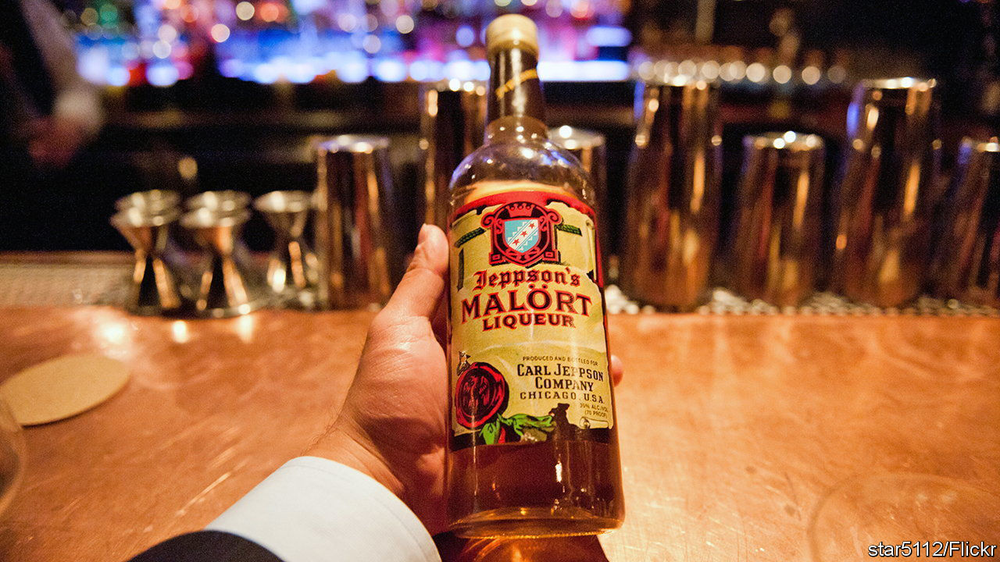
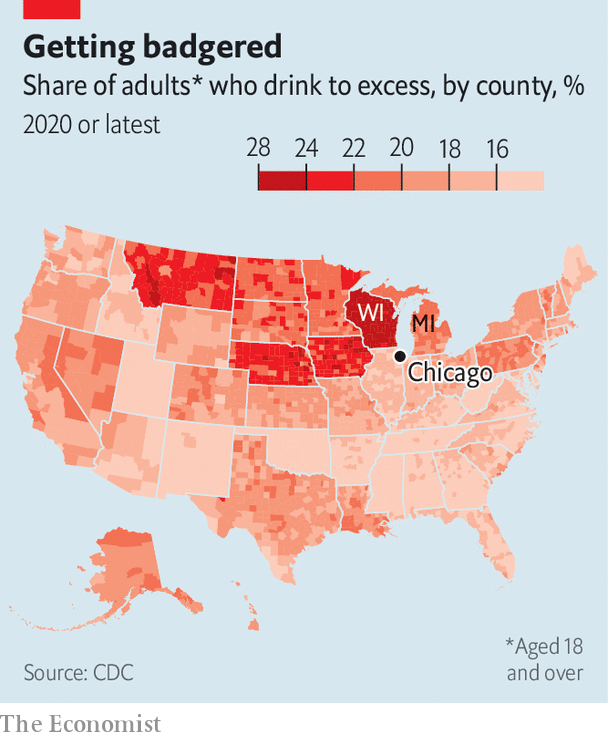

###### Care for a shot of Malört?

# Chicago tries to export its most unpleasant drink 

##### Why do parts of the Midwest love such awful booze? 

 

> Mar 30th 2023 

New visitors to Chicago—at least those who stay with local friends or relatives—can expect many lovely experiences. They will be taken to the Art Institute, to pose like Ferris Bueller in front of priceless paintings, and to The Bean to take selfies with the skyline, then perhaps for an Italian beef sandwich. Almost as inevitable, at least if they are not teetotallers, is that afterwards they will be taken to a bar and forced to drink a “Chicago handshake”: a pint of Old Style beer and a shot of a deeply bitter spirit that is almost entirely unknown outside the Windy City. 

That is Jeppson’s Malört, a wormwood liqueur invented by Carl Jeppson, a Swedish immigrant to the city almost a century ago. The spirit is so closely associated with Chicago that it includes a version of its flag on the bottle (an old one, with three stars instead of four). It tastes, connoisseurs say, a little like an old shoe. Yet its owners would like it to sell elsewhere.

 


In late March Malört went on sale in Ohio, with a flurry of publicity mostly focused on how awful it is. Since 2018, when ch Distillery, a small Chicago-based maker of vodka, gins and other spirits, bought the brand, it has expanded sales to around 30 states, says Tremaine Atkinson, the firm’s CEO. The market is already there, largely because “Chicagoans land in other places and they all seem to get nostalgic about Malört,” he says. As a result, “it spreads like the noxious weed that wormwood is.” Some fans have even written in from New Zealand, Mr Atkinson says, sending a recording of a song about the drink that leaves a similar aftertaste to its subject. He declined to share it with. It is less clear yet, however, whether the market expands much beyond Chicagoans who have moved away.

And what about the core market, Chicago proper? Some might expect the growing sophistication of American drinking culture to reduce the appeal of bizarre hooch. Visitors to even the smallest towns can now usually buy a fancy craft beer made nearby, so why drink something awful to feel like a local? Drinks like Malört seem to hold on as a symbol of regional pride. Indeed, some fancy bars have recently started offering Malört cocktails—a less traumatising way to try the city spirit. Mr Atkinson says the taste of wormwood goes especially well with citrus flavours.

Of course, Malört is not the only Midwestern alcoholic speciality outsiders are shocked by. In Wisconsin, locals drink a sickly sweet version of an Old Fashioned made with Korbel, a Californian brandy, and Sprite, topped with a glazed cherry. Over half of Korbel’s sales are in the Badger State. In Michigan a popular cocktail, the “Hummer”, features white rum, Kahlúa and two full scoops of vanilla ice cream. Midwesterners are more likely to indulge in binge-drinking than most other Americans (see map). Malört is advertised as being “savoured by two-fisted drinkers”. That is because you need something else in your other hand to wash it down.■


