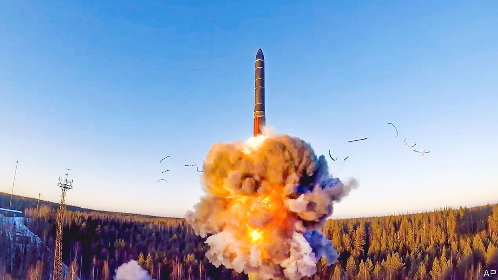

###### Mistrust, don’t verify

# Perils grow as America and Russia stop sharing data on nukes 

##### The war in Ukraine is destroying what remains of arms control 

 

> Mar 30th 2023 

Bit by bit, the fabric of nuclear arms control is being rent. America has done much tearing, for example by abandoning the Anti-Ballistic Missile Treaty and the Intermediate-Range Nuclear Forces Treaty. But with its invasion of Ukraine, and its  to use nukes, Russia has slashed away at what remains.

In recent weeks it has made two more gashes. On March 25th Vladimir Putin, Russia’s president, announced that Russia would deploy  (those with relatively short range and low yield) to Belarus, its satellite state. This would do little to change the nuclear balance—Russia scarcely needs Belarus to nuke Ukraine or NATO. Rather, the move is more a form of nuclear intimidation as Russian conventional forces falter on the ground. America says it has seen no worrying movement of tactical weapons.

More serious is Russia’s near-total halt to information-sharing about long-range “strategic” nuclear weapons. On February 21st Mr Putin declared that Russia would “” New start, a treaty signed in 2010 and extended in 2021. It limits America and Russia each to 1,550 warheads and 700 deployed “launch platforms” (defence-speak for intercontinental ballistic missiles, submarines and heavy bombers). 

The practical meaning of Mr Putin’s move soon became clear: no day-to-day notification of matters such as the movement of nukes; no twice-yearly data exchanges on the state of stockpiles and platforms; no on-the-ground inspections; and restrictions on information on missile launches. On March 28th the Biden administration confirmed to Congress that it, too, would stop the twice-yearly data exchange. “We obviously would like to see Russia back in full compliance. We believe that the New start treaty is good for both our countries. Heck, it’s good for the world,” said John Kirby, a White House spokesman. But given that Russia was not supplying information, “we have decided to likewise not share that data.”

America’s retaliation is calibrated: it will still publish six-monthly public summaries of its strategic arsenal. Moreover, it will continue to provide day-to-day notifications even if Russia does not. “It’s a clever position, and also a very responsible position,” says Rose Gottemoeller of Stanford University, who was America’s chief negotiator for New START. “It conveys to not only Russia but the international community at large that the United States is being the responsible one here.” Yet such asymmetry—whereby America offers reassurance while Mr Putin stirs nuclear insecurity—may not hold indefinitely.

Swapping of information is vital to nuclear stability, enabling each side to verify that the other is abiding by the treaty. Intelligence will  some of the gaps created by the lack of exchanges. But over time, says Daryl Kimball of the Arms Control Association, a lobby group, each side’s picture of the other’s arsenal will blur, increasing doubt and the risk of misunderstanding. “It makes an already difficult relationship harder to manage,” he says.

For now both sides say they will abide by New staRT’s limits on weapons. Yet the breakdown in nuclear information-sharing raises the risk of a future arms race. The treaty is set to expire in less than three years’ time, removing the last restraint on nuclear arsenals. As enmity deepens, the prospect of a follow-on deal is vanishing. This comes just as a new era of  approaches: America will soon confront not one but two big nuclear rivals as China builds up its nuclear stockpile from a few hundred warheads to perhaps 1,500 by 2035, according to the latest Pentagon estimates. 

America is in the midst of modernising its nuclear “triad” of ground-, sea- and air-launched weapons. Some argue that it needs a much larger arsenal. Russia is thus handing American nuclear hawks “a gift”, says James Acton of the Carnegie Endowment for International Peace, a think-tank. What is more, he argues, limits on weapons benefit Russia more than America because Russia is poorer and will one day want to rebuild its degraded conventional forces. “Russia has cut off its nose to spite its face,” says Mr Acton. “The US ultimately beats Russia in an arms race.” ■


