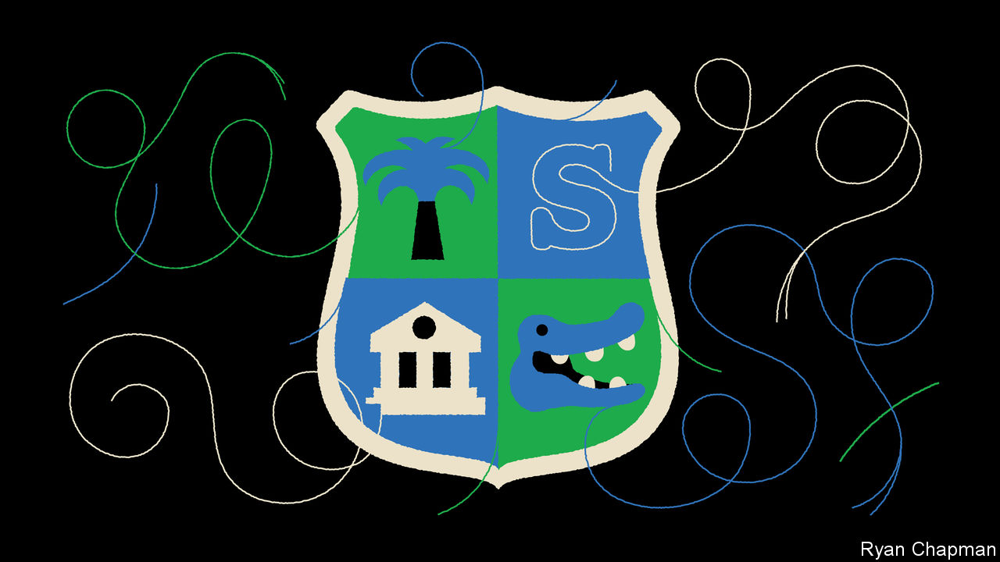

###### Hogwarts and all

# School-voucher schemes are spreading across America 

##### This is despite little evidence that they improve academic achievement 

 

> Mar 30th 2023 

People lined the walls in the packed hearing room. The double doors at the back opened and closed constantly as traffic flowed in and out. Adults whispered, some small children whimpered. A heavyset man in a bright green T-shirt smelling strongly of damp laundry was seated shoulder-to-shoulder with your correspondent. When the Democratic legislators spoke, he leaned closer and mumbled disapprovingly. Agitation was palpable on both sides. Florida was about to pass its first statewide universal school-voucher bill, and the stakes were high.

On March 27th Florida’s governor, Ron DeSantis, signed a bill that will allow families to take about $8,000 of state education funds, typically allocated to public schools, and use it for private school, religious school or even home schooling. Florida is not the first state to do this. A similar law was passed in Arizona last year, and in Arkansas, Iowa and Utah over the past few months. Indiana, Oklahoma and Texas all have similar bills in the works. According to the Centre on Budget and Policy Priorities, half of all states are considering new laws to expand these policies.

About 10% of pupils attend private schools in America, a higher share than in Britain, which is often seen as an outlier. And their number may be about to soar. Fans of vouchers argue that they give less-affluent parents the same sort of choices as the parents of children at Andover and Choate. The concept of school vouchers originated with Milton Friedman in the 1950s, then picked up again in the 1990s and early 2000s. The first programme of that period was spurred by black families in Milwaukee seeking a black-run school district that they hoped would perform better than the racially integrated one. Vouchers were given instead. In the 2010s several statewide initiatives took root in Arizona, Florida and elsewhere.

Now a new wave is building, this time in response to the culture wars. In July 2021 Betsy DeVos, a former secretary of education under Donald Trump, wrote an opinion piece for Fox News which argued that these funding schemes could “liberate kids from race indoctrination”. The pandemic woke parents up to what was happening in state-school classrooms, says Skylar Zander of Americans for Prosperity, a conservative advocacy group.

There is one hitch, though. The evidence for the effectiveness of these programmes is weak. The number of studies, many pointing in different directions, can make the research seem mixed. But limit them to randomised control trials measuring academic achievement, published in top journals, and the story is clear. Voucher schemes did well in the 1990s and 2000s. The programme in Milwaukee had a positive effect on pupils’ maths scores when compared with the state-school children left behind. A separate programme in Washington, DC, during the 2000s also had a positive impact on reading.

Unfortunately, these schemes have fared poorly since then. A decade later, the DC programme produced worse maths scores. In Louisiana’s statewide scheme, pupils who received vouchers for private school had test scores in maths that were 0.4 standard deviations lower than their public-school peers. “We’ve never found something so catastrophically bad,” says Joshua Cowen, who researches education policy at Michigan State University. This was almost double the size of learning loss from covid-19 and Hurricane Katrina.

Why have more recent schemes done so poorly? One reason could be that the earlier ones were more focused. Both Milwaukee’s and DC’s were restricted to lower-income families. Milwaukee’s initiative was limited to only 1% of the entire public-school population from 1990 until 1994, and only 12 private schools took part by 1995. Even as programmes expanded to entire states, they were still focused on specific pupils. The first statewide voucher policy, implemented in 1999 in Florida under then-governor Jeb Bush, was limited to children in failing schools. (Two schools qualified and only 58 pupils took part in the first year.)

These newer programmes might be dealing with the “challenge of scaling”, says Patrick Wolf of the School Choice Demonstration Project at the University of Arkansas. Florida’s current law allows disabled pupils, children in foster care and families with a household income of $120,000 a year or less to qualify. Last year about 200,000 Floridians participated. The new law allows any family to get the state money, even those who have never used the public-school system. Arizona’s kindred universal policy has already nearly quadrupled its voucher programme’s size.

Public schools have also improved over the past 20 years, making it harder for private ones to best them. With the exception of covid-19 learning loss, national exam scores have steadily ticked upwards since the 1990s. Some private schools are excellent, of course. But those ones are typically oversubscribed. Many children whose parents take advantage of vouchers are left with what Dr Cowen calls “sub-prime private schools”, some inside old strip malls and crumbling churches.

Perhaps because the evidence is so thin, the voucher laws in Florida and Arizona are light on measuring academic achievement. What is more, currently the benefits of these schemes go mainly to wealthy families. One study of three states found that most tax-credit scholarship recipients (a type of voucher) came from families earning over $200,000 a year. Even Mr DeSantis had reservations about a universal scheme: “If you have a family that’s very high-income, they have school choice,” he said on March 7th after his state-of-the-state address. “They don’t necessarily need to be eligible for the [universal] programme.” He signed the bill anyway.■


