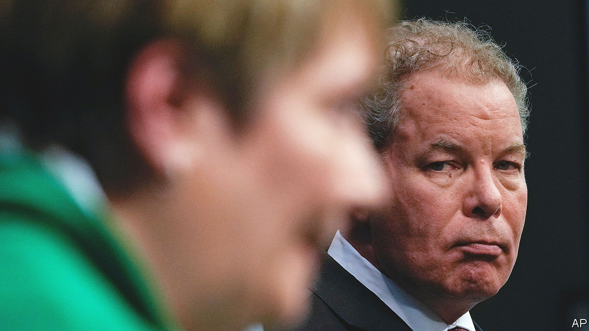

###### Full-court press

# Why winning a Wisconsin Supreme Court race matters so much 

##### In a gridlocked, gerrymandered state, it is the Democrats’ best hope for change 

 

> Mar 26th 2023 

ELECTING JUDGES is fundamentally odd. The perfect example of this is the race to fill an open seat for the Wisconsin Supreme Court. The two candidates met for the only debate of the campaign on March 21st. Daniel Kelly, the relative conservative, insisted in his closing remarks that he was completely apolitical. “We must not talk about politics,” he said. The moderator, a political journalist who had asked mostly political questions, thanked the debate’s sponsor, a website called WisPolitics.com. Journalists then flocked to Mr Kelly’s press adviser, a Republican Party activist and former candidate for lieutenant-governor, to try to get interviews.

The problem is that no one believes the judges will be apolitical. The race has become the most expensive judicial election in the country, with at least $30m spent by partisan operatives on television ads. This contest will determine the ideological balance of the bench, which voters treat more as a supreme legislative council than a deliberative judicial body. 

Mr Kelly, who was appointed to the court in 2016 by a Republican governor, is expected to rule to maintain the state’s s. He is also expected to vote to keep the state’s ban on abortion, which was passed in 1849, in effect. Janet Protasiewicz, his opponent, a liberal circuit-court judge from Milwaukee, is telegraphing her opinions rather unsubtly. She talks frequently about her fundamental belief that a woman has a right to choose. And she has called the current maps rigged. “I put my values right out there. You can figure out what Dan Kelly’s values are by a simple Google search,” says Ms Protasiewicz.

Democrats hope the election on April 4th will help break the stranglehold Republicans have had on state politics. “This election is the hinge moment in Wisconsin’s political history,” says Ben Wikler, the state party’s chairman. Wisconsin, rather like the entire United States, is a profoundly and bitterly, with an almost equal split between Republicans and Democrats. In statewide contests, Democrats have won slightly more elections in Wisconsin than they have lost in recent years. The governor, Tony Evers, is a Democrat, as is one of two United States senators, the secretary of state and the attorney-general. Yet favourable district lines mean that Republicans completely dominate the legislature. They hold 64 out of 100 seats in the state House and 21 out of 33 in the Senate, one short of a supermajority. That means that, at best, a Democratic governor can veto Republican laws, but has no chance of making his own.

These lines are consistently ranked as the most gerrymandered in the country. Mr Wikler hopes the maps will be revisited. Last year the Supreme Court, ruled by a conservative majority, sided with the Republican legislature rather than seeking a compromise. (Wisconsin law says that the legislature and the governor are meant to agree on the map.) It was also unusually strict about voting challenges, making it harder to cast absentee ballots. Mr Wikler warns that three members of the seven-member bench wanted to take Donald Trump’s lawsuit seeking to overturn his election loss in 2020. A knife-edge election in 2024 could be mucked about with, Mr Wikler fears. “To live in Wisconsin is to disabuse oneself of the fantasy that the threat to democracy is gone,” he says.

Republicans agree that democracy is at risk, but argue that the threat is from the other side. With Ms Protasiewicz on it, the court would adopt “a purely partisan gerrymandering map, as opposed to some sense of compromise,” says Scott Walker, the most recent Republican governor of the state. He claims that Democrats are hoping to use the court to usurp the Wisconsin legislature because they cannot win it. Young voters, in particular, he says, have been “indoctrinated” and “don’t appreciate that just because there’s a Democrat governor and Democrat president, that doesn’t mean that they get whatever they want”. He accuses Ms Protasiewicz of promising them political victories even if it means taking legally unsound decisions. 

It is true that Ms Protasiewicz has campaigned on political lines that hardly focus on legal questions. In a series of advertisements, for example, she has highlighted her view that abortion should be legal. That is certainly animating the race. Before the televised debate, a protester dressed as a uterus appeared outside the venue to greet the watchers. But that is a curious thing for Republicans to complain about: they have long approached not just elections but judicial appointments on almost entirely partisan grounds. 

Mr Wikler says Democrats have little choice but to lean in, as the alternative would be tantamount to “unilateral disarmament”. Candidates who are “arguing for a totally apolitical message about competence…can wind up losing,” he says. Craig Gilbert, of Marquette University, points out that the correlation between voting for judicial elections and ordinary partisan contests has gone up markedly over time.

Courting voters

A fairer map would not guarantee Democratic supremacy, because Democratic voters are so concentrated in Madison, the state capital, and Milwaukee, its biggest city. That divide has widened as rural voters have drifted towards the Republican Party, even as Madison has grown and the once-staunch Republican suburbs of Milwaukee have swung to the Democrats. Mr Wikler concedes that “if you relied on geography” there would still “be some tilt” towards the Republican Party.

As long as Wisconsin is divided almost exactly between Republicans and Democrats, the politicisation of the court is inevitable. Too much is at stake, and law too ambiguous, for it to be any other way. Russ Feingold, a progressive former Wisconsin senator, says: “Our elections are, sadly, already becoming increasingly judicial affairs.” The reliance on lawyers to determine huge social and political questions is evidence of a failure of the political system. As this goes on, it will weaken trust in the judiciary. That is not just true of Wisconsin. Last September disapproval of the United States Supreme Court hit its highest recorded level. Wherever you look, the judiciary seems less and less able to do its essential job—to manufacture democratic consensus on the thorniest questions.■


