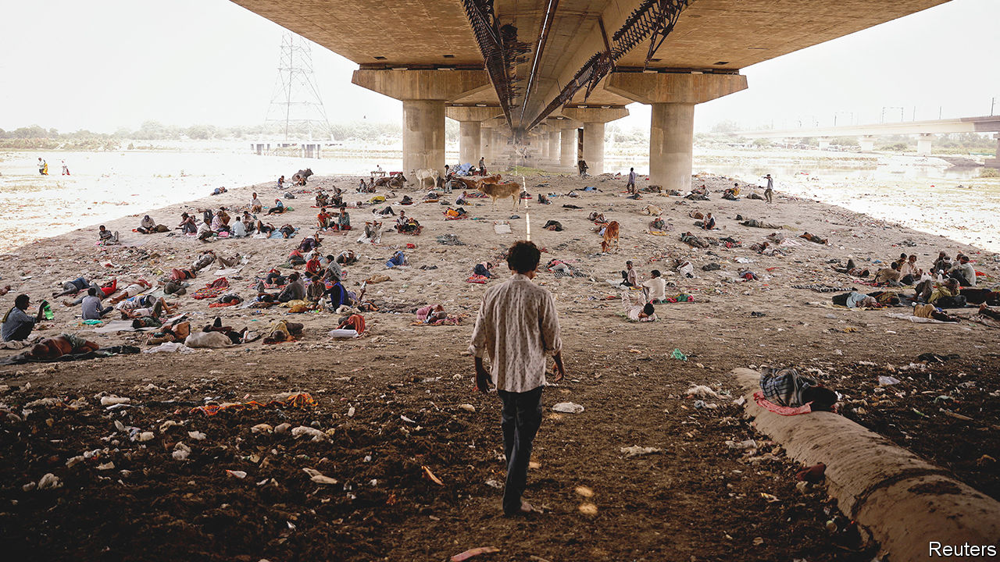
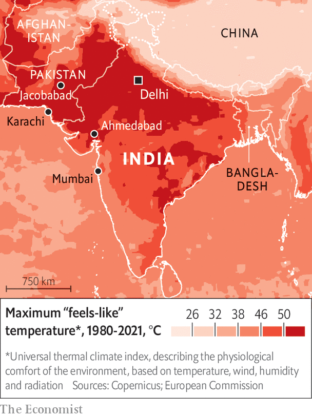
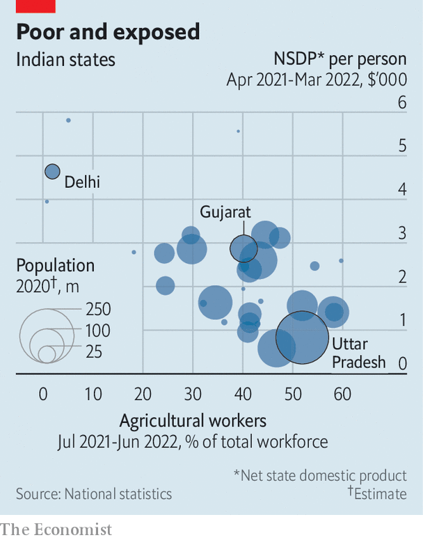

###### Wet bulb hot

# India’s deadly heatwaves are getting even hotter 

##### The consequences of climate change will be horrific for the Indo-Gangetic Plain 

 

> Apr 2nd 2023 

In the opening scenes of “The Ministry for the Future”, the American novelist Kim Stanley Robinson  what happens to a small Indian town hit by a . Streets empty as normal activity becomes impossible. Air-conditioned rooms fill with silent fugitives from the heat. Rooftops are littered with the corpses of people sleeping outside in search of a non-existent breath of wind. The electricity grid, then law and order, break down. Like a medieval vision of hell, the local lake fills with half-poached bodies. Across north India, 20m die in a week.

 


Mr Robinson has said he wrote his bestseller, published in 2020, as a warning. The Indo-Gangetic Plain, which extends from the spine of Pakistan through northern India to the deltas of Bangladesh, is home to 700m people and exceptionally vulnerable to the heat pulses that climate change is making more frequent. It is one of the hottest, poorest and most populous places on Earth (see map). Between 2000 and 2019, South Asia saw over 110,000 heat-related excess deaths a year, according to a study in , a journal. Last year’s pre-monsoon hot season, which runs from March until early June, was one of the  on record. This year’s could rival it.

India has just experienced its hottest December and February since 1901. Last month the India Meteorological Department (IMD) and its counterpart in Pakistan (PMD) warned of above-average temperatures and heatwaves until the end of May. On March 6th Narendra Modi, India’s prime minister, chaired a review on hot-season preparedness. Pakistan’s National Disaster Management Authority kicked off a countrywide simulation to test emergency responses to the flooding that can follow extreme heat. Despite a relatively cool March, the coming weeks could be perilously hot. On April 1st Mrutyunjay Mohapatra, IMD’s chief, raised the alarm again. 

Scientists record heat stress as a combination of temperature and humidity, known as a “” measurement. As this combined level approaches body temperature, 37°C, it becomes hard for mammals to shed heat through perspiration. At a wet-bulb temperature of around 31°C, dangerously little sweat can evaporate into the soup-like air. Brain damage and heart and kidney failure become increasingly likely. Sustained exposure to a wet-bulb temperature of 35°C, the level Mr Robinson imagines in his book, is considered fatal. The Indo-Gangetic Plain is one of the few places where such wet-bulb temperatures have been recorded, including on several occasions in the scorched Pakistani town of Jacobabad. A report by the World Bank in November warned that India could become one of the first places where wet-bulb temperatures routinely exceed the 35°C survivability threshold.

In Jacobabad, the air temperature last year peaked at 51°C. Half the town’s population of 200,000 had by then fled in search of more bearable weather elsewhere. Even after the heatwave began to ease, in June, it was hard to resume regular activity. Ali Bahar, a daily-wage labourer in Jacobabad, recalls trying and failing to work in its surrounding fields in June. While driving a tractor in 42°C heat, he felt feverish and dizzy, then tumbled from the machine, injuring his head. Co-workers carried him to a local clinic, which dished out the standard treatment of a packet of orange-flavoured rehydration salts. He was unable to work for a week. 

The temperature record provides a horrifying account of the changes afoot. According to the definition of a heatwave used by India’s weather agency, India saw, on average, 23.5 heatwaves every year in the two decades to 2019, more than twice the annual average of 9.9 between 1980 and 1999. Between 2010 and 2019, the incidence of  in India grew by a quarter compared with the previous decade, with a corresponding increase in heat-related mortality of 27%. During last year’s hot season, India experienced twice as many heatwave days as in the same period in 2012, the previous record year.

Climate change made last year’s heatwave 30 times likelier than it would otherwise have been, according to World Weather Attribution, a research collaboration. That is both because it has raised India’s average annual temperature—by around 0.7°C between 1900 and 2018—and because it has made heatwaves bigger and more frequent. The magnifying effect of the built urban environment, which can be 2°C hotter than nearby rural areas, is often pronounced in India’s concrete jungles. Those living in slum housing, which offers little air circulation and often uses heat-sucking materials such as tin, suffer the worst of it.

Hot mess

If the climate warms by 2°C compared with pre-industrial levels, as appears unavoidable, such events would be more likely by an additional factor of 2-20. Even if the world makes more headway towards curbing greenhouse-gas emissions than looks likely, “vast regions of South Asia are projected to experience [wet-bulb temperature] episodes exceeding 31°C, which is considered extremely dangerous for most humans,” according to a paper by Elfatih Eltahir of the Massachusetts Institute of Technology and colleagues.

The costs of the heat are already vast. Even working in the shade on an average summer day in Delhi results in labour losses of 15-20 minutes per hour at the hottest times, reckons Luke Parsons of Duke University, North Carolina. Mr Parsons and colleagues have estimated that India loses 101bn man-hours per year to heat, and Pakistan 13bn. During last year’s hot season, the wheat harvest was down by around 15% in both countries. Livestock perished. The normal agricultural day became impossible. Electricity outages shut down industry and, worse, air-conditioning. Even India’s capital, Delhi, faced blackouts. 

A study in 2020 by McKinsey Global Institute (MGI), a corporate think-tank, estimates that the loss of outdoor daylight working-hours to extreme heat in India has risen from 10% of the maximum total before 1980 to 15% today. Models suggest that the proportion will double by 2050 in some parts of India. 

 


The effect is hugely exacerbated by how labour-intensive India and other hot and poor places are (see chart). In 2017 heat-exposed work accounted for 50% of India’s GDP and employed 75% of the labour force, or some 380m people. By 2030, reckons MGI, such work will still make up 40% of GDP, and the rising number of lost working hours could put at risk 2.5-4.5% of GDP, or $150bn-250bn. Pakistan could lose 6.5-9% of GDP due to climate change, the World Bank warned last year, “as increased floods and heatwaves reduce agriculture and livestock yields, destroy infrastructure, sap labour productivity and undermine health”. 

What, short of reversing global warming, can be done? Ahmedabad, a city in India’s western state of Gujarat, offers a guide. In 2010 it suffered a heatwave that killed 800 people in a week. “This was a shocking figure,” says Dileep Mavalankar. As director of the Indian Institute of Public Health in Gandhinagar, Gujarat’s capital, he helped Ahmedabad design India’s first heat action plan (hap). It recommended several simple but effective measures: warn people of extreme temperatures, advise them to stay indoors and drink lots of water, and put emergency services on alert.

Today there are estimated to be more than 100 such plans in India’s cities, districts and states. Karachi, Pakistan’s commercial capital, developed a similar plan after a heatwave in the city in 2015 killed 1,300 people. These steps probably contributed to a surprisingly low death toll during last year’s extended heatwave. Early estimates identified only 90 deaths in India attributable to it, though the true number was probably much greater. The fact that last year’s heatwave was not particularly humid was probably the main reason for the low death toll. It is also the case that places used to intense heat are better at adapting to it than ill-accustomed ones. 

Some haps are better than others. A new study by the Centre for Policy Research, a think-tank in Delhi, found that many oversimplified heat hazards by ignoring the role of humidity, failed to target vulnerable groups and lacked adequate financing. Provisions for forecasting heatwaves are also variable. India’s IMD issues a sophisticated daily heat bulletin with colour-coded five-day forecasts. Pakistan is much further behind. “The PMD is creaky in technology,” says Sherry Rehman, the country’s climate change minister. “To be better prepared, we will need better forecasting abilities.” The two countries would do better by co-operating, says the UN.

They will both increasingly be called on to take much costlier measures, such as designing “cold shelters”, rethinking urban planning and building materials, and bailing out those unable to work in the heat. “We are going to have to learn to live in a warmer world,” says Gabriel Vecchi, a scientist at Princeton University, New Jersey. The question is how orderly, costly or calamitous that learning process will be.

It is hard to find much comfort in the underlying facts. Year by year, parts of the poor and crowded Indo-Gangetic Plain will become increasingly difficult to live in for days or weeks on end. Even the most capable government would struggle to prevent that leading to catastrophe. And India’s, much less Pakistan’s, is not the most capable.

This is in fact where Mr Robinson’s dystopian novel goes off the rails. He imagines the heatwave he describes spurring transformative climate action around the world. That was “ludicrously unrealistic”, concluded Francis Fukuyama, a political scientist. Yet without such action, it is hard to see what will stop one of the most dire threats of global warming becoming a horrifying reality.■

