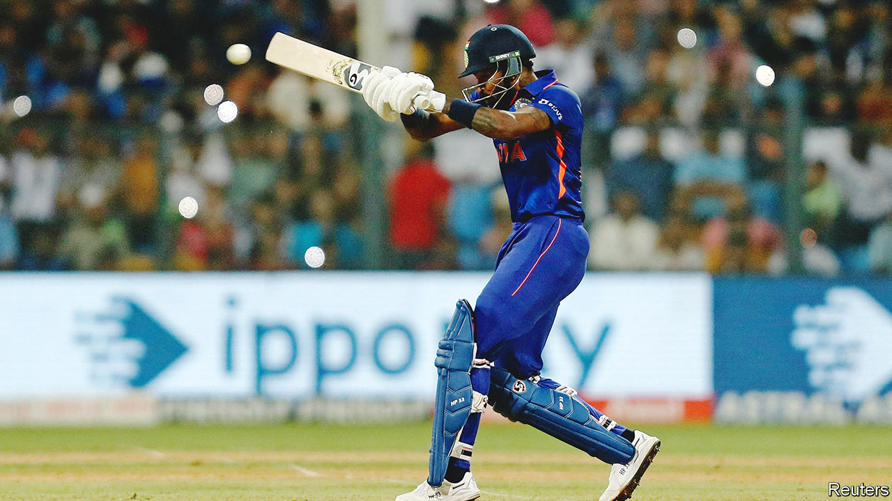

###### Hit for six

# The Indian Premier League is taking over global cricket 

##### India’s lucrative domestic tournament is strangling international contests 

 

> Mar 31st 2023 

THE GROWTH of the Indian Premier League (IPL) has been spectacular. Only 15 years after its launch, India’s biggest domestic cricket contest, which this year began its annual rendition on March 31st, has become by one measure the world’s  after America’s National Football League (nfl). The sale of five-year media rights to the IPL, which uses the fast-paced Twenty20 (T20) cricket format, raised $6.2bn last year for its organiser, the Board of Control for Cricket in India. This commercial success has confirmed India as by far the . But the owners of the IPL’s team franchises, who include some of India’s richest men and biggest companies, want more. 

The valuations of IPL franchises are much less than the billions that English football clubs and American football teams can trade for. Two new IPL teams were sold in 2021 for $940m and $750m. This mostly reflects how little  they play. The IPL season consists of 74 matches played over two months. The nfl hosts 272 games a year. To expand their playing time, India’s franchise owners are looking abroad.

In the past year IPL owners have snapped up all six franchises in sA20, a new T20 league in South Africa; three of the six teams in the United Arab Emirates’ International League; and four of the six sides in Major League Cricket,  that begins in July. These acquisitions have turned the ipl owners into international businesses. For example, the stable of the Mumbai Indians team, which is owned by a subsidiary of Reliance, India’s biggest industrial group, consists of five teams in four countries. 

Reliance and other multi-team T20 investors hope to mobilise their Indian fans behind their newer acquisitions. That should greatly increase merchandise, broadcast and other revenues. The overseas teams are expected to act as feeder clubs for the IPL, says Dan Weston of Sports Analytics Advantage, which helps the franchises build their rosters for T20 tournaments. The Mumbai Indians signed up a promising South African bowler, Duan Jansen, for their Cape Town team and, encouraged by his performances, brought him to Mumbai. Owning teams abroad also helps IPL investors experiment tactically. Before Sunrisers Hyderabad appointed their captain for 2023, they gave him a trial leading their Eastern Cape side. 

For the new leagues, the IPL connection confers credibility as well as financial clout. According to Graeme Smith, a former South African captain and now the commissioner of sA20, “the willingness of IPL owners to share their experience and know-how was key to our success in season one.” Although the South African league does not disclose its finances, IPL owners are believed to have paid more than $25m each for at least two of the teams and, more important, generated enough interest back in India for its media rights to have been sold there. This made sure its first season was profitable.

For cricket fans, the changes are dizzying—and not entirely positive. The game has long been largely organised around international contests. The domestic tournaments played in Australia, England, India, South Africa and other cricketing powers were mainly considered as talent pools for the national teams. The privatisation of cricket through the IPL’s franchise model, and its huge commercial success, has upended that relationship. IPL owners can offer players far bigger salaries than their national cricket boards. So more and more cricketers are cutting short international careers in favour of the T20 circuit. 

The fear is that younger cricket stars will forgo international cricket altogether. The IPL’s de facto global expansion makes that much likelier. Venky Mysore, chief executive of the Kolkata Knight Riders franchise (which also owns teams in three other leagues), wants to sign players on year-round contracts to play for all his sides. That would be incompatible with the national service that former star players such as Mr Smith, who played 347 times for South Africa, describe as the highlight of their careers.■

