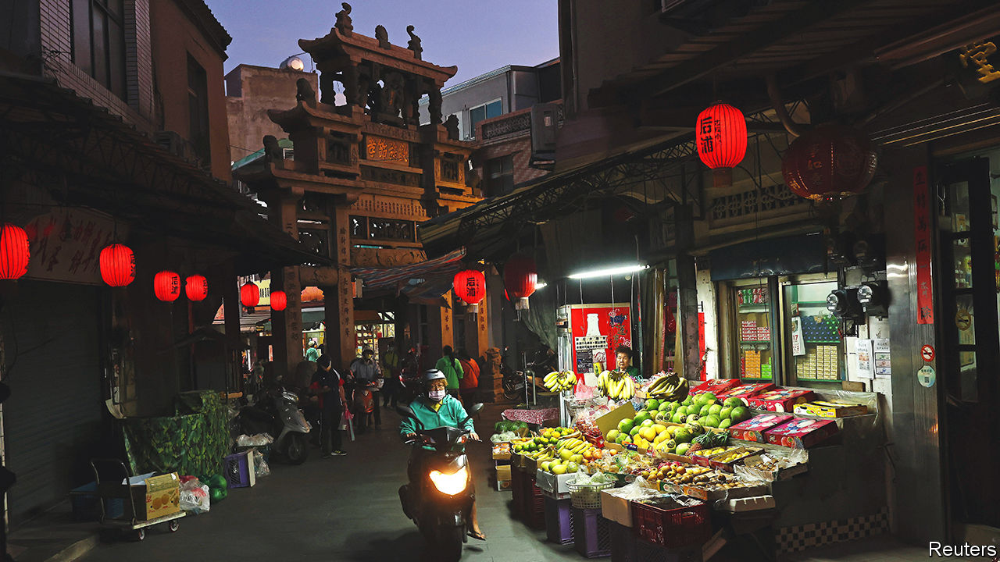
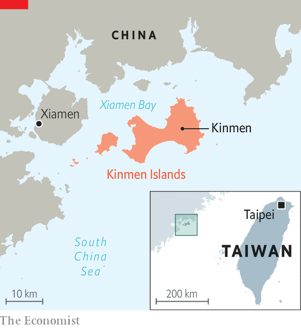

###### In the dragon’s mouth

# The view from the front line between Taiwan and China 

##### As Tsai Ing-wen visits America, we visit Kinmen island, 3km from the mainland 

 

> Apr 5th 2023 

Think about it this way: if in a conflict between America and China it is Taiwan that will be the , then in a confrontation between Taiwan and China that role will be played by Kinmen, an island that is 187km from Taiwan, which administers it, but only 3km away from China, which does not.

 


Kinmen, just 150 sq km, is the main island in an archipelagic Taiwanese county of 142,000 residents at the mouth of Xiamen Bay, nestling up against Fujian province in southern China (see map). Rusting anti-ship barricades line its beaches. The skyline of Xiamen, a sub-provincial but by comparison massive Chinese city just across the water, is visible from its shores. In 2001  to Xiamen, turning the island into a centre of tourism and business exchange. Many in Kinmen would like to be closer still—some have proposed a bridge and want the electricity grids to be connected. They hope not just to make Kinmen more prosperous, but also that closer integration with the mainland might be the best way to avoid being attacked. “America, China, Taiwan, whatever you do, just leave us out of it,” says Chen Yang-hue, a local councillor. He is one of several local politicians to demand, in February, that Taiwan withdraw its troops and “demilitarise” the island. Taiwan’s central government has not issued a response. 

The Kinmen islands were cut off from the Chinese mainland in 1949, when they turned into the front line of China’s civil war between the Nationalists, who escaped to Taiwan and became the self-governing entity known as the Republic of China, and the Communists, who won control of the mainland and created the People’s Republic of China. 

For decades, Kinmen endured routine shelling from China even as Taiwan turned the county into a garrison, with as many as 100,000 soldiers stationed there. Kinmenese were forced to carry supplies for the soldiers, to live under curfew and to train in village fighting units from the age of 16. Hong Ming-hwa, 88, was a dock worker when China subjected Kinmen to a burst of shelling in 1958, firing more than 470,000 shells in 44 days. More than 600 people died. He remembers soldiers fleeing while he and other locals waded past dead bodies in the water to save as many people as they could. “If there was no Kinmen then, there would be no Taiwan now,” he says. 

Many Kinmenese feel that Taiwan owes them a debt of peace. Its pro-China politicians complain that Taiwan’s politics are blocking Kinmen from prosperity, and that they have been left behind while mainland China and the rest of Taiwan prosper. That is an illusion: Kinmen’s average disposable income per person in 2021 was roughly $13,200, compared with $21,800 in Taipei, Taiwan’s capital, and $9,980 in Xiamen.

But the contrast between the dozy villages of Kinmen and the  still gives rise to envy. Kinmenese want to be part of China’s growth and China wants to invest, says Chen Yu-Jen, who represents Kinmen in the national parliament: “They will treat us well, make us a model, and Kinmen can develop and prosper. But Taiwan won’t accept this.” 

Supporters of demilitarisation also blame Taiwan, not China, for threatening Kinmen’s safety. China does not want to attack Kinmen in the first place because they are family, argues Mr Chen, the councillor. But the 3,000 Taiwanese soldiers stationed on Kinmen are a “thorn” in China’s side that should be removed, he says. “If we pose no threat, they won’t hurt us,” he says.

The arguments strike some as naive. Kinmenese are not discussing whether peace through integration with China would mean a loss of freedoms, says Wang Ling, 37. Ms Wang grew up in Kinmen and went to university in Taipei. She used to argue with her Taiwanese classmates, insisting that she was Chinese because of Kinmen’s Fujianese heritage. Kinmenese speak the same southern Fujianese dialect as people in Xiamen. Many still live in traditional Fujianese homes with curving red roofs. But gradually she realised her affinity to China was cultural, not political. In Taipei she joined labour-rights campaigns. Later, she studied in Beijing, where she saw how grassroots activists were suppressed. Now she calls herself Taiwanese. Already Kinmenese politicians act “like obedient children”, not equals, when they interact with Chinese officials, she says.

And just because Kinmen says “no war” does not mean that it will not happen, says Tung Sen-po, a county councillor who opposes the demilitarisation plan as unrealistic. Instead Kinmen—and Taiwan—should prepare for the worst while holding on to their democratic values, he says. That is a tough message for a people who feel they have little control over their own future. “We are the pawns, the chess pieces,” says Mr Tung, “not the chess players.”■


