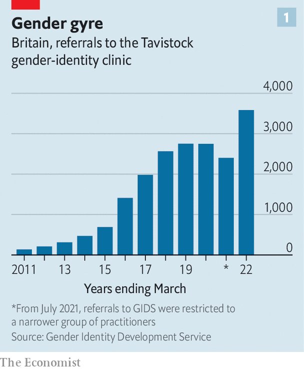
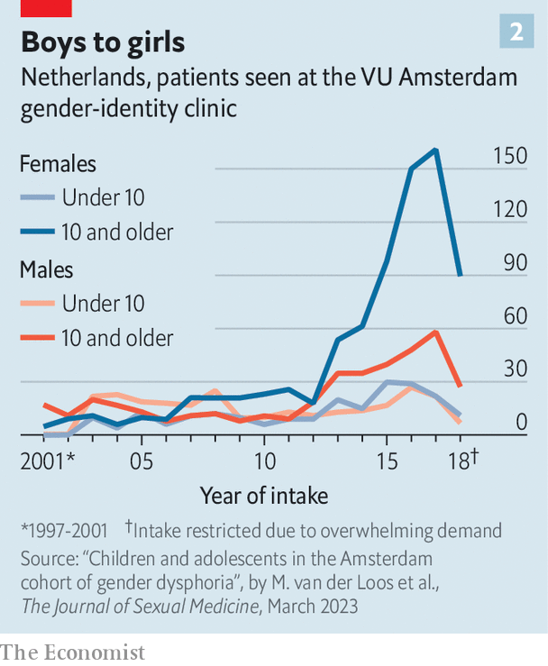

###### Trans substantiation

# The evidence to support medicalised gender transitions in adolescents is worryingly weak 

##### The effectiveness and side-effects of the most common treatments are not well understood 

 

> Apr 5th 2023 

PRISHA MOSLEY was 17 when she was first given testosterone in a clinic in North Carolina, after she had declared to her parents that she was a boy. She had struggled through her teen years with anorexia and depression after a sexual assault. Luka Hein had both breasts removed as a 16-year-old in Nebraska. Chloe Cole, in California, was a year younger when she had her double mastectomy. She had been on testosterone and puberty-blocking drugs since 13, also after a sexual assault. 

 


All three girls were experiencing “gender dysphoria”, a feeling of intense discomfort with their own sexed bodies. Once a rare diagnosis, it has exploded over the past decade. In England and Wales the number of teenagers seeking treatment at the Gender Identity Development Service (GIDS), the main clinic treating dysphoria, has risen 17-fold since 2011-12 (see chart 1). An analysis by Reuters, a news agency, based on data from Komodo, a health-technology firm, estimated that more than 42,000 American children and teenagers were diagnosed in 2021—three times the count in 2017. Other rich countries, from Australia to Sweden, have also experienced rapid increases.

As the caseload has grown, so has a method of treatment, pioneered in the Netherlands, now known as “gender-affirming care”. It involves acknowledging patients’ feelings about a mismatch between their body and their sense of self and, after a psychological assessment, offering some of them a combination of puberty-blocking drugs, opposite-sex hormones and sometimes surgery to try to ease their discomfort. Komodo’s data suggest around 5,000 teenagers were prescribed puberty-blockers or cross-sex hormones in America in 2021, double the number in 2017.

Dysphoria furoria

The treatment is controversial. In many countries, but in America most of all, it has become yet another front in the culture wars. Many on the left caricature critics of gender-affirming care as callously disregarding extreme distress and even suicides among adolescents with gender dysphoria in their determination to “erase” trans people. Zealots on the right, meanwhile, accuse doctors of being so hell-bent on promoting gender transitions that they “groom” vulnerable teenagers—a term usually applied to paedophiles. In October supporters and critics of gender-affirming care held rival, rowdy protests outside a meeting of the American Academy of Paediatrics. Several American states, such as Florida and Utah, have passed laws banning gender-affirming care in children. Joe Biden, America’s president, has described such laws as “close to sinful”. 

Almost all America’s medical authorities support gender-affirming care. But those in Britain, Finland, France, Norway and Sweden, while supporting talking therapy as a first step, have misgivings about the pharmacological and surgical elements of the treatment. A Finnish review, published in 2020, concluded that gender reassignment in children is “experimental” and that treatment should seldom proceed beyond talking therapy. Swedish authorities found that the risks of physical interventions “currently outweigh the possible benefits” and should only be offered in “exceptional cases”. In Britain a review led by Hilary Cass, a paediatrician, found that gender-affirming care had developed without “some of the normal quality controls that are typically applied when new or innovative treatments are introduced”. In 2022 France’s National Academy of Medicine advised doctors to proceed with drugs and surgery only with “great medical caution” and “the greatest reserve”. 

There is no question that many children and parents are desperate to get help with gender dysphoria. Some consider the physical elements of gender-affirming care to have been life-saving treatments. But the fact that some patients are harmed is not in doubt either. Ms Mosley, Ms Hein and Ms Cole are all “detransitioners”: they have changed their minds and no longer wish to be seen as male. All three bitterly regret the irreversible effects of their treatment and are angry at doctors who, they say, rushed them into it. Ms Cole considers herself to have been “butchered by institutions we all thought we could trust”.

The transitioning of teenagers has its roots in a treatment protocol developed in the Netherlands in the 1980s and 1990s. It is built on three pillars: puberty-blockers (formally known as GnRH antagonists), cross-sex hormones and surgery. The goal was to alter the patient’s body to more closely match their sense of cross-sex identity, and thereby relieve their mental anguish. A pair of papers published in 2011 and 2014 by Annelou de Vries, one of the Dutch protocol’s pioneers, reported on the experiences of some of the first patients. They concluded that symptoms of depression decreased among patients taking puberty-blockers, and that gender dysphoria “resolved” and psychological functioning “steadily improved” after cross-sex hormones and surgery.

Transition ignition

Puberty-blockers do what their name suggests. The idea is that suspending unwanted sexual development can give patients time to think about their dysphoria, and whether or not they wish to pursue more drastic interventions. The same family of drugs is used to treat “central precocious puberty”, in which puberty begins very early. Some countries also use them to chemically castrate sex offenders. As with many other medicines used in children, the use of puberty-blockers in gender medicine is “off-label”, meaning that they do not have regulatory approval for that purpose.

Patients who decide to proceed with their transition are then prescribed cross-sex hormones. Males will see the development of breasts and alterations to how fat is stored on the body. Giving testosterone to females boosts muscle growth and causes irreversible changes such as deepening the voice, altering the bone structure of the face and the growth of facial hair. 

Under the original Dutch protocol, surgery was permitted only after a patient turned 18, although as the cases of Ms Cole and Ms Hein show, in some places mastectomies occur at a younger age. Male patients can have artificial breasts implanted. More elaborate procedures, in which females have a simulated penis built from a tube of skin harvested from the forearm or the thigh, or males have an artificial vagina made in a “penile inversion”, are performed extremely rarely on minors. 

In 2020 the National Institute for Health and Care Excellence (NICE), a British body which reviews the scientific underpinnings of medical treatments, looked at the case for puberty-blockers and cross-sex hormones. The academic evidence it found was weak, discouraging and in some cases contradictory. The studies suggest puberty-blockers had little impact on patients. Cross-sex hormones may improve mental health, but the certainty of that finding was low, and NICE warned of the unknown risks of lasting side-effects. 

For both classes of drug, NICE assessed the quality of the papers it analysed as “very low”, its poorest rating. Some studies reported results but made no effort to analyse them for statistical significance. Cross-sex hormones are a lifelong treatment, yet follow-up was short, ranging from one to six years. Most studies followed only a single set of patients, who were given the drugs, instead of comparing them with another set who were not. Without such a “control group”, researchers cannot tell whether anything that happened to the patients in the studies was down to the drugs, to other treatments the patients might be receiving (such as counselling or antidepressants), or to some other, unrelated third factor.

The upshot is that it is hard to know whether any of the supposed effects reported in the studies, whether positive or negative, are actually real. Reviews in Finland and Sweden came to similar conclusions. As the Swedish one put it, “The scientific base is not sufficient to assess…puberty-inhibiting or gender-opposite hormone treatment” in children.

Two American professional bodies, the Endocrine Society (es) and the World Professional Association for Transgender Health (wpath) have also reviewed the science underpinning adolescent transitions. But ES’s review did not set out to look at whether gender-affirming care helped resolve gender dysphoria or improve mental health by any measure. It focused instead on side-effects, for which it found only weak evidence. This omission, says Gordon Guyatt of McMaster University, makes the review “fundamentally flawed”. WPATH, for its part, did look at the psychological effects of blockers and hormones. It found scant, low-quality evidence. Despite these findings, both groups continue to recommend physical treatments for gender dysphoria, and insist that their reviews and the resulting guidelines are sound. 

One justification for puberty-blockers is that they “buy time” for children to decide whether to proceed with cross-sex hormones or not. But the data available so far from clinics suggest that almost all decide to go ahead. A Dutch paper published in October concluded that 98% of adolescents prescribed blockers decide to proceed to cross-sex hormones. Similarly high numbers have been reported elsewhere. 

The reassuring interpretation is that blockers are being prescribed very precisely, given only to those whose dysphoria is deep-rooted and unlikely to ease. The troubling one is that puberty-blockers lock at least some children in to further treatment. “Time to Think”, a new book about gids by a British journalist, Hannah Barnes, cites British medical workers concerned by the latter possibility. They say patients received blockers after cursory and shallow examinations.

The Dutch researchers weigh both explanations. “It is likely that most people starting [puberty-blockers] experience sustained gender dysphoria,” they write. But, “One cannot exclude the possibility that starting [puberty-blockers] in itself makes adolescents more likely to continue medical transition.” 

Perhaps the biggest question is how many of those given drugs and surgery eventually change their minds and “detransition”, having reconciled themselves with their biological sex. Those who do often face fresh anguish as they come to terms with permanent and visible alterations to their bodies.

Once again, good data are scarce. One problem is that those who abandon a transition are likely to stop talking to their doctors, and so disappear from the figures. The estimates that do exist vary by an order of magnitude or more. Some studies have reported detransition rates as low as 1%. But three papers published in 2021 and 2022, which looked at patients in Britain and in America’s armed forces, found that between 7% and 30% of them stopped treatment within a few years. 

The original Dutch studies published in 2011 and 2014 were longitudinal—that is, they followed the same group of patients throughout their treatment. Yet three recent critiques published in the  nonetheless find fault with the studies’ data. 

One of the new studies’ concerns is the small size of the original samples. The 2011 paper looked at 70 patients. But the outcome of treatment was only known for between 32 and 55 of them (the exact number depends on the specific measure). And even then, the final assessment of outcomes occurred around 18 months after surgery—a very short timeframe for a treatment whose effects will last a lifetime. (The first patient, “FG”, was followed for longer. In 2011, when in his mid-30s, researchers reported his feelings of “shame about his genital appearance” and of “inadequacy in sexual matters”. A decade later though, things had improved, and FG had a steady girlfriend.)

The critiques also suggest that the finding that gender dysphoria improved with treatment may have been an artefact of how the participants were assessed. Before treatment, female patients were asked to agree or disagree with such statements as, “Every time someone treats me like a girl I feel hurt.” This established their desire to be seen as male. After blockers, hormones and surgery the same individuals were asked questions on a scale originally developed for those born male. It offered statements such as, “Every time someone treats me like a boy I feel hurt.” Naturally, patients who preferred to be seen as male disagreed. In effect, the yardstick was changed in a way that might be seen as making positive outcomes more likely. 

Finally, the original studies seem to have inadvertently cherry-picked patients for whom the treatment was most effective. The researchers started with 111 adolescents, but excluded those whose treatment with puberty-blockers did not progress well. Of the remaining 70, others were omitted from the final findings because they did not return questionnaires, or explicitly refused to do so, or dropped out of care or, in one case, died of complications from genital surgery. The data may therefore exclude precisely those patients who were harmed by or dissatisfied with their treatment. 

In a rebuttal published in the same journal, Dr de Vries insists that the original papers found a significant improvement in gender dysphoria, the condition the protocol was designed to treat. She concedes that the switching of assessment scales is “not ideal” but says this does not imply the studies’ results were “’falsely’ measured”. In response to worries about the relatively short follow-up, she noted that a study reporting longer-term outcomes is due “in the upcoming years”. 

Newer longitudinal studies have been published since, but they have drawbacks, too. One published in January in the  by Diane Chen of Northwestern University and colleagues looked at teenagers after two years of cross-sex hormone treatment. Although participants did typically report improvements in their mental health, they were small—generally single-digit increases on a scale that runs from 0 to 100. The study lacked a control group. Two of the 315 patients committed suicide. 

 


What is more, whatever the merits of the Dutch team’s original research, the patients passing through modern clinics are strikingly different from those assessed in their papers. Twenty years ago the majority of patients were pre-pubescent boys; in recent years teenage girls have come to dominate (see chart 2). The findings of older research may not apply to today’s patients.

The Dutch team’s approach was deliberately conservative. Patients had to have suffered from gender dysphoria since before puberty. Many of today’s patients say they began to suffer from dysphoria as teenagers. The Dutch protocol excludes those with mental-health problems from receiving treatment. But 70% or more of the young people seeking treatment suffer from mental-health problems, according to three recent papers looking at patients in America, Australia and Finland.

Despite the protocol’s caution, says Will Malone of the Society for Evidence-Based Gender Medicine, an international group of concerned clinicians, the reality is often the reverse, especially in America, with mental-health issues becoming a reason to proceed with transitions, rather than to stop them. “We are now told that if we don’t address young people’s mental-health problems caused by dysphoria with transition, they will kill themselves.” 

Gender agenda

The original Dutch protocol emphasises the need for careful screening and assessments, as do official guidelines in most countries. But whatever the guidance, there are persistent allegations that it is not being followed in practice. “I had one 15-minute appointment before I was given testosterone,” says Ms Mosley. Many American patients contacted by  reported similarly brief examinations. 

 


The possibility that many teenagers presenting as trans could instead be gay has long been discussed. The Dutch study of 2011 found that 97% of the participants were attracted either to their own sex or to both sexes. In 2019 a group of doctors who resigned from GIDS told the , a British newspaper, of their worries about homophobia in some patients and parents. They worried that, by turning children into simulacra of the opposite sex, the clinic was, in effect, providing a new type of “conversion therapy” for gay children. 

Both within America and without, whatever the loudmouths may claim, the vast majority of practitioners are simply trying to ease the genuine suffering of adolescents afflicted by gender dysphoria. But in America in particular the charged atmosphere has made it very difficult to separate the science from the politics.

European medical systems have not concluded that it is always wrong for an adolescent to transition. They are not trying to erase distressed patients. They have simply determined that more research and data are needed before physical treatments for gender dysphoria can become routine. Further research could, conceivably, lead to guidelines similar to those already in use by American medical bodies. But that is another way of saying that it is impossible to justify the current recommendations about gender-affirming care based on the existing data. ■

