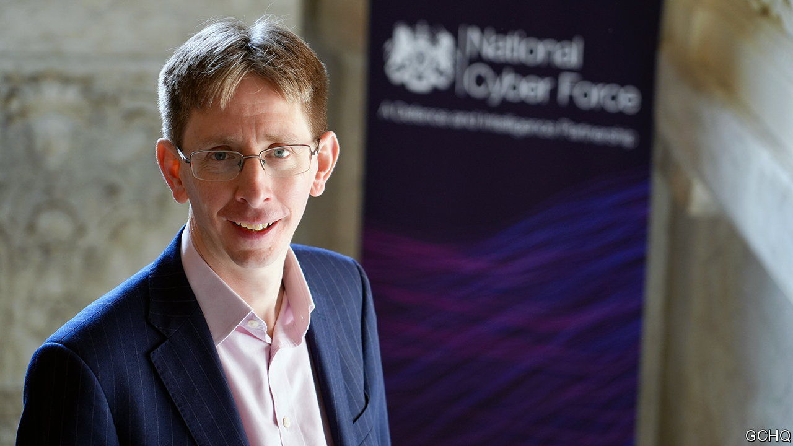

###### A tremor in the force

# Cyberwarfare is all in the mind, says Britain 

##### An interview with the commander of the National Cyber Force 

 

> Apr 4th 2023 

“IT IS THE deterrent rocket force of our age,” gushed one columnist. “Cyber divisions are worth more than aircraft carrier[s] or nuclear weapons.” He was referring to Britain’s  (ncf), created in 2020 with a mission to “disrupt, deny, degrade” in cyberspace. Now the ncf is opening up to dispel such fantasies. 

On April 4th it published “Responsible Cyber Power in Practice”, which explains in 28 pages how Britain views the purpose and principles of “offensive cyber”. On the same day it revealed its commander’s identity. James Babbage has spent nearly 30 years at , Britain’s signals-intelligence agency. Mr Babbage gave his first interview to .

Less than a decade ago, he says, even insiders “tended to think about offensive cyber as a red button”—a potent weapon to pull out in the first hour of a war, or in response to some provocation. Now, he says, “both of those framings have lost quite a lot of their power”. Instead ncf operations reflect “the doctrine of cognitive effect”—the idea that offensive cyber is less about turning the lights off in Moscow than a stealthy and subtle form of psychological warfare.

In essence, the ncf—staffed by gchq, mi6 and the armed forces—hacks computers and their networks. Today, that means everything from smartphones to fighter jets. Hacking can do physical damage, as America and Israel showed in the Stuxnet attack on Iranian nuclear facilities over a decade ago. It can also wipe data, as Russia has done prolifically in Ukraine. But the ncf sees its ultimate goal as influencing the behaviour of people or groups, whether criminals, terrorists or state adversaries. 

Sometimes that means simple disruption, such as disabling a server or app that terrorists are using to communicate. But it usually calls for a more artful approach. “Covert techniques may be used to reach out to individuals who pose a significant threat,” says the ncf. In 2018, for instance, the Pentagon’s Cyber Command sent targeted messages to Russian hackers to dissuade them from interfering in that year’s American midterm elections. 

More often the aim is to stay in the shadows. “The intent is sometimes that adversaries do not realise that the effects they are experiencing are the result of a cyber operation,” says the ncf. It finds the “greatest cognitive effect” comes from tinkering with an enemy’s networks over time—what Mr Babbage calls “tilting the playing field imperceptibly”. British cyber operations against Islamic State during 2016-17, for instance, not only hampered IS’s communications, but also made its operatives distrust the orders sent over them. “Adversaries aren’t very good at identifying and attributing uk cyber activity,” boasts Mr Babbage, “and that’s quite a good thing.”

 


Inducing paranoia among enemies is a long-standing aim of covert action, says Rory Cormac, of the University of Nottingham. Historically, he says, mi6 “set people very discreetly against one another so that they destroyed each other”. He points to Operation Flitter, a (failed) effort by the agency to induce a purge in the Soviet leadership in the 1950s. During Northern Ireland’s Troubles spooks routinely sowed division within the Irish Republican Army, for instance by spreading rumours that one faction was plotting against another.

In many ways, cognitive effect is a repackaging of these dark arts. But one reason why the ncf is coming out of the shadows is to emphasise that it is a “responsible” cyber power. It says its operations are precisely targeted, calibrated to avoid escalation and accountable to ministers and Parliament—the Intelligence and Security Committee oversees operations. “When the Russians talk about psychological operations, they are much more often looking at population scale,” says Mr Babbage. “When we’re talking about cognitive effect, we’re really talking about decision-makers, or usually quite small...groups.” 

Russia’s invasion of Ukraine underscores the difference. Its cyber-attack on communication satellites inadvertently disrupted nearly 6,000 wind turbines in Germany. Russian digital propaganda has been crude and scattershot, using deepfake videos and fake news outlets. “Our currency really is the truth,” insists Mr Babbage. “The wider our audience, the more critical it is that what we’re putting out is true.” Above all, he says, the Russian hackers waging information warfare appear to be disconnected from those disrupting Ukrainian computer networks. “That is exactly counter to our doctrine of cognitive effect, which is about bringing them both together.”

Britain is still learning what that means in practice. In the past it often thought military cyber-attacks would be tactical—say, electronic warfare to take out a particular radar at a key moment. Now, says Mr Babbage, they seem most useful at the “theatre” level: influencing enemy generals in their headquarters, rather than colonels in the field. Two military lawyers sit within the ncf to advise on how the laws of war might apply.

The ncf refuses to discuss specific operations, citing the benefits of ambiguity. But it hopes that opening up about its doctrine will help shape others’ behaviour. Its cognitive framing “is becoming something of a consensus” among allies, says Mr Babbage. “It’s really important to help middle-ground states see that there’s a real difference between responsible cyber power, that we advocate and practise, and…adversary cyber power”. Meanwhile the ncf is a work in progress. It is developing versatile tools for use against a wide range of targets rather than just one. “Red buttons,” says Mr Babbage, “become rusty buttons.”■


