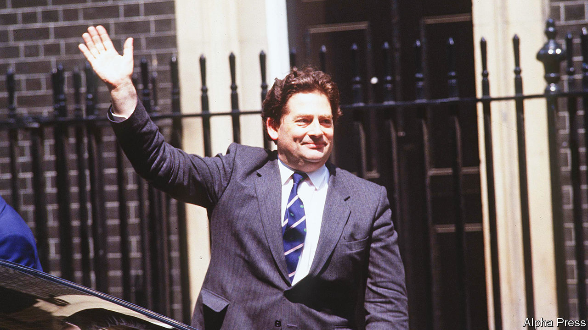

###### The Iron Lady’s chancellor

# Nigel Lawson was the economic brain of Thatcherism 

##### The tax reformer, privatiser and Euro- and climate-sceptic died on April 3rd, aged 91 

 

> Apr 4th 2023 

Nigel Lawson, the former Conservative chancellor of the exchequer who died on April 3rd, leaves two legacies.  is still largely the one he transformed in the Thatcherite wave of privatisation, deregulation and tax reform in the 1980s. And the , transfixed by arguments over Europe and a rising tax burden, is packed with pretenders to his intellectual mantle. 

As chancellor under Margaret Thatcher from 1983 to 1989, Lord Lawson eliminated a tax in each one of his six budgets. His record, however, was one of reforming rather cutting taxes, most notably by abolishing several higher rates of income tax and simplifying the system. (Subsequent chancellors have re-complicated it horribly.) In his memoirs, published in 1992, he lamented that during his chancellorship the share of national income the state took in tax fell only slightly—from 33% to 31%, according to the latest figures.

He was an enthusiast for the privatisation of nationalised industries, a process he launched as financial secretary to the Treasury and energy secretary before he became chancellor. After the sale of shares in British Telecom in 1984, he lauded “the birth of people’s capitalism”.

The government’s goal, he said in his budget speech in 1986, was “the conquest of inflation and the creation of an enterprise culture”. Neither was fully achieved. The “big bang” of financial deregulation breathed new life into the City of London but privatisations did not ultimately create the mass shareholder culture he and Thatcher hoped for. A successful policy of disinflation in the early 1980s—though at the price of mass unemployment, which Lord Lawson said Britain “can get along with”—gave way to rocketing inflation in the “Lawson boom” that followed his tax-cutting budget of 1988. 

Marked man

Like many in his party, Lord Lawson grew more radically Eurosceptic over the years. Yet his advocacy of European integration of a sort had brought about his downfall. He had pushed for Britain’s entry into the European Exchange Rate Mechanism, a system of fixed exchange rates: determined to control inflation, he anchored the pound to the German Deutschmark. Lord Lawson clashed with Thatcher’s economic adviser, Alan Walters, who wanted Britain to stay out of the mechanism. Lord Lawson demanded that Walters be made to resign but Thatcher refused. The chancellor quit instead. Walters would follow. Little more than a year later, in November 1990, Thatcher herself was gone. 

Arguments about Europe have consumed the party ever since. Lord Lawson remained part of them right up until his death. In 2016 he briefly became chair of the Vote Leave campaign, which successfully advocated Britain’s departure from the EU. Though he was curious about ideas and his budget speeches were often long and dry, filled with technical details about monetarism, he believed that the  was a simple combination: free-market thinking, nationalism, self-reliance and “a dash of populism”.

He was not shy of provocation. In later life he was a prominent climate-change sceptic as well as a fervent Brexiteer. His anti-eu pronouncements—from his home in France, where he sought permanent residency two years after the 2016 referendum, though he later left—irritated those who had backed Remain. His frequent presence on the bbc, arguing against the reality of man-made climate change or, alternatively, that a bit of warming was desirable, depending on the day, outraged environmentalists and scientists alike.

All sides of today’s Conservative Party still lay claim to his (and Thatcher’s) inheritance. Rishi Sunak, the prime minister, called Lord Lawson an “inspiration” after his death. Yet the exact shape of this legacy is contested. In a lecture in 2022 when he was chancellor, Mr Sunak said that many Conservatives gave only a partial account of Lord Lawson’s time in office: their idol had waited to cut taxes until he had balanced the budget. In her tributes, Liz Truss, Mr Sunak’s immediate predecessor, hailed Lord Lawson’s tax-cutting zeal. The prime minister before her, Boris Johnson, hailed him as a “prophet of Brexit”. 

The difficulties confronting Conservatives in government today give the lie to simplistic claims to be Lord Lawson’s economic heirs. The party is yet to find a way to combine voters’ desire for  with its own small-state instincts. Ms Truss’s brief, disastrous premiership, during which borrowing costs spiked after a surprise announcement of tax cuts, has quietened calls to shrink the state immediately, but few on the party’s right are happy with the ratcheting-up of the tax burden to pay for better services.

And although Mr Johnson praised Lord Lawson’s Euroscepticism, when prime minister he compared his own governing philosophy more to the views of Michael Heseltine, one of the “wets” more sceptical of the Thatcherite revolution than the true-believing “dries”, such as Lord Lawson. Mr Johnson’s embrace of a bigger state and regional redistribution, with a dash of populist bluster about “getting Brexit done”, helped him win swathes of former Labour voters in the election of 2019.

Lord Lawson endorsed Mr Sunak over Ms Truss in last year’s contest to become leader of the Conservative Party, arguing that he was the true heir to Thatcherism. Tax cuts required fiscal rectitude, he wrote, rather than an “insouciant attitude to the public finances”. On the subject of how to combine that rectitude with fixing Britain’s creaking health service, however, Lord Lawson’s legacy is silent. ■


