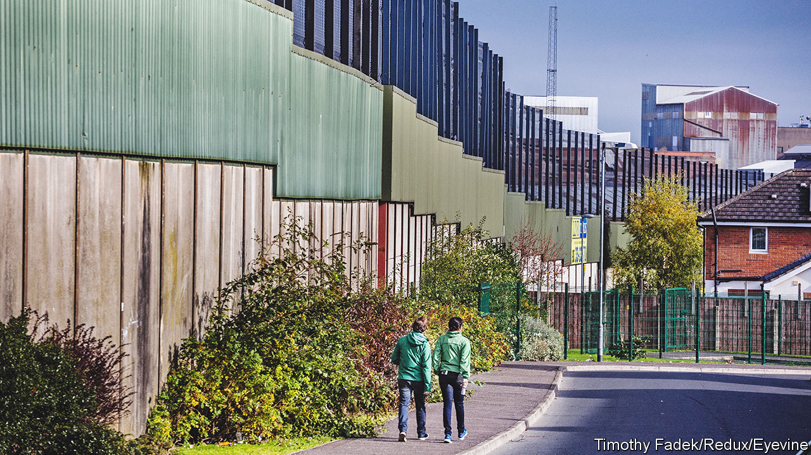
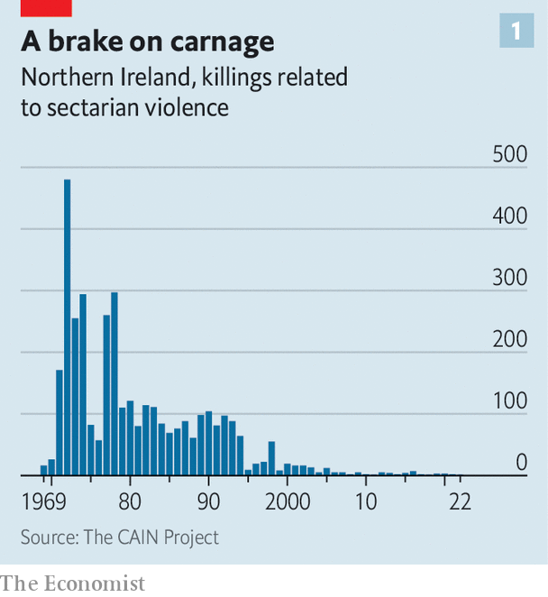
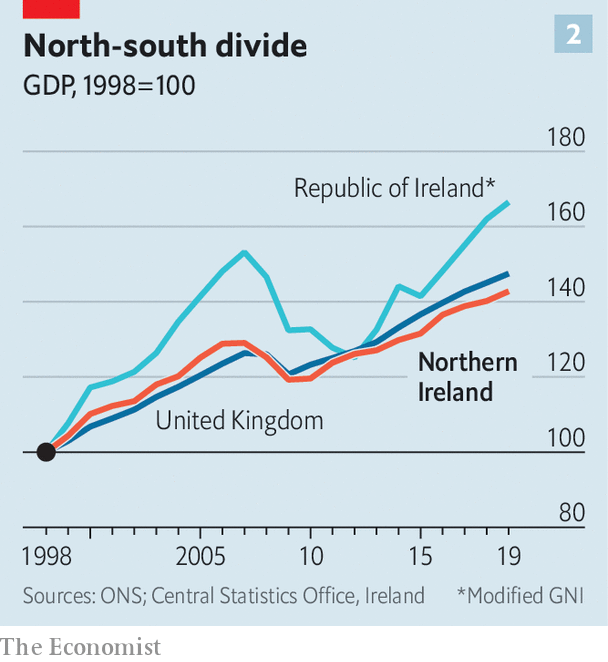
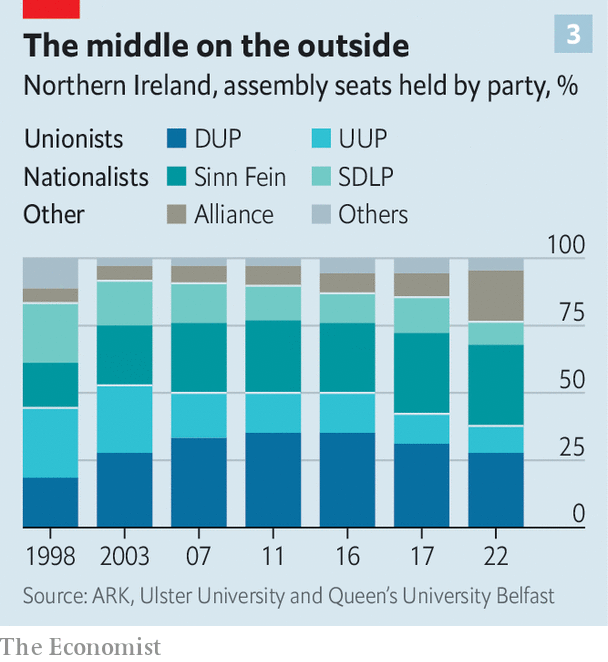
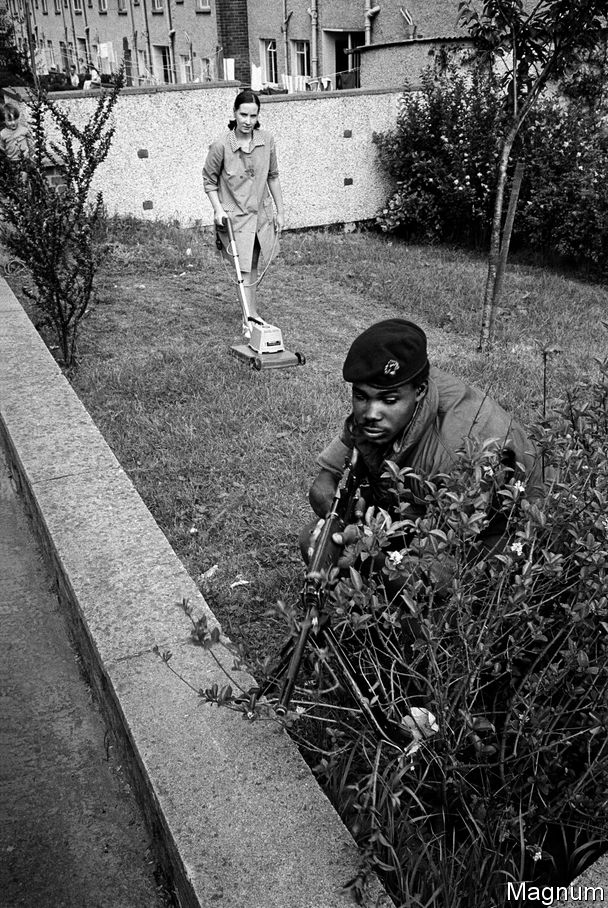

###### A good Good Friday

# Thanks to the Belfast Agreement, Northern Ireland is a better place 

##### Twenty-five years on, its politics are rarely deadly. But they are depressingly dysfunctional 

 

> Apr 5th 2023 

ON THE COLD April day in 1998 when the Good Friday Agreement was struck, George Mitchell told Northern Ireland’s leaders that he had a dream. The former American senator had missed most of the first six months of his son’s life in cajoling unionists and nationalists to reach a settlement. One day, he said, he wanted to sit with the boy in the public gallery of the Stormont Assembly, watching former enemies govern together. Fourteen years later he did just that. The ministerial statement they sat through was “dry as dust”, he said. “But it was music to my ears, and I thought it wonderful to hear.”

President Joe Biden, Rishi Sunak and other global leaders will soon be in Belfast, marking the deal’s 25th anniversary on April 10th. There is much to celebrate. You can see the accord’s traces in the city’s very architecture: without the fear of bombs, there are glazed structures on nearly every street. You can taste them, too: where once a ring of steel kept out not only bombers but also diners, the Michelin guide recommends 18 restaurants. They have fostered friendship and even love. The Troubles forced people to stick largely to their own communities. Though most still live apart, many mix freely in the city centre.

The compromise that mostly ended 30 years of carnage has endured and even won over some who opposed it. Yet there are deep divisions still—and there is none of Mitchell’s music, but plenty of dust, in the assembly’s walnut-panelled chamber. Devolved government has been in abeyance for over a year, after its sixth collapse in all. Civil servants are keeping health, education and other services running, but cannot change laws or policies. 

The deal was an astonishing achievement. Some of those who struck it could barely speak to each other. David Trimble, leader of the Ulster Unionists, then the largest unionist party, did everything he could to avoid speaking directly to Gerry Adams of Sinn Féin, the political wing of the Irish Republican Army (IRA), believing him to have been a key figure in the terrorist group. Mr Adams once tried to strike up conversation as they relieved themselves at the urinals. “Grow up,” Trimble growled.

Yet Trimble led wary unionists to a generational compromise with nationalists, led by the avowedly non-violent John Hume, leader of the Social Democratic and Labour Party (SDLP), then the biggest on the nationalist side, whose thinking saturated the document. The two men would share the Nobel Peace Prize for their courage. Mr Adams showed courage of a different sort. Having failed to drive out the British at gunpoint, he oversaw the destruction of the IRA’s arsenal, knowing he could be killed for doing so.

The agreement’s genius lay in giving everyone just enough. Power-sharing between unionists and nationalists is compulsory. The leading party on one side provides the first minister and the other the deputy, and key votes in the assembly must be passed by majorities representing both. This protected the nationalist minority’s interests, even while Northern Ireland remained British. The requirement to hold a referendum on uniting Ireland if there was evidence nationalists would win allowed Sinn Féin to say it had a political path to its goal (though Northern Ireland was always unviable without majority support). Cross-border bodies blurred a previously militarised frontier, even if unionists retained a veto over their actions.

It was enough for almost three-quarters of a population worn down by incessant atrocities. In referendums six weeks later 71% of voters in Northern Ireland and 94% in the Republic of Ireland voted for the agreement. The Democratic Unionist Party (DUP) furiously opposed the deal. Now it is the main unionist group, the DUP cites it in defence of its interests. One of the most controversial changes for unionists was the transformation of the old Royal Ulster Constabulary, which was only 8% Catholic, into the Police Service of Northern Ireland, which is 32% Catholic. A government survey says that change has won the confidence of 86% of the population.

Tragic calculations

The accord undoubtedly saved many lives. How many, no one can know. But in nearly three decades of bloodletting, beginning in 1969, more than 3,500 people had been killed—nearly 400 of them even in the 1990s, when improved intelligence and security were constraining loyalist and republican paramilitaries.

 


The violence did not end at once—the deadliest single atrocity, a bombing in Omagh by dissident republicans, came in August 1998—and small loyalist and republican groups still occasionally kill. MI5, Britain’s security service, still dedicates 20% of its resources to Northern Ireland. On March 28th it raised the threat level to “severe”, meaning an attack is highly likely. But the scale of violence is minuscule after what went before (see chart 1). In the past 12 months, one person has been killed and 37 wounded by paramilitaries. There have been six bombings and 36 shootings. The police have recovered 1,000-odd rounds of ammunition. 

Peace has come at a price, paid largely by victims and their families. Michael Longley, a Belfast poet, encapsulated this in “Ceasefire”, which draws on Homer’s “Iliad”. Collecting the battered body of his son Hector from Achilles, who has slain him, the elderly King Priam says: “I get down on my knees and do what must be done/And kiss Achilles’ hand, the killer of my son.”

What had to be done was to allow prisoners to walk free. Killers caught later would spend no more than two years in prison. Now the British government is going further still, in effect introducing an amnesty, saying it is time to move on. 

Some have forgiven the unforgivable. Jude Whyte, whose mother was murdered by a loyalist bomb in 1984, sees no benefit in jailing her killer. Others cannot. Standing at the spot by the family cottage where his father was shot by the IRA in 1985, Sammy Heenan remembers the “haunting and dying screams” outside his bedroom window. He didn’t welcome the accord: “I was absolutely devastated and distraught.”


Mr Heenan is concerned, too, that his father’s killers will become heroes. He believes a new generation is romanticising the bloody past. Young people have chanted “Ooh aah, up the ’Ra” (short for IRA) at concerts, in bars and even in the dressing room of the Irish women’s football team. Sinn Féin’s leader at Stormont, Michelle O’Neill, has said there was “no alternative” to the IRA’s campaign of terror. In a poll last year seven in ten nationalist respondents agreed with her; in 1998 seven in ten Catholics said they had no sympathy at all for republican violence.

Many unionists foresee a further price: Irish unification. They complain that where they saw a settlement, Sinn Féin saw a staging post on its long march to a united Ireland. (According to a recent poll, 54% of unionists would now vote against the deal if they could.) But Mr Adams was always open about that. He said in 1998 that the Good Friday document was “concluding one phase of our struggle and opening up another”. Confining agitation for unity to politics was the whole point.

Yet despite Sinn Féin’s electoral success—it long ago overtook the SDLP as the main nationalist party and came top in last year’s elections to Stormont, ahead of the DUP—republicans are little closer to uniting Ireland than in 1998. Declining to murder their fellow citizens has made unity less threatening to more of the unconverted. But actual converts have been limited.

Nationalists are nonetheless more confident than at any time since Ireland’s partition in 1921. They believe the tide of history has turned decisively in their favour, although even few republicans would expect to win a border poll now. Unionists are despondent. A succession of inept political leaders and the sense that their power is slipping away have fuelled fatalism.

 


Peace has surely been good for the economy, if not as good as you may have hoped. Between 1998 and 2019 Northern Ireland’s GDP grew by 43%, a little less than that of the whole UK. But despite closer economic integration on the island, the Republic of Ireland’s economy (on a measure stripped of the distorting effect on GDP of the Irish corporate-tax system) grew half as fast again (see chart 2). 

Afloat again

Even so, to pace the modern streets of Belfast’s Titanic quarter is to walk through the Northern Ireland that the agreement made possible. The site of the doomed liner’s construction had by 1998 become a post-industrial wasteland. Now the 75-hectare site houses more than 100 companies, including global giants such as Citibank and Microsoft. The architecturally daring Titanic visitor centre has been more successful than the ship, attracting 7m visitors since opening a decade ago—an influx that would have been inconceivable when the city was fortified against attack. Nearby, in the cavernous Paint Hall Studio, “Game of Thrones” was filmed.

Across the road is the unremarkable scene of another drama, now almost seven years old: a huge hall where, in the early hours of June 24th 2016, it was announced that Northern Ireland had voted to remain in the EU, but the UK as a whole had chosen to leave. The Brexit vote critically destabilised a deal which had deliberately and helpfully blurred the border on the island.

To keep that border open, the British government ultimately decided to keep Northern Ireland in the EU’s customs union and single market for goods, while taking the rest of the UK out. The resulting Northern Ireland protocol, part of the Brexit treaty, eased nationalists’ discombobulation at Brexit, but dismayed unionists because it drew a border in the Irish Sea, making trade with Great Britain more difficult.

In February 2022 the DUP walked out of Stormont in protest. The Windsor framework agreed on by Britain and the EU has since replaced the protocol, but has been rejected by the DUP. Stormont is still not sitting. The powerful vetoes the agreement gave both sides have enabled a party with just 21% of the vote to stop a government being formed.

Numbers have always been critical to Northern Ireland. Its boundaries were carefully drawn a century ago to take in six of the nine counties in the province of Ulster, ensuring Catholics, who opposed partition, would be in a minority. But the Protestant majority has long gone. Last year’s census confirmed that Catholics now outnumber Protestants, though they are not a majority either.

Paul Nolan, a social researcher, likens the publication of the census once a decade to football results announcing victory or defeat for one side or the other. But closer inspection of the latest showed something else: “The big winners were not unionism or nationalism, but those who wished to slip free of those moorings altogether…and with three teams now at play no one knows how this game will end.”

Orange, green and in between

In 1998, just 7% of legislators were from non-tribal parties; today the centrist Alliance Party has almost 20% (see chart 3). Its rise is partly the child of the agreement, but now threatens that which gave it birth. The privileges the accord gave to two tribes in the assembly, unionists and nationalists, mean in effect that the votes of a third, centrists, don’t count. That was theoretically indefensible in 1998, but made little practical difference; now it is an untenable absurdity. Moving to qualified majority voting, in which the backing of maybe 65% of all legislators is needed to pass a law—would prevent a return to the abuses of majority rule and give all members an equal say.

 


Even when functioning, devolved government has lurched between the plodding and the preposterous. The collapse before the latest one, which lasted three years, came in 2017 after the “cash for ash” scandal. Those in the know had piled into a green-energy scheme in which Stormont paid £1.60 for every £1-worth of fuel burned. An inquiry cleared anyone of corruption, but the incompetence revealed was shocking enough.

To Alban Maginness, an SDLP negotiator in 1998 and Belfast’s first nationalist lord mayor, the agreement remains “the only way you can have a civilised form of politics here”. Remarkably, he would like a referendum on unity in the next five years because he expects to lose. With the agreement ruling out another poll for seven years, it “might be best to get that out of the way and give us seven years of relatively stable government”. But he admits that the price of stability is weak government.

Jonathan Powell, who as chief of staff to Tony Blair, then Britain’s prime minister, was centrally involved in the 1998 talks, says that forced power-sharing “can’t go on for ever”. But to remove it just after the DUP has been overtaken by Sinn Féin would be a mistake, he adds.


Yet the agreement which operates today is already not the one agreed on in 1998. The number of legislators has been cut from 108 to 90. The sensitive justice ministry is allocated outside the accord’s mechanisms to assuage unionist fears of an ex-IRA bomber being in charge of criminal justice. A technical change to how the first and deputy first minister are chosen has increased tribalisation—which is bad for Northern Ireland, but good for the DUP and Sinn Féin.

 


Stormont has been good at talking about problems. Agreeing on solutions is another matter. “It was a tremendous wasted opportunity,” says Stephen Grimason, a former BBC journalist who spent 15 years as Stormont’s chief spin doctor. “The DUP and Sinn Féin had no guts to take the decisions that had to be taken, particularly in health. Now it’s maybe too late.” (There is poignancy in his words: Mr Grimason is seriously ill.) Peter Donaghy, an analyst, calculates that 37.7% of people on National Health Service waiting lists have been there for more than two years, compared with 0.016% in England. The agreement may have ended terrorist killings, but bad government can be deadly in a different way.

It is not only in Stormont that hearts still need softening. Northern Ireland remains a land of perpetual disputes, even over the name of the 1998 accord. Most unionists call it the unadorned Belfast Agreement (its official title), while nationalists and others prefer the grander Good Friday label. It has become one of the innumerable shibboleths—from how someone pronounces the letter H to whether their name is Sean or Billy—that mark people as Catholic or Protestant. 

Most people still live by choice in segregated communities. Divisions linger in everything from sport to schools, and in  (see Culture section). It is “a huge scandal for us as church leaders” that religious denomination is a badge of conflict, says Archbishop Eamon Martin, Ireland’s most senior Catholic cleric. 

Yet there have been myriad examples of inter-communal generosity. And some problems are shockingly simple to solve. “We still need to create opportunities for kids to get to know each other,” says Gareth Harper, from PeacePlayers, which uses sport to bring together young people who otherwise would never mix outside their communities.

The push and the pull

A.J. Conlon, a 17-year-old Catholic, and Rebecca Crozier, a 16-year-old Protestant, met through PeacePlayers and have come to cherish the freedom from sectarianism which it provides. Yet both expect to leave Northern Ireland. For Ms Conlon, an attack on her aunt and her awareness of people being burnt out of their homes are a spur to leave; Ms Crozier wants to “see what doors I could open for myself”.


But their yearning may be less gloomy than it sounds. When Andrew Hassard cast his vote for the Good Friday Agreement in 1998, he was as young as anyone with a say could be: it was his 18th birthday. He too had no intention of staying in Northern Ireland. He left to study in England and then worked abroad. Twenty-five years later, he is back, running his own company selling psychedelically painted bicycles. Married with four children, he lives two miles away from his parents.

“Home is home,” Mr Hassard says. “I worked around the world, but Northern Ireland is ultimately where I was drawn back to.” The pull of a peaceful home—even such a stubbornly dysfunctional one—can be hard to resist.■


