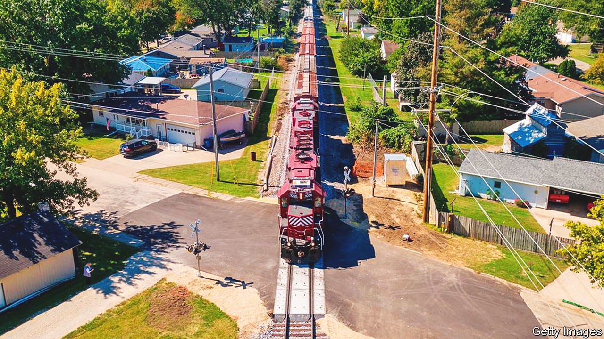
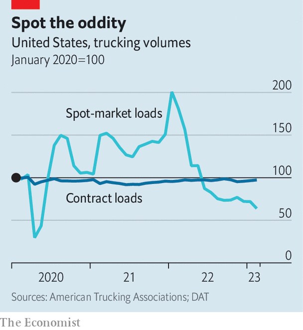

###### Watching the wheels

# American railways and truckers are at a crossroads 

##### Will their fortunes diverge? 

 

> Apr 5th 2023 

In some ways, freight rail and trucking seem to be direct competitors. Companies that need to get a container of goods from one city to another can choose between them. Rail is more cost-effective, fuel-efficient and can move greater volumes on a single trip. Trucking is usually faster and, unless the container is going from rail yard to rail yard, more direct. In America, both sectors boomed during the pandemic, as service-deprived shoppers stocked up on stuff. Now both are bracing for an economic slowdown, which may also affect them in similar ways.

Start with rail. Cost-cutting and price rises brought huge profits to American freight-rail firms in 2021 and 2022, despite lower volumes than before the pandemic. Railways embraced “precision scheduling”, which reduces how long full train carriages sit in yards waiting for a long train to be built. The industry is also consolidating, which leads to greater pricing power. On April 14th Canadian Pacific will complete its purchase of Kansas City Southern, the first big freight-rail merger that the Surface Transportation Board (STB), the federal rail regulator, has approved since the 1990s. That will leave America with just six large “Class I” rail companies. 

Counterintuitively, the merger may end up enhancing competition. That is because not all rail companies compete against each other directly. Rather, the country is split into duopolies: CSX and Norfolk Southern rule the east; Union Pacific and BNSF dominate the west. Those lines meet in the Midwest, where they compete with Canadian National and, now, the enlarged Canadian Pacific, which will provide the first train lines running from Canadian ports through the heart of America into Mexico. 

Instead of less choice, in other words, customers in America’s most crowded rail corridor, which runs through the centre of the country, will now have the option of moving goods on a single line from the northern to the southern border. It was this “end-to-end” nature of the merged company—with no overlapping tracks or shared customers—that the STB invoked as one reason for waving through the combination of the two smallest Class I firms. 

If the merger is unlikely to boost margins for the industry, could more cost-cutting? Probably not. Fuel, though down from recent peaks, remains pricier than before the war in Ukraine. Precision scheduling has come under scrutiny after a chemical-train derailment in Ohio in February; critics have blamed the pressure to get trains out of yards as quickly as possible for corners being cut on safety inspections. If Congress passes rail-safety legislation, that may reduce efficiency and increase costs. Non-fuel expenses such as insurance are already going up. 

So are labour costs, as rail firms recruit workers to improve service. At the start of 2023 they employed 8% more people than a year earlier, even though volumes and traffic had fallen in the preceding 12 months. Amit Mehrotra of Deutsche Bank notes that adding staff even as volumes decline is a sign that “rail is playing the long game and focusing on service.” But, he concedes, “the bumper-profit period is over.”

The same could be true for hauliers, for many similar reasons. During the pandemic, demand soared and the number of trucking firms, starting one of which requires little more from an entrepreneur than securing the right licence and a lorry, steadily increased. Today America has nearly 600,000 such companies, 100,000 more than in 2019. Capacity has been recovering from a covid-induced dip: in February it was 4% higher than the year before. But the market is much softer: in the fourth quarter of 2022 freight volumes fell to their lowest level since 2014. 

 


The combination of robust supply and weakening demand has produced an unusual pricing situation. Typically, rates in the spot market, which shippers use when they have freight to move straight away, exceed contract rates, which shippers and trucking firms set for a fixed term, usually a year. For roughly the past 12 months, says Dan Murray of the American Transportation Research Institute, an industry body, “the spot market has been on life support” (see chart). In February, spot rates were more than 70% lower than the year before—and below contract rates.

This price signal could lead some truckers to call it a day. Others may, like their railway rivals, try to consolidate. On March 21st Knight-Swift, one of America’s biggest truckers, agreed to buy biggish but struggling US Xpress. Mr Murray thinks that “more acquisitions are coming”, not least because spot prices look unlikely to recover for another six to 12 months.

In the longer run, however, things may be looking up for American truckers and railwaymen alike. The government is ploughing hundreds of billions of dollars in subsidies to boost domestic manufacturing, particularly of green-energy equipment and semiconductors. If those handouts have the desired effect, that could mean more intermediate goods, in addition to finished products, to ferry around America’s vastness. ■


