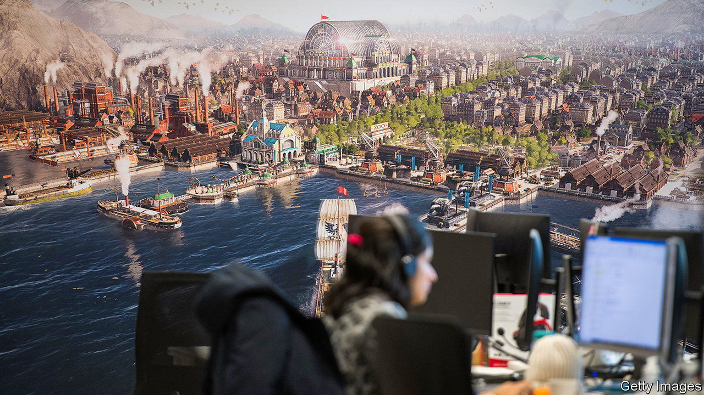

###### Game changer

# How AI could disrupt video-gaming 

##### Gamemaking is especially laborious—and especially ripe for automation 

 

> Apr 5th 2023 

Flinging brightly coloured objects around a screen at high speed is not what computers’ central processing units were designed for. So manufacturers of arcade machines invented the graphics-processing unit (gpu), a set of circuits to handle video games’ visuals in parallel to the work done by the central processor. The gpu’s ability to speed up complex tasks has since found wider uses: video editing, cryptocurrency mining and, most recently, the training of artificial intelligence.

ai is now disrupting the industry that helped bring it into being. Every part of entertainment stands to be affected by generative ai, which digests inputs of text, image, audio or video to create new outputs of the same. But the games business will change the most, argues Andreessen Horowitz, a venture-capital (VC) firm. Games’ interactivity requires them to be stuffed with laboriously designed content: consider the 30 square miles of landscape or 60 hours of music in “Red Dead Redemption 2”, a recent cowboy adventure. Enlisting ai assistants to churn it out could drastically shrink timescales and budgets.

Gamemakers showed off their latest ai tricks at the Game Developers Conference in San Francisco last month. Ubisoft, a French developer of blockbusters such as “Assassin’s Creed”, unveiled Ghostwriter, a tool that generates dialogue for in-game characters. Roblox, an American platform for diy games, launched one that draws materials from text commands, like “stained glass”, and an autocomplete helper for programmers. A few weeks earlier Straight4 Studios previewed a new driving game, “gtr Revival”, with personalised racing commentary delivered by ai.

ai represents an “explosion of opportunity”, believes Steve Collins, technology chief of King, which makes “Candy Crush Saga”, a hit mobile game. King, which bought an ai firm called Peltarion last year, uses ai to gauge levels’ difficulty. “It’s like having a million players at your disposal,” says Mr Collins. This year Electronic Arts, another big gamemaker, and Google both received patents for using ai in game testing. Unity, a game-development “engine”, plans a marketplace for developers to trade ai tools. Danny Lange, Unity’s head of ai, hopes it will “put creators of all resource levels on a more equal playing-field”.

Making a game is already easier than it was: nearly 13,000 titles were published last year on Steam, a games platform, almost double the number in 2017. Gaming may soon resemble the music and video industries, in which most new content on Spotify or YouTube is user-generated. One games executive predicts that small firms will be the quickest to work out what new genres are made possible by ai. Last month Raja Koduri, an executive at Intel, left the chipmaker to found an ai-gaming startup.

Don’t count the big studios out, though. If they can release half a dozen high-quality titles a year instead of a couple, it might chip away at the hit-driven nature of their business, says Josh Chapman of Konvoy, a gaming-focused VC firm. A world of more choice also favours those with big marketing budgets. And the giants may have better answers to the mounting copyright questions around ai. If generative models have to be trained on data to which the developer has the rights, those with big back-catalogues will be better placed than startups. Trent Kaniuga, an artist who has worked on games like “Fortnite”, said last month that several clients had updated their contracts to ban ai-generated art. 

If the lawyers don’t intervene, unions might. Studios diplomatically refer to ai assistants as “co-pilots”, not replacements for humans. But workers are taking no chances. The Writers’ Guild of America, whose members include game scriptwriters, said in March that “plagiarism is a feature of the ai process.” In Hollywood, it is threatening strikes. Upset creatives may press pause on the games business, too. ■


