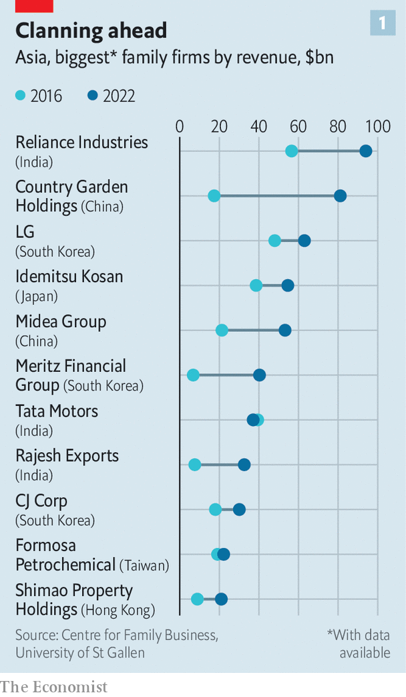
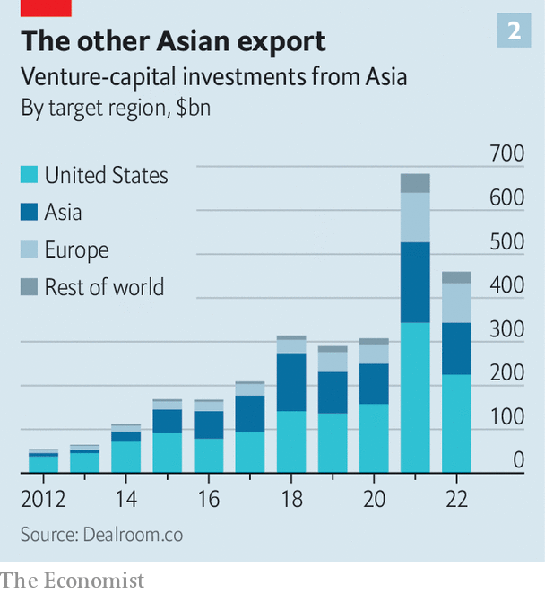

###### Asian business elites

# Meet Asia’s millennial plutocrats 

##### They are worldier and techier than their forebears 

 

> Apr 3rd 2023 

The idea that wealthy dynasties can go to pot in three generations pops up throughout history and around the world. John Dryden, an English poet who died in 1700, mused that “seldom three descents continue good.” In 19th-century America, successful families were said to go from “shirtsleeves to shirtsleeves” in that span of time. A Chinese proverb,  (wealth does not pass three generations) captures an identical sentiment.

 


As a rising share of the world’s ultra-rich comes from emerging markets, the three-generation hypothesis is being tested once again—nowhere more so than in developing Asia. Asians are helping to swell the number of individuals with fortunes of more than $500m, which rose from 2,700 to nearly 7,100 globally between 2011 and 2021, according to Credit Suisse, a bank. The continent’s tycoons did more than their African or Latin American counterparts to push the developing world’s share of that total from 37% to 52% over the decade. The combined revenue of the continent’s 80 or so family firms that rank within the world’s 500 biggest such concerns surpassed $1trn last year, according to researchers at the University of St Gallen in Switzerland (see chart 1).

Overall, the results of the three-generation test so far look encouraging for Asia’s ageing patriarchs (most are men) as they seek a safe pair of hands to which to entrust their legacy. The grandchildren of the region’s founder tycoons may well be in shirtsleeves, but out of sartorial choice rather than necessity. They are worldlier than their elders, who built their fortunes on local businesses that thrive in periods of rapid economic development, such as construction or natural resources. They often blend the needs of the family business with personal preferences. 

At the same time, they are keenly aware of their responsibility to avoid the prodigal trap. As they take the reins of their business houses, it is up to them to show whether, in the words of one Asian heir, “you can institutionalise” and, like “a sort of Rothschild”, keep generating wealth over centuries. (Members of the Rothschild family are shareholders in ’s parent company.)

To understand what makes these Rothschild wannabes tick, start with education. Most have attended university abroad, often in America. Adrian Cheng, grandson of Cheng Yu-tung, a Hong Kong property tycoon, went to Harvard University. John Riady, the New York-born scion of an Indonesian business dynasty, attended Georgetown University, before earning an MBA at the Wharton School of the University of Pennsylvania and a law degree from Columbia University. Isha Ambani, daughter of Mukesh Ambani, graduated from Yale and then Stanford University’s Graduate School of Business in 2018. 

A foreign education distinguishes the new crop of tycoons from their grandparents, many of whom never completed university. What sets them apart from their parents is their career paths into the family businesses. Like their fathers, Mr Cheng, Mr Riady and Ms Ambani all now work for these. Mr Cheng runs New World Development, the family’s property arm; Mr Riady is chief executive of Lippo Karawaci, the family empire’s property developer; Ms Ambani heads Reliance’s retail operation. But, like plenty of their peers, they took circuitous routes to get there. 

For many, that means a stint in finance or professional services. Mr Cheng started his career in investment banking, including at UBS, a Swiss lender. Ms Ambani was a consultant at McKinsey. Mr Riady worked in private equity. For others, the bridge is the world of venture capital and tech startups. Korawad Chearavanont, great-grandson of the founder of CP Group, Thailand’s largest private company, launched a tech startup that provides social-media features for apps. Kuok Meng Xiong, grandson of Robert Kuok, a commodity, property and logistics billionaire from Malaysia, runs K3 Ventures, a Singapore-based VC firm. 

 


Both in the case of foreign VC investments in Asia and of Asian investments in foreign VC firms, the heirs’ fluent English, foreign education and Western social circles make them the ideal conduit. And these flows are growing: in the past two years VC investments in Asia averaged $150bn annually, more than half of America’s $280bn or so, and up from $11bn in 2012, when it was a quarter of America’s. Asian investments in foreign VC deals are up, too (see chart 2). In America, the share from Asia has gone from less than 10% by value a decade ago to around a quarter in 2022, according to Dealroom, a data firm. 

Permitting the heirs to have a professional life outside the family is partly about letting them . “The first and second generation were quite traditional,” says Kevin Au, director of the Centre for Family Business at the Chinese University of Hong Kong. But, he adds, they were happy to send their children abroad, “where values are different and business is done differently”. 

Impact investing and sustainability-related roles are popular among the millennial plutocrats. Rather than join Hyundai Group, Chung Kyungsun, grandson of its founder, Chung Ju-yung, has set up an impact-investment firm called Sylvan Group, which focuses on companies aligned with UN Sustainable Development Goals. The shift to more vocally progressive views in some areas, like inequality, may be driven by pragmatism, too. “In societies where economic growth isn’t being shared, they want to break you up, tax you, regulate you, they presume the worst,” says one heir.

Giving heirs experience beyond the family concern reflects a more open-minded parenting style. But it is also becoming a business priority for the older generation, especially as the family businesses diversify into new industries and geographies. Reliance, which made its name in petrochemicals, is now India’s biggest telecoms firm and digital platform. Lippo has gained greater exposure to young technology firms in South-East Asia through Venturra Capital, its VC subsidiary. That young business scions have a wider circle of contacts than do their parents is useful for their families’ firms: rubbing shoulders with would-be startup founders, venture capitalists, consultants and bankers offers opportunity for early dibs on interesting investment opportunities. 

Last year Campden Wealth, a consultancy, surveyed 382 global family offices, the investment vehicles that manage dynastic wealth. It found that the majority would prefer the next generation of owners to gain external work experience before taking the reins. Globally, 54% of respondents said they expected their heirs to get at least a year of outside experience. In Asia the figure was 58%.

The more international and liberal mindset of the young plutocrats, then, holds promise for avoiding the three-generation trap. But it is not risk-free. Many developing-world commercial empires were constructed by combining business acumen and political nous. In 2001 Raymond Fisman, then at Columbia University, showed that whenever rumours about the failing health of Suharto, Indonesia’s dictator, intensified in the mid-1990s, publicly listed firms that were close to the government, many of which were family-run, underperformed those with fewer political ties. Similar research suggests a positive association between the political allegiances of South Korean companies and the government: firms with ties to the ruling party benefited even after the country’s transition to democracy and economic liberalisation in the late 1980s.

In many emerging markets, navigating interest groups and local power brokers remains an important part of doing business. It can ensure preferential treatment, access to state contracts or just a better understanding of the often Byzantine bureaucracy.  will not teach Asia’s young business elites such skills. To preserve their family empires, they will also have to learn a thing or two from their elders. ■


